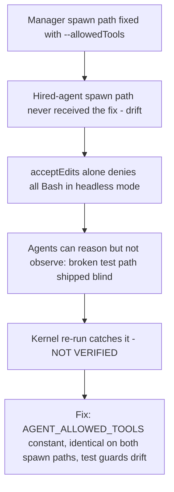

# Brief Compilation and Hired-Agent Sandbox Permissions

**Confidence:** firm — the individual bugs are verified and merged, but the pattern that produced them (drift between spawn paths, ad-hoc prose instead of enforced rules) is a standing risk, not something structurally eliminated.

A hired agent's entire understanding of the task and its entire capability to act on it come from two things compiled before it ever starts: the rendered brief (compileBrief/renderBrief) and the process spawn flags that grant it tool access. Both have repeatedly drifted out of sync with what the agent actually needs, and the fixes converge on one lesson: when hired agents fail the same way independently, the defect is in the brief or the spawn config, not in the agents. The pre-flight forecast shown in the composer (GET /preflight) is deliberately not a second heuristic — it is compileBrief's own prediction of what will be touched, rendered early so it can never disagree with the brief actually dispatched, and its "dependents" count must be computed from the memory-cited paths compileBrief will actually cite, not the full graph-expanded touch set, or the forecast silently undercounts the risk it exists to surface. Two brief-content gaps were found by dogfood: the citation extractor is so eager that a token like `state.room/state.pty` in prose is treated as a cited path, so a claim describing the bug it fixes can trip the very check it is trying to satisfy; and the project compiles to CommonJS, so `import.meta` (TS1470) is illegal, which independent agents hit within minutes of each other until the brief was made to say so explicitly. Separately, hired agents could not run any shell command at all for a period: the claude adapter spawned them with `--permission-mode acceptEdits` and no `--allowedTools`, and acceptEdits only auto-approves file edits — Bash still needs an explicit allow in headless `-p` mode, so every test/build command was silently denied and agents could only reason about correctness, not observe it. This was drift, not a design choice: the manager spawn path (manager-client.ts, room-supervisor.ts) had already been fixed the same way earlier. The permanent fix is an exported `AGENT_ALLOWED_TOOLS` constant applied identically on both hired-agent spawn paths (the one-shot args builder and `claudeLiveArgs`), with a test asserting the two paths can never diverge again, plus a brief line telling the agent it can and should run tests before claiming.

## Supporting evidence

- `.agent_memory/packets/decision-pre-flight-forecast-is-the-briefs-own-prediction-and-its-dependents-are-asked-of-9c2627c3.md` — establishes preflight = brief's own prediction, and that blast radius must use memory-cited paths, not the full graph-expanded touch set.
- `.agent_memory/packets/decision-compilebrief-createrun-renderbrief-all-work-against-a-plain-tempdir-with-no-git--3c22fc39.md` — "fix the brief, not the agents": adds test-placement, coverage, and claim-fence rules to renderBrief after three independent agents dropped the same instructions.
- `.agent_memory/packets/gotcha-the-citation-extractor-is-so-eager-it-fails-the-run-that-describes-it-and-briefs-e1a8bbe2.md` — citation self-trap on slash-joined prose tokens, and the CommonJS/import.meta gap two agents hit independently.
- `.agent_memory/packets/negative_result-rejected-approach-mcp-delegation-brief-ts-renderbrief-must-tell-hired-agents-pla-61d0738d.md` — a duplicate dispatch of the "tell agents they never run harness tools" brief fix; rejected only because the manager redispatched the same intent twice, not because the work was wrong.
- `.agent_memory/packets/bug_fix-hired-agents-could-not-run-any-command-acceptedits-without-allowedtools-denies-b-93c7a109.md` — first-recorded (later superseded) statement of the acceptEdits/allowedTools sandbox bug.
- `.agent_memory/packets/bug_fix-the-hired-agent-spawn-paths-own-permission-gap-no-allowedtools-blocks-the-hired--c3653f2c.md` — the fuller, approved version of the same bug with reproduction proof and the concrete fix (AGENT_ALLOWED_TOOLS on both spawn paths, brief updated to say tests can be run).

## Contradictions / open questions

- The two sandbox-permission packets describe the identical bug: one is marked `deprecated`/superseded, the other `approved`/verified, and the later one has materially more evidence (two independent agents' claim fences, the downstream broken-test consequence). Treat the approved packet as current; the deprecated one is kept only as an earlier, less complete statement of the same fact.
- The rejected duplicate-dispatch packet raises an unresolved question: nothing in these packets confirms whether Kage's manager now has protection against dispatching two runs for the same intent, or whether this remains a recurring waste pattern that has to be caught manually each time.

## Causality

