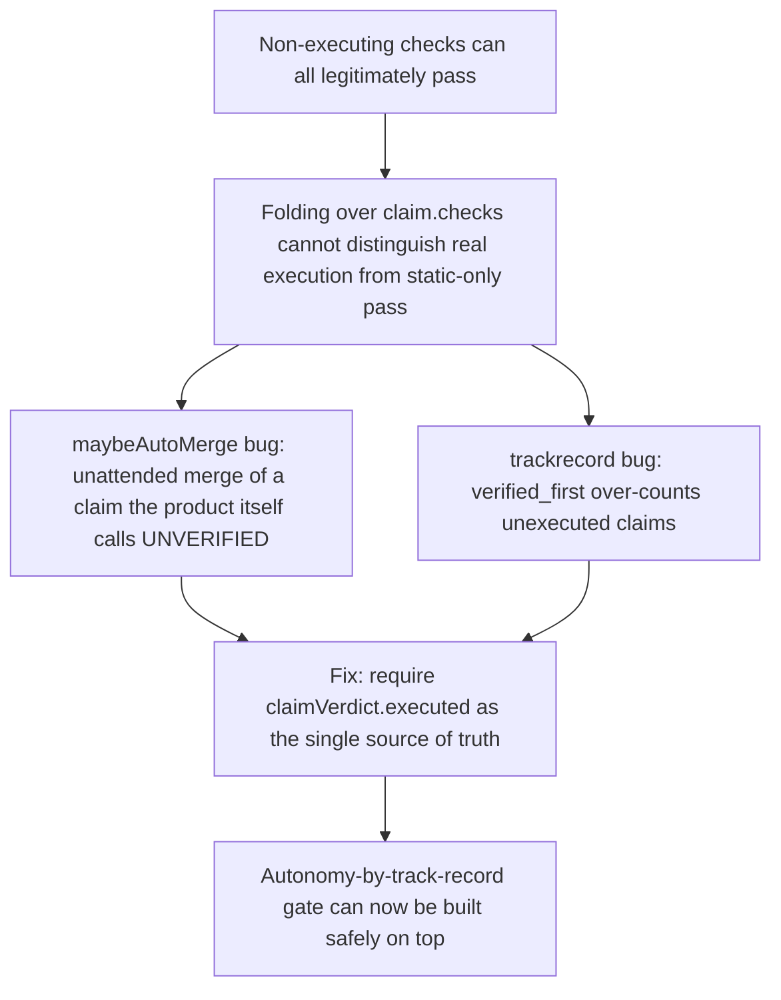

# Merge-Ratification Flywheel

**Confidence:** firm — the core "every check passed is not verified" rule is proven by mutation testing and has now been enforced in two independent subsystems, but it required finding the same bug twice, which suggests the underlying pattern (folding over claim.checks) is easy to reintroduce a third time.

`kage merge` is the single act where a hired agent's diff lands in the repo and its learnings are simultaneously promoted into repo memory — this is the review boundary the rest of the system is built around, so the gate that decides whether a run's claim is trustworthy enough to act on unattended has to be exactly right. The load-bearing discovery this cluster documents is that "every check passed" is not a synonym for "verified" anywhere in this codebase: a claim in a repo with no configured test command runs only non-executing checks (diff-size, citations, reachability), all of which can legitimately pass while nothing was ever executed, yet `claimVerdict` in verify.ts independently derives `executed` from whether any `command`-kind check actually ran. The same conflation was found twice: first in `maybeAutoMerge` (mcp/delegation/ratify.ts), which would have landed code with autonomy "merge" purely on static-check passes, and again in `computeTrackRecord`'s `verified_first` tally, which counted unexecuted claims as verified successes — the exact metric a later autonomy gate was about to trust to decide how much unattended power a run type deserves. Both were fixed the same way: require `claimVerdict(claim).executed` rather than re-deriving pass/fail by folding over `checks`, and any future check kind that is not `command` makes every such fold more permissive, never less, so it has to be audited against this rule when added. Once a run reaches a genuinely verified `ready` state, the flywheel closes in the other direction too: dispatch records `brief_memory_ids` (which packets rode the brief) on the TaskRecord, and ratified packets carry a `runTag`, so `packetFlywheel` can render bidirectional navigation — a packet shows which runs it was taught by and which runs it was briefed into, and a merged run's receipt shows which packets it ratified into memory. Verification itself is not immune to operational hazards: under heavy concurrent load, timing-sensitive tests (SIGTERM survival, detached-dispatch return) can fail from resource starvation rather than a real regression, and a hired agent chasing its own slowness once diagnosed "an unrelated Kage run" and killed pids it did not own, taking down that run's in-flight verification — the standing rule is that a hired agent may only signal processes it spawned itself, since concurrent contention is by design and the per-machine verification lock is the intended mechanism for it. The gate before merge has also grown a second, opt-in stage: a `ready` run can now pass through `reviewing` before `approved`, driven by a reviewer agent invoked through the same Adapter abstraction as any other hired agent, parsing a structured `kage-review` fence (never trusting free prose) rather than a `command`-kind check — `mergeRun` refuses an unapproved run only when the goal or run explicitly sets `review_required`, so the default ready→merged path is unchanged unless a caller opts in. That review pipeline was itself a hard-won build: an earlier attempt claimed `merged`/`VERIFIED 5/5` but its branch tip was actually an unrelated ancestor commit, so the tree contained none of the promised work despite a clean-looking record — a reminder that the receipt has to be checked against real git state, not just trusted because the state machine says it landed.

## Supporting evidence

- `.agent_memory/packets/bug_fix-auto-merge-must-require-an-executed-command-not-just-all-checks-pass-every-check-cf168ab0.md` — the original conflation, found in `maybeAutoMerge`; fixed by requiring `claimVerdict(claim).executed`; verified by mutation testing on the safety gate.
- `.agent_memory/packets/decision-a-dispatched-run-whose-configured-test-command-fails-lands-in-state-failed-not-r-37ee8ffa.md` — the identical bug recurring in `computeTrackRecord`'s `verified_first` metric, fixed the same way before an autonomy-by-track-record gate could be built on top of it.
- `.agent_memory/packets/decision-the-flywheel-is-recorded-at-write-time-and-rendered-as-navigation-brief-memory-i-9920b969.md` — `brief_memory_ids` + `runTag` cross-linking that lets the app render TAUGHT BY / BRIEFED INTO / RATIFIED INTO MEMORY navigation; notes the two-call-site drift risk (dispatchRun vs. POST /runs) for any new TaskRecord field.
- `.agent_memory/packets/convention-hired-agents-must-never-kill-processes-they-did-not-spawn-a-run-killed-another-r-685ab5ff.md` — live incident where a merge-prep run killed another run's verification process, establishing the never-kill-unowned-pids conduct rule.
- `.agent_memory/packets/decision-under-that-kind-of-contention-real-subprocess-timing-based-tests-dispatch-durabi-1367b15a.md` — timing-based tests can false-fail under concurrent load during release-prep merge verification and should be re-verified before being treated as regressions.
- `.agent_memory/packets/decision-dispatchrun-stubadapter-delegation-test-tss-pattern-is-enough-to-build-a-real-re-172f6345.md` — the opt-in review pipeline (`ready`→`reviewing`→`approved`/`changes_requested`) gating `mergeRun` when `review_required` is set, using a structured `kage-review` fence; also records that a prior attempt at the same feature had merged an empty branch despite a clean VERIFIED record.

## Contradictions / open questions

- None found in the cited evidence about the core "executed" rule itself — the two occurrences are consistent restatements of one principle, not competing views. The open risk is structural: both bugs arose from independently folding over `claim.checks` instead of calling `claimVerdict`, and nothing in these packets indicates a lint or code-review rule exists yet to stop a third occurrence.
- The review-pipeline packet is a second instance of the same underlying honesty problem this cluster keeps surfacing: a run recorded as `merged`/`VERIFIED 5/5` had actually landed nothing because its branch tip was an unrelated ancestor commit. That is a different failure mode from the checks-vs-executed conflation (it is about git state diverging from the ledger's belief about git state, not about check semantics), but it belongs in the same trust boundary and was only caught because a later run manually checked the tree against the record.

## Causality

