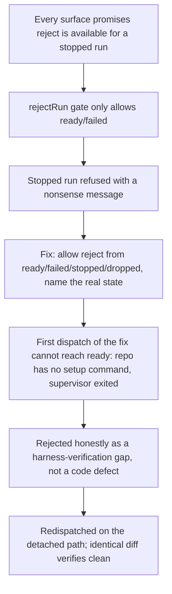

# Reject State Gate and Honest Rejection Reasons

**Confidence:** firm — the state-gate bug and its fix are verified by tests and by a real redispatch that reused the working diff, and the negative-result packets are first-hand operator records of why specific runs were rejected.

Rejecting a run is as load-bearing as merging one: the record has to say honestly why a run did not land, and the mechanics that decide whether a run is even eligible to be rejected have to match what every surface already promises the user. The core bug here was that `rejectRun`'s gate only allowed `ready` and `failed`, so a `stopped` run — which has no live agent process and is exactly the kind of run a user would want to reject — was refused with a message ("stop it before rejecting") that made no sense for a run already stopped, even though contract.ts's own decision text and the app's Reject button both promised rejection was available. The fix allows reject from `ready`, `failed`, `stopped`, and `dropped` (a `dropped` run — a derived display state, not a real `RunState` — is reaped to `failed` first via `reapRun` before the transition, since `dropped` cannot appear directly in `LEGAL_TRANSITIONS`), while continuing to refuse `draft`/`briefed`/`dispatched`/`running`/`verifying`/`blocked`, since `blocked` in particular has a live agent waiting and genuinely requires stopping first — and refusal messages now name the actual state instead of always saying "stop it". This fix has an instructive delivery history: a first dispatched attempt produced a verified-good implementation, but the run record could not honestly reach `ready` because the repo's delegation config lacked a setup command at dispatch time and the CLI-dispatch supervisor had already exited — no product path existed to re-verify it, so it was rejected not for being wrong but because the harness could not confirm it, and the same fix was cleanly redispatched on the standard detached path, reusing the identical diff. That negative result is itself evidence of a broader convention this cluster demonstrates: Kage's rejection mechanism distinguishes "the implementation is wrong" from "the harness could not verify this," and records the true reason rather than collapsing both into a generic failure — the same honesty appears in a rejected smoke-test dispatch ("the intent was never real work") and a rejected six-day-stale test-era artifact whose underlying issue had already been fixed by unrelated later commits, where the Room manager itself recommended rejection and the operator concurred.

## Supporting evidence

- `.agent_memory/packets/bug_fix-rejectruns-dropped-state-handling-relies-on-reaprun-projectdir-runid-contract-ts-b7987668.md` — the verified fix: reject allowed from ready/failed/stopped/dropped (dropped reaped to failed first via `reapRun`), refusal messages name the actual state.
- `.agent_memory/packets/bug_fix-the-base-state-of-mcp-delegation-ratify-ts-and-mcp-delegation-contract-ts-in-thi-864eb8f8.md` — near-duplicate confirmation that the redispatched worktree's base state was unchanged from before the reference fix, so the verified diff applied cleanly with no adaptation — this is the same fix landing a second time after the first attempt's harness-verification gap.
- `.agent_memory/packets/negative_result-rejected-approach-fix-rejectruns-state-gate-in-mcp-delegation-ratify-ts-bug-a-st-d18c4294.md` — the first attempt's rejection reason: implementation verified good (3/3 on operator re-run) but the run could not honestly reach `ready` because the repo lacked a setup command and the supervisor had exited; redispatched rather than treated as a code failure.
- `.agent_memory/packets/negative_result-rejected-approach-add-a-one-line-comment-to-readme-md-tiny-chore-test-dispatch-cae69976.md` — a deliberately trivial smoke-test dispatch, rejected with the honest reason that the intent was never real work.
- `.agent_memory/packets/negative_result-rejected-approach-fix-the-last-dispatch-76d8a693.md` — a six-day-stale test-era run rejected because its underlying subject was already fixed by later, unrelated commits; notes that this very rejection exercises the reject-from-stopped fix the run itself once blocked on.

## Contradictions / open questions

- None found — the two bug_fix packets and the corresponding negative_result packet describe one continuous story (rejected for a harness gap, then successfully redispatched) rather than conflicting accounts. Left open: whether the missing-setup-command class of false rejection (a verified-good run that cannot be marked `ready` because the repo config was incomplete at dispatch time) has a general detection or auto-repair path now, or whether each future occurrence still depends on an operator manually diagnosing it the way this one was.

## Causality

