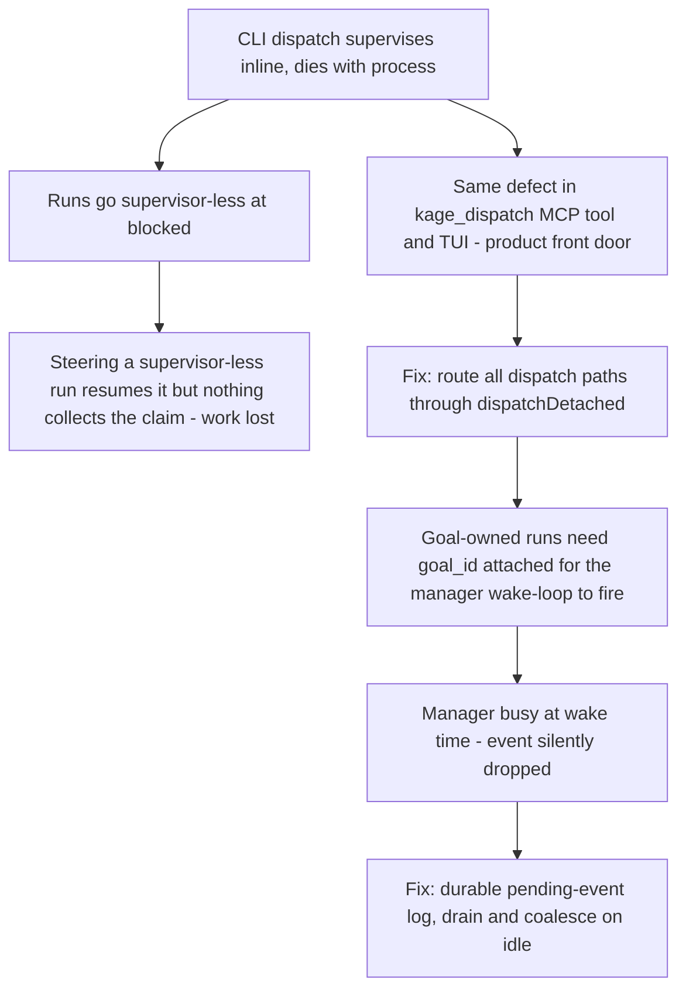

# Run Lifecycle: Detached Dispatch and Honest Event Delivery

**Confidence:** firm — each individual fix is verified with tests and, in several cases, live-repo evidence, but the cluster reads as a sequence of gaps found by actually operating the product (dogfood), which means the class of bug ("a surface tells a story the kernel already knows is false") is a standing risk category rather than a closed one.

A dispatched run has to survive independently of whatever process created it, and every surface that displays or acts on its state has to agree with the kernel's own record — this cluster is the history of Kage's delegation layer learning that lesson the hard way, one dogfood incident at a time. The foundational gap: `kage dispatch` originally supervised the run inside the calling process, so when a run went `blocked` the CLI printed its card and exited, leaving the run supervisor-less; steering (answering) a supervisor-less run would resume the agent and let it complete a full turn, but nothing existed to collect its claim or verify it, so a 3.7M-token completed turn simply fell on the floor with no claim.json. The same class of bug also hit the product's front door: the `kage_dispatch` MCP tool (the path the Room manager uses) and the TUI's dispatch effect both still called `dispatchRun` end-to-end inline, so a manager-orchestrated run died with the MCP server rather than surviving under `dispatchDetached`. The fix pattern is consistent across all these call sites: route through `dispatchDetached`, return promptly with the run id rather than blocking for completion, and never steer a run whose supervisor is gone — redispatch instead. A second, related discipline is that derived run state must be computed in exactly one place and consumed everywhere: before the fix, `displayState` was computed in only two of four surfaces, so the TUI would correctly show a dead run as "dropped" while the manager's room state and the while-you-were-away digest still called it "running" — the fix attaches a `RunView` via `readRun`/`listRuns` so printing raw state is an opt-out, not the default, and a test asserts no surface anywhere prints "running" for a run whose process is gone. The same honesty principle applies to steering: a live agent's steer message was reported delivered ("queued... will join the brief") when the steer log is actually only consumed on retry, so nothing reached the running agent — the vocabulary is now `resumed`, `stored`, or `refused`, with `stored` explicitly saying the message was not delivered and naming `kage stop` as the real way to redirect. Goal-owned run events have their own delivery-honesty problem: `notifyManagerOfRunEvent` required the manager to be idle (`busy===false`), and a busy manager silently dropped the event — exactly the moment a wave changes state right after dispatch, while the manager is still busy from that very turn — fixed with a durable per-goal pending-events log that always appends first, then drains and coalesces on idle rather than ever silently discarding. Finally, goal orchestration itself required a missing stitch: the `kage_dispatch` MCP tool had no `goal_id` field, so runs the manager dispatched for a goal never reached `attachRunToGoal`, and the event bridge that wakes the manager for goal-owned runs never fired for them at all.

Two structural precedents underpin how honestly this machinery can report itself. First, `transitionRun` is the one place policy gates for a state change belong: `assertConcurrencyAllows` (gating the `running` transition) and the later `assertReviewOptIn` (gating `ready -> reviewing -> approved|changes_requested`, opt-in via `review_required`) both live as unconditional checks called from *inside* `transitionRun` itself, not left to individual callers to remember — a kernel-level gate wired this way can't be silently skipped by a caller that forgets to check it, the same principle as routing every dispatch path through `dispatchDetached` above. `transitionRun` also already appends every state-change note to the run's own ledger automatically, so a budget-halt or gate-refusal reason is recorded for free rather than needing each caller to log it separately — but its `onRunTransition` hooks run *synchronously* inside the transition and swallow any error they throw, so anything that needs to do real async work in response to a transition (spawning a process, writing to a socket) must hand off to a detached child process rather than trusting a fire-and-forget promise inside the hook to actually run. Second, the same never-silently-drop discipline extends down to the raw pipe a supervisor writes into: `Writable.write()`'s boolean return value is a backpressure/highWaterMark signal ("wait for drain before writing more"), not a delivery/success signal — a queued, successful write can still return `false` — which is a live trap anywhere the supervisor writes to an agent child's stdin (including the `tell`-as-frame injection above), and is the same shape of honesty gap as the steer-delivery-vocabulary fix: a `false` return must not be read as "the write failed." A related configuration gotcha in the same dispatch surface: `POST /runs` used to hardcode its default agent to `"claude"` with no per-project override until `DelegationConfig.default_agent` was added, and `writeRoomMcpConfig`'s `KAGE_PROJECT_DIR` must stay pointed at the real project root — not an orchestrator's own worktree — or the goal/run-state tools it configures silently orphan themselves from the real delegation state.

## Supporting evidence

- `.agent_memory/packets/gotcha-first-real-dogfood-day-found-three-systemic-gaps-no-setup-command-cli-dispatch-s-9446ccc6.md` — the originating dogfood incident: no setup command, CLI-dispatch supervisor dying at blocked, and steering a supervisor-less run losing a completed 3.7M-token turn with no claim.json.
- `.agent_memory/packets/bug_fix-mcp-index-tss-kage-dispatch-mcp-tool-and-mcp-delegation-tui-app-tss-tui-dispatch-006b39fa.md` — extends the detached-dispatch fix to the MCP tool (the manager's path) and flags the TUI as a third inline caller; also fixes unreadable "kage stale" output.
- `.agent_memory/packets/bug_fix-mcp-delegation-test-ts-had-no-prior-import-of-calltool-from-index-js-dispatching-c0c6db53.md` — adds `goal_id` to the `kage_dispatch` tool schema so manager-orchestrated runs actually attach to their goal and wake the manager on state change.
- `.agent_memory/packets/bug_fix-one-derived-state-for-every-surface-sequence-the-ledger-never-claim-undelivered--99671c41.md` — the "one derived state for every surface" fix (RunView/displayState), the steer delivery-vocabulary honesty fix, and the event-cursor sequencing fix (monotonic seq instead of string-compared ISO timestamps, which silently dropped same-millisecond events).
- `.agent_memory/packets/bug_fix-redispatch-of-a-previously-rejected-claim-see-negative-result-packet-75756e08-th-0874ad16.md` — durable per-goal pending-event log with drain-on-idle coalescing, fixing the busy-manager silent-drop gap in `notifyManagerOfRunEvent`.
- `.agent_memory/packets/decision-contract-tss-transitionrun-already-had-a-precedent-for-a-policy-gate-distinct-fr-2ae926ec.md` and `.agent_memory/packets/decision-contract-tss-transitionrun-already-has-a-precedent-for-a-policy-gate-distinct-fr-b0b41aaa.md` — near-duplicate captures of the same run establishing the `assertConcurrencyAllows`/`assertReviewOptIn` kernel-level policy-gate precedent inside `transitionRun`; both cited since neither is authoritative over the other.
- `.agent_memory/packets/bug_fix-transitionrun-contract-ts-already-appends-every-state-changes-note-to-the-run-le-8b3ca6a3.md` — `transitionRun` already ledgers every state-change note automatically.
- `.agent_memory/packets/decision-contract-tss-onruntransition-hooks-run-synchronously-inside-transitionrun-and-sw-71d96a9c.md` — `onRunTransition` hooks run synchronously and swallow thrown errors, so real async work triggered by a transition needs a detached child process, not a fire-and-forget promise.
- `.agent_memory/packets/decision-writable-write-s-boolean-return-is-a-backpressure-highwatermark-signal-you-may-w-e6f46151.md` — `Writable.write()`'s boolean return is a backpressure signal, not a delivery signal; a live trap in the supervisor's writes to an agent child's stdin.
- `.agent_memory/packets/decision-post-runs-previously-hardcoded-its-default-agent-to-claude-when-the-caller-omitt-68fec206.md` — `POST /runs` had no per-project default agent before `DelegationConfig.default_agent` existed.
- `.agent_memory/packets/decision-writeroommcpconfigs-kage-project-dir-must-stay-pointed-at-the-real-project-direc-9e9bb963.md` — `KAGE_PROJECT_DIR` must track the real project root, not an orchestrator's own worktree, or goal/run-state tools silently orphan themselves.

## Contradictions / open questions

- None found among the cited packets — they describe a single coherent progression (dogfood finds a gap, a targeted fix lands, the next dogfood session finds the next gap) rather than disagreeing accounts. The open question is whether the "one derived state for every surface" discipline has actually been enforced structurally (e.g., a lint rule or a single shared accessor) or whether it depends on future authors remembering the rule, since it was violated by omission (only two of four surfaces updated) the first time.

## Causality

