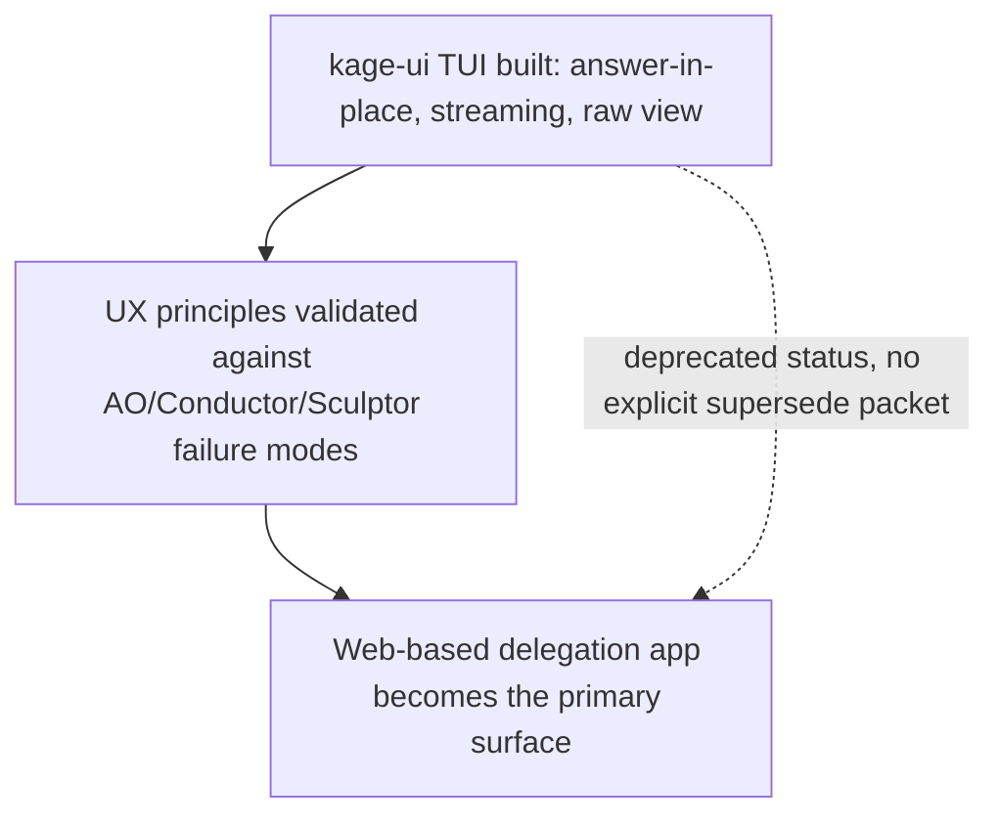

# Desktop Shell Packaging and Delegation App Interaction Surface

**Confidence:** firm for the Electron packaging and auto-update mechanics (documented through direct build/runtime gotchas); provisional for the interaction-surface strategy and delegation-app UX findings — the TUI-to-web-app transition is inferred from status metadata rather than a directly stated supersession, and the most recent UX work (the manager-reply-redaction fix) was halted on budget before landing.

Kage ships as a desktop app on top of a deliberately tiny Electron shell. `shell/main.js` is a ~140 line, zero-HTML, zero-renderer-logic Electron main process that reuses `kage app --no-open` to find/heal/start the daemon and loads its `/app` page in a sandboxed `BrowserWindow`. Two mechanics here are non-obvious: spawning a CLI child process from the Electron main process needs `ELECTRON_RUN_AS_NODE=1` set on the child, because without it `process.execPath` resolves to the Electron binary itself and launches a second full app instance that hangs instead of running the CLI; and the dock badge needs no IPC channel at all — it rides on `document.title` and the shell's `page-title-updated` listener, since that's the one channel a sandboxed page and its shell already share without extra wiring. Packaging with electron-builder required two more non-obvious facts, discovered together in the same auto-update work: a custom `files` array in the builder config must explicitly list `node_modules/**/*` to bundle a runtime dependency into the package (electron-builder still correctly prunes `devDependencies` automatically even under a wholesale glob, so listing `node_modules/**/*` broadly is safe); and `extraMetadata` in `electron-builder.config.js` merges directly into the packaged app's `package.json` at build time — which is how the auto-updater learns at runtime whether Squirrel.Mac can actually install an update versus must degrade to notify-only, without duplicating build-time signing-detection logic in a second place. On the release-channel side, `shell/update.js`'s `CHECK_INTERVAL_MS` constant (`4 * 60 * 60 * 1000`) is the single ground-truth source for the "checks every 4 hours" claim repeated across `shell/README.md`, `docs/releases.html`, and the root `README.md`, so that constant and those three docs can silently drift apart if only one is edited when the interval changes. First-run onboarding for a user who downloaded the `.dmg` before ever running the npm installer mirrors `resolveCli`'s login-shell-command-v technique: `shell/bootstrap.js` detects the missing `kage` CLI *before* attempting to spawn it, and offers a native-dialog-consented install (`npx -y @kage-core/kage-graph-mcp install`) rather than surfacing a bare spawn error.

Underneath the desktop packaging sits a real, only-partially-documented pivot in interaction-surface strategy. A full dependency-free terminal UI (`kage ui`, with a deliberately testable pure-reducer-core-plus-thin-imperative-shell architecture, ANSI rendering, and hard-won rules like text-entry modes swallowing printable keys before global shortcuts) was built as the delegation interaction surface, adopting patterns studied from AO/Conductor/Sculptor/Claude Code — answer-in-place on a waiting agent, live event streaming instead of a blank pane, and a genuine unfiltered "raw" transcript view, on the belief that a context-switch to reply is what causes users to abandon a manager for raw tmux. That TUI packet is itself marked deprecated in its own freshness metadata, consistent with a web-based delegation app (`app-client.ts`, served through the desktop shell above) having become the primary interaction surface instead — but no packet in this evidence explicitly states the TUI was superseded, so the transition is inferred from status metadata rather than a direct statement. The UX principles the TUI established (answer-in-place, streaming, raw view, never hide completeness) outlived the terminal implementation that first proved them and now govern the web app.

Dogfooding the web delegation app against Agent Orchestrator directly, rather than against a feature checklist, surfaced concrete UX debt that got fixed incrementally, on top of a headless manager loop that was proven to work end-to-end before this UX work began — a non-interactive `claude` session calling `kage_room_state`, `kage_compile_brief`, and `kage_dispatch` in the order its constitution specifies, at a measured cost of 13-25 seconds and $0.15-0.22 per manager turn on a small repo, with one honest gap noted at the time: the manager restated claim-card numbers in its prose despite being explicitly told not to. A timed comparison found the Room's chat path took ~17 seconds to answer because every message cost a full manager LLM turn, against 0.1 seconds for a direct dispatch call — a 170x gap between the product's front door and its own fast path — fixed with a two-speed composer (Enter asks the manager, Cmd-Enter dispatches immediately). The same investigation found the Room composer's Agent/Type/Mode pickers were partly decorative: `composerPrefs` was read only by a modal's fallback path, never by the actual send path, so a user's picked agent was silently ignored; the unread Mode picker was removed outright rather than left lying, on the stated principle that a decorative control is worse than none in a product about trust. A separate collapse of three redundant run-list views (Inbox/Runs/Board) into one Work surface — because each of the three exposed a different, inconsistent subset of powers over the same underlying runs — immediately exposed a real kernel bug the split had been hiding: `ownership()` mapped `stopped` runs to `"working"`, so no single surface actually owned them (Inbox never listed them, Runs filed them under Working, Board filed them under Lost); the general lesson recorded is that unifying redundant views is a bug-finding act, not just a UX one. A separate rejected delegated-run attempt targeted the manager's reply-redaction system, which blindly censored every number matching a claim-verdict pattern regardless of whether the manager had stated it correctly — including a word-boundary bug that mangled "hand-verified" into "hand-[verdict on the card]" — on the grounds that a text censor with no access to ground truth punishes correct reporting exactly as hard as fabrication; that specific fix was itself halted on budget before landing, though the underlying diagnosis was verified correct by hand. Smaller discoverability and workflow gaps were also found and closed: CLI help text had drifted so far that the flagship `kage app` command wasn't listed among 12 advertised commands (115 were implemented, 32 documented), now gated by a test that fails if an advertised command has no implementation or a flagship one goes missing; and the project sidebar's "+" button had no CLI-side equivalent for registering a project until `kage projects add` was added.

Finally, a mid-August owner decision repositioned Kage as leading with an *orchestrator* framing (see the companion release/positioning belief doc for the full strategic arc), made the same day a direct measurement showed zero goal-management tools existed anywhere on the manager's MCP surface even though the manager's own prompt already instructed it to decompose work into waves. An independent audit confirmed the gap was structural, not superficial: the Goals feature captures a plan and renders it, but nothing drives a goal forward — `transitionGoal` has exactly one caller (`abandonGoal`), so a goal is born "planning" and its only exit is a user clicking Abandon; attached runs are filed into a wave without ever transitioning the goal's state; the manager has no tool to create a goal, read its status, or mark a wave complete; and auto-attach defaults every run with no explicit wave index to the *last* wave, so in any real multi-wave plan the first wave stays permanently empty while the displayed "wave N of M" progress is simply wrong. This audit was itself corrected once — an earlier read claimed zero runs were attached to two real goals, which was wrong; the runs were attached, just recorded under `plan.waves[].run_ids` rather than the top-level field the first check read — a small but concrete example of memory needing its own correction cycle even within a single audit.

## Supporting evidence

- `.agent_memory/packets/decision-kage-desktop-shell-zero-html-electron-frame-electron-run-as-node-for-cli-childre-a51a4b7e.md` — the zero-HTML Electron shell architecture, `ELECTRON_RUN_AS_NODE`, and the dock-badge-via-`document.title` mechanism.
- `.agent_memory/packets/decision-electron-builders-custom-files-array-must-explicitly-list-node-modules-to-bun-1e3afaec.md` — the `files` array packaging gotcha (must list `node_modules/**/*` explicitly).
- `.agent_memory/packets/decision-extrametadata-in-electron-builder-config-js-merges-into-the-packaged-package-jso-55aa7e92.md` — the `extraMetadata` merge-into-packaged-`package.json` mechanism, used by the auto-updater.
- `.agent_memory/packets/decision-shell-update-jss-check-interval-ms-4-60-60-1000-is-the-ground-truth-for-the-c-e7878643.md` — the single-source-of-truth constant for the "every 4 hours" auto-update claim, and its drift risk across three docs.
- `.agent_memory/packets/decision-shell-bootstrap-js-mirrors-resolvecli-s-login-shell-command-v-technique-as-its-o-b5067d9c.md` — the dmg-first onboarding flow's missing-CLI detection and consent-gated install.
- `.agent_memory/packets/decision-kage-ui-dependency-free-tui-with-a-pure-render-reducer-core-5d16b8f2.md` — the `kage ui` TUI's testable pure-reducer architecture and hard-won interaction rules.
- `.agent_memory/packets/decision-answer-in-place-streaming-and-a-genuine-raw-view-close-the-orchestrator-ux-gap-f80f5743.md` — the answer-in-place/streaming/raw-view UX research and rationale, evidenced from competitor teardown of a manager tool users abandoned.
- `.agent_memory/packets/runbook-the-manager-loop-works-headlessly-ask-pane-and-judgment-recording-proven-live-00cfd6f6.md` — the headless manager loop proof, its measured per-turn cost, and the noted card-number-restating gap.
- `.agent_memory/packets/decision-the-manager-tax-17s-vs-0-1s-and-the-two-speed-composer-lying-controls-removed-0d51b076.md` — the 17s-vs-0.1s measurement, the two-speed composer fix, and the decorative-Mode-picker removal.
- `.agent_memory/packets/decision-work-is-the-one-run-surface-powers-attach-to-the-run-and-collapsing-the-doors-ex-b680d43c.md` — the three-views-to-one-Work-surface collapse and the `ownership()` bug it exposed.
- `.agent_memory/packets/negative_result-rejected-approach-the-managers-replies-are-unreadable-replace-blind-redaction-wi-611dd316.md` — the rejected manager-reply-redaction fix, halted on budget but diagnosed correctly.
- `.agent_memory/packets/gotcha-help-drifted-until-the-flagship-command-was-undiscoverable-now-gated-9f49dfdb.md` — the CLI help-drift finding and its new discoverability test gate.
- `.agent_memory/packets/decision-the-sidebars-rememberproject-readknownprojects-registry-kage-projects-json-previ-4f2577bf.md` — the missing CLI-side project-registration path, closed by `kage projects add`.
- `.agent_memory/packets/decision-positioning-decision-kage-is-an-orchestrator-that-manages-your-work-memory-comes-fc177fde.md` — the August orchestrator-first positioning call that triggered the Goals audit below (full strategic context in the companion release/positioning belief doc).
- `.agent_memory/packets/gotcha-the-goals-orchestrator-plans-and-displays-but-never-executes-no-state-advance-no-7ea8c2a4.md` — the independent audit confirming Goals is a shell, including its own self-correction about run attachment.

## Contradictions / open questions

- The `kage-ui` TUI packet is marked `deprecated` in its own freshness metadata, and other evidence describes a web-based delegation app (`app-client.ts`) as the live interaction surface — but no packet in this evidence explicitly states the TUI was superseded, so the transition is inferred from status metadata rather than a direct statement.
- The August orchestrator-first positioning decision (see companion release/positioning belief doc) asserts Kage should compete with AO/Conductor on "running a real workday of parallel agent work," while the same-day audit here shows the goal-execution engine underneath that claim cannot advance a goal's state at all — the positioning and the audited capability are in direct tension, and this evidence set does not show which one changed first to resolve it, or whether it has been resolved.
- The Goals-orchestrator audit packet itself contains a documented self-correction (an earlier claim of "0 runs attached" was wrong; runs were attached but under a different field) — worth remembering this specific audit needed its own correction cycle.
- The rejected manager-reply-redaction fix was diagnosed correctly (verified by hand) but halted on budget before landing — the underlying "blind text censor punishes correct reporting as hard as fabrication" problem is therefore still open in the live product, not resolved.

## Causality



```mermaid
graph TD
  A[Owner decision: Kage leads as an orchestrator] --> B[Same-day measurement: zero goal tools on manager's MCP surface]
  B --> C[Independent audit: Goals feature has no state-advance path]
  C --> D[transitionGoal has one caller (abandonGoal); manager cannot create/advance a goal; auto-attach files runs into the last wave]
```
