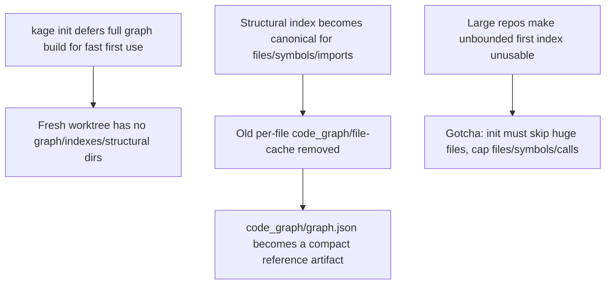

# Code Graph Construction and Scale

**Confidence:** firm — this is a coherent, chronologically consistent build-out of one subsystem (`kernel.ts`'s code graph pipeline) with an explicit, evidenced supersession inside the evidence itself, though later kernel.ts changes are not re-verified here.

Kage's code graph is generated, not committed, and its construction went through a deliberate architectural settling: the structural index (`.agent_memory/structural`) is now the single canonical source for files, symbols, and imports, and `buildCodeGraph` derives richer bounded facts (calls, routes, tests, packages) on top of it instead of running its own separate, capped per-file extraction pass — this removed an old 2000-file cap on what counted as "in" the code graph. That canonical role replaced an earlier design: a per-file fact cache under `.agent_memory/code_graph/file-cache` keyed by content hash, which reused unchanged files' metadata/symbols/imports across runs while still rebuilding global call edges (an internal performance layer, explicitly not durable memory). One day later, once the structural index became canonical, that exact file-cache implementation — along with `codeIndexSelection`, `KAGE_MAX_CODE_GRAPH_FILES`/`_SYMBOLS`, and `codeGraphStatFingerprint` — was removed outright; `.agent_memory/code_graph/graph.json` is now kept only as a compact compatibility artifact that *references* structural data rather than duplicating it, cutting a 20k-file repo's `.agent_memory` footprint from 150M to 59M. Performance at scale is handled at multiple layers: structural indexing itself parallelizes per-file extraction across worker threads once file count crosses a configurable threshold (`KAGE_STRUCTURAL_WORKERS`, `KAGE_STRUCTURAL_PARALLEL_MIN_FILES`), with workers writing batch results to temp files the parent merges deterministically, while the public `buildStructuralIndex` API stays synchronous for callers. `kage refresh` persists a cheap stat fingerprint for selected code-graph inputs and reuses the current graph outright when that fingerprint is unchanged, avoiding rereading/rehashing every source file on a large unchanged repo (with `--full` / `full: true` available to force a real rebuild); refresh also reuses the graph *objects* already produced during indexing and reports only lightweight metrics, deliberately leaving expensive quality/benchmark computation to explicit `metrics`/`benchmark` commands so it isn't multiplied on every refresh. Read-only commands (recall, etc.) follow the same discipline: they load current graph artifacts, keep an in-process cache for the life of an MCP session, and avoid rewriting indexes unless inputs are missing or stale, precomputing graph lookup maps once per query rather than rescanning entities/edges per packet. Freshness itself is content-based rather than git-HEAD-based — hashes of source files, approved packets, and code-index inputs decide whether `kage pr check` demands another refresh, so push-only operations and empty/same-tree commits don't force one. `kage init` deliberately skips building the full code/knowledge graph at all (packet-only bootstrap) so first use stays fast, deferring real graph construction to `index`/`refresh`/normal recall — which is why a freshly built, never-refreshed worktree genuinely has no `.agent_memory/graph`, `indexes`, or `structural` directories, a fact test suites must account for. Because an unbounded first index can make `kage init` unusable on a large repo, generation is explicitly bounded: large source files and generated/vendor/cache directories are skipped, files/symbols/calls are capped, and call callers resolve only against same-file symbols rather than the whole repo symbol set. Real benchmarking (synthetic 5.5k and 20k file repos) reached 100% structural coverage but surfaced two further bugs: read-only code-graph queries were trusting a stale structural manifest after source edits (fixed by checking `currentStructuralFingerprint` on read), and natural-language code queries could rank generic "Worker"-type symbols above exact identifier matches because a substring boost matched loosely (fixed with exact/token identifier score boosts). Separately, structural indexing was hardened for real monorepo conditions unrelated to scale: it now skips symlinks/unreadable paths instead of crashing on a broken symlink, and diff/propose/branch-overlay normalize git-status paths to project-relative when run from inside a package subdirectory. The code graph is mostly *not* exposed to agents directly: the standalone `kage_code_graph` MCP tool was deleted from the default agent-facing surface after an agent-trajectory eval showed agents never chose it (answering "who calls X" with grep instead) and `kage_context` already surfaces caller/dependency-path/risk context from the same graph — the underlying `queryCodeGraph`/`buildCodeGraph` kernel functions remain, still used by `kage_context` and the `kage code-graph` CLI command. `kage_context` was itself deliberately widened to be the one target-aware entry point: instead of an agent chaining separate risk and dependency-path lookups, `kage_context` folds those signals into one call keyed off the files it's about to touch, which is the same design instinct that motivated deleting the standalone graph tool — agents get repo intelligence through their existing recall call, not a second tool they have to remember exists.

Two more command-surface features sit on top of the same code graph and inherit its bounding discipline. `kage code-index` prefers an external SCIP path when `scip-typescript` is installed (richer, cross-file-resolved symbols) and falls back to the built-in LSP-compatible symbol index when it isn't, so indexing quality scales with what's actually installed rather than forcing a dependency. `kage dependency-path` has to resolve TypeScript/JS import specifiers the way the language actually writes them — `./kernel.js` in source must resolve back to `kernel.ts` on disk — and its structural cache keys are versioned so a parser improvement doesn't get silently hidden behind stale cached facts from before the improvement landed. Downstream of extraction, a conservative `kage cleanup-candidates` feature was captured twice in this packet set under different ids (`bb3314f5` and `42a15f10`) with the same substance: candidates surface only when there is real absence evidence — an exported symbol is skipped unless the same file has at least one other named export that *is* imported elsewhere, anything imported/called/route-registered/test-covered is excluded outright, and internal-symbol candidates are limited to underscore-prefixed helpers — and the feature is explicitly review-input only, never an auto-delete.

Indexing large repos stays bounded but honest about incompleteness, extending the same discipline that governs `kage init`: a source file over the per-run size/count limit is recorded as `deferred` in `.agent_memory/code_graph/index-manifest.json` rather than silently dropped, and the resulting metrics expose `index_status`, `indexed_files`, `deferred_files`, `ignored_files`, and `coverage` so a caller can tell complete coverage from partial — only generated/vendor/cache files and genuinely unsupported types are silently ignored, and even those get a summary count rather than vanishing untracked.

## Supporting evidence

- `.agent_memory/packets/decision-structural-index-is-canonical-for-code-graph-facts-31b27246.md` — structural index becomes the canonical source; old capped extraction path removed.
- `.agent_memory/packets/decision-structural-index-is-the-only-active-code-graph-file-selector-e0f97c47.md` — old quick-selection/file-cache path and its env vars removed; supersedes the per-file cache design below.
- `.agent_memory/packets/decision-code-graph-reuses-per-file-facts-by-content-hash-7852a235.md` — the earlier per-file content-hash cache design, later superseded.
- `.agent_memory/packets/decision-generated-graph-artifacts-use-compact-references-4c4fb191.md` — code_graph/graph.json becomes a compact compatibility artifact; 150M→59M footprint reduction on a 20k-file repo.
- `.agent_memory/packets/decision-structural-index-uses-parallel-workers-on-large-repos-a5979354.md` — worker-thread parallelization above a file-count threshold.
- `.agent_memory/packets/decision-refresh-reuses-unchanged-code-graph-by-stat-fingerprint-4047c167.md` — stat-fingerprint-based reuse to avoid rereading unchanged large repos.
- `.agent_memory/packets/decision-refresh-full-mode-bypasses-unchanged-graph-reuse-2515f229.md` — `--full`/`full: true` escape hatch to force a rebuild.
- `.agent_memory/packets/decision-refresh-reuses-graph-builds-and-stays-lightweight-5883bd12.md` — refresh reuses indexing's graph objects and defers heavy metrics to explicit commands.
- `.agent_memory/packets/decision-read-only-commands-reuse-current-graph-artifacts-5f996184.md` — recall/read-only commands cache graphs in-process and precompute lookup maps.
- `.agent_memory/packets/decision-graph-freshness-is-content-based-646b2446.md` — content-hash freshness instead of requiring HEAD match.
- `.agent_memory/packets/decision-init-uses-packet-only-bootstrap-refresh-builds-full-graphs-f899117a.md` — `kage init` skips full graph construction for speed.
- `.agent_memory/packets/decision-this-worktree-built-from-commit-bf4753f-has-no-agent-memory-graph-agent-memory-i-08ea2c3a.md` — observed consequence: an un-refreshed worktree has no graph/indexes/structural directories at all.
- `.agent_memory/packets/gotcha-gotcha-init-must-bound-generated-code-graph-size-ac6784e9.md` — bounding rules needed to keep first-run indexing usable on large repos.
- `.agent_memory/packets/bug_fix-large-repo-benchmark-exposed-stale-read-and-exact-symbol-ranking-fixes-32327205.md` — 5.5k/20k benchmark results plus stale-manifest-read and identifier-ranking fixes.
- `.agent_memory/packets/bug_fix-fix-vercel-ai-large-repo-edge-cases-28fed3d4.md` — symlink/monorepo path-normalization hardening for structural indexing.
- `.agent_memory/packets/decision-agent-mcp-surface-is-eval-driven-core-11-kage-code-graph-deleted-337d02ef.md` — `kage_code_graph` tool deleted from the agent surface; kernel functions remain in use elsewhere.
- `.agent_memory/packets/decision-kage-context-should-surface-target-aware-repo-intelligence-e6d25a8a.md` — `kage_context` folds risk/dependency-path signals into one call for target-aware queries, the same instinct behind deleting the standalone graph tool.
- `.agent_memory/packets/decision-code-index-prefers-scip-with-lsp-fallback-53ef952e.md` — `kage code-index` prefers an installed `scip-typescript` over the built-in LSP-compatible fallback.
- `.agent_memory/packets/decision-dependency-path-must-handle-typescript-js-specifiers-b6335c45.md` — `kage dependency-path` resolves `.js` import specifiers to `.ts` source files; structural cache keys are versioned against stale parser-era facts.
- `.agent_memory/packets/decision-cleanup-candidates-are-conservative-review-input-bb3314f5.md` and `.agent_memory/packets/decision-symbol-level-cleanup-candidates-stay-conservative-42a15f10.md` — near-duplicate captures of the same `kage cleanup-candidates` design (absence-evidence gating, review-only, never auto-delete).
- `.agent_memory/packets/decision-quick-code-indexing-defers-source-files-instead-of-silently-skipping-them-52888287.md` — deferred-not-skipped bookkeeping in `index-manifest.json` and the `index_status`/`indexed_files`/`deferred_files`/`ignored_files`/`coverage` metrics fields.

## Contradictions / open questions

- Direct evolution, not a live contradiction: `decision-code-graph-reuses-per-file-facts-by-content-hash` (approved 2026-05-08) describes a per-file cache under `.agent_memory/code_graph/file-cache` as the design; `decision-structural-index-is-the-only-active-code-graph-file-selector` (approved 2026-05-09, one day later) states that exact implementation was removed once the structural index took over as canonical. The later packet reflects current behavior; the earlier one is historical only and should not be treated as still-accurate without re-verification.

## Causality

