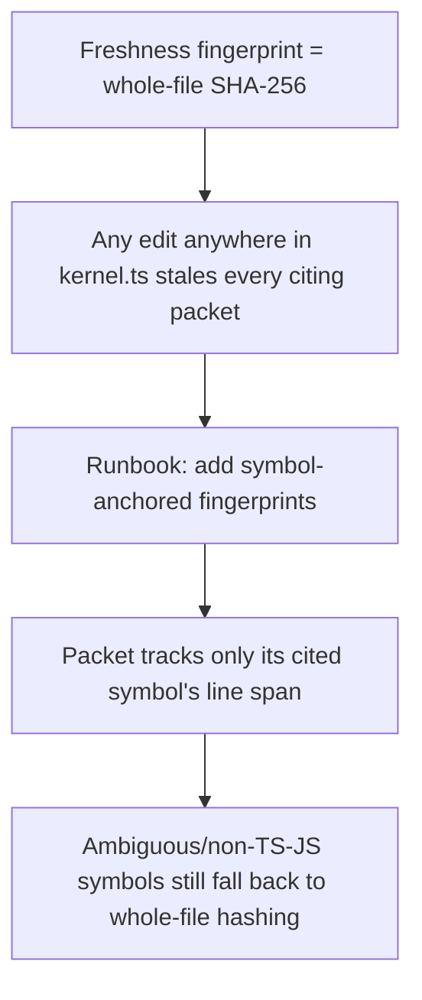

# Memory-Code Linkage and Freshness Fingerprinting

**Confidence:** firm — the fingerprinting and citation model is internally consistent and each step is evidenced, but the model's own self-check caught one of its cited packets going stale, which is worth reading as a live demonstration rather than a flaw.

A memory packet is only as trustworthy as Kage's ability to tell when the code it cites has drifted, and that machinery was built up in distinct, separable layers rather than one design. The earliest layer is parsing: inline structured memory fields (Fact/Why/Trigger/Action/Verified by/Risk) were originally parsed by scanning to the next period, which truncated verification commands containing dotted paths like `mcp/dist/cli.js`; this was fixed to parse up to the next *known label* instead, and explicit "Decision" wording was made to win over generic Why/Rationale classification so decision-shaped memories aren't misclassified. On top of parsing sits admission and staleness policy, which are deliberately two separate concerns: citation validation — whether a cited path/fact is real — is enforced only at the agent boundary (the `kage_capture`/`kage_learn` tools and CLI, via `strictCitations: true`), not inside core `capture()`, so programmatic callers and migrations stay permissive (`allow_missing_paths` is the intentional escape hatch); recall-time staleness is a different question entirely, answered by `recallHardStaleReason()`, which excludes a packet only when its *stored* path fingerprints (paths that existed at capture time) are later deleted, past TTL, or explicitly reported stale — a citation that was never grounded in the first place is caught at write time, not flagged as staleness later. Freshness fingerprinting itself then went through its own refinement: it started as whole-file SHA-256, so any edit anywhere in a large file like `kernel.ts` marked *every* packet citing that file as content-stale regardless of relevance; this was replaced with symbol-anchored fingerprints, where a packet can track just the hash of a named symbol's line span instead, falling back to whole-file hashing only when a symbol name is ambiguous (resolves to more than one span) or the file isn't TS/JS — legacy packets without symbol data keep whole-file staleness until they're reverified. Even with better fingerprinting, staleness *mechanisms* and staleness *causes* can drift apart: fixing how git-porcelain paths are parsed for changed-file risk reports (preserving `mcp/cli.ts` rather than truncating to `cp/cli.ts`) did not change how linked-code memory reconciliation actually decides staleness — that still runs on source-hash fingerprint drift for packets tied to changed files, so a packet tied to `mcp/kernel.ts` can still be marked stale by `kage refresh` independent of any path-parsing fix, and agents are expected to update or supersede such memory before PR handoff rather than assume a parser fix already covered it. The same path-parsing fix confirmed, separately, that public-source skip lists (which paths get treated as external/generated and skipped from close examination) intentionally stay generic, with no external-tool-specific names reintroduced. Underpinning all of this is a trust-scoring safeguard at the audit layer: because a dense memory-code knowledge-graph can make a repository *look* well-covered even when its approved packets lack real rationale, verification, or stale conditions, `kage audit`'s trust score deliberately caps memory-code edge scoring by the count of approved packets rather than letting graph density alone imply trust, and rewards packets with explicit Fact/Why/Action/Verified-by/Stale-when structure.

## Supporting evidence

- `.agent_memory/packets/bug_fix-structured-memory-parser-must-preserve-dotted-commands-and-explicit-decisions-df89d93d.md` — inline field parsing fixed to stop at known labels, not periods; explicit Decision wording wins classification.
- `.agent_memory/packets/decision-citation-validation-enforced-at-agent-boundary-stale-exclusion-is-fingerprint-ba-c575beee.md` — citation validation at the agent boundary vs. fingerprint-based recall-time staleness as two separate mechanisms.
- `.agent_memory/packets/runbook-freshness-fingerprints-anchor-to-named-symbols-not-just-whole-file-hash-a20a3a22.md` — symbol-anchored fingerprints replacing whole-file SHA-256 to avoid over-broad staleness.
- `.agent_memory/packets/bug_fix-linked-code-reconciliation-still-uses-source-fingerprints-after-risk-path-parser-24204434.md` — the path-parsing fix did not change the underlying source-fingerprint staleness model for linked-code memory.
- `.agent_memory/packets/decision-public-source-skip-lists-remain-generic-after-risk-path-parser-fix-921fd297.md` — confirms public-source skip lists stayed generic through the same path-parsing fix.
- `.agent_memory/packets/decision-audit-trust-scoring-must-not-let-dense-graph-edges-mask-missing-context-6f292d5f.md` — trust-score cap on memory-code edge density; rewards explicit structured fields.

## Contradictions / open questions

- Self-referential rather than a true factual conflict: `decision-citation-validation-enforced-at-agent-boundary...` is itself now flagged `stale: true` in its own freshness metadata, with the reason "linked path changed since memory was verified: mcp/kernel.ts" and status `deprecated` — i.e., the exact source-fingerprint staleness mechanism this packet describes has since caught the packet itself. This is worth treating as a live example of the system working as designed, not as evidence the described mechanism is wrong, but the packet's specific claims about current `mcp/kernel.ts` behavior should be re-verified against the live source before being relied on.

## Causality

