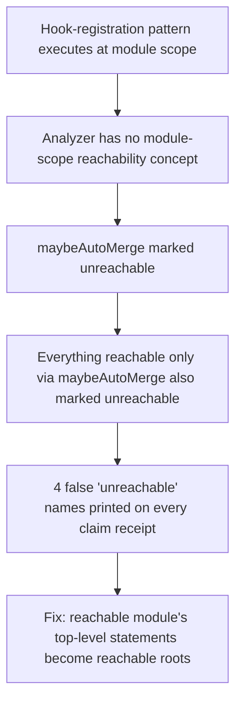

# Reachability Checker Parser Edge Cases

**Confidence:** firm — the fixes are measured against real repo files with explicit before/after false-positive counts, but the checker was still being actively tuned (one rule's fate left open) when this evidence was captured.

`mcp/delegation/reachability.ts` is a lightweight, line/regex-based static reachability analyzer distinct from the main code graph (`kernel.ts`'s `buildCodeGraph`/structural index) — it scans only the delegation source tree to catch orphaned exports and one-sided (write-only) fields, and prints its findings as an advisory line on every agent claim receipt. Because it runs on every receipt, its own authors treated precision as existential: an advisory check that is wrong most of the time gets ignored, and an ignored check is worse than no check because it still occupies a receipt line and implies coverage that isn't there. Across several sessions on 2026-08-18–20 the checker accumulated a run of real parser bugs, each found by measuring false-positive rates against actual files rather than assumed correct. First, a **module-scope reachability blind spot**: the analyzer had no concept of module-level reachability — a bare top-level statement (not matching any declaration pattern) left every line inside it, including nested callbacks, with no scope owner, so calls registered inside a module-scope hook-registration pattern (e.g. `onRunTransition(callback)`) were marked unreachable even though the module executes on import. This produced a textbook cascade: one missing rule (`maybeAutoMerge` marked unreachable) transitively marked everything reachable only through it (`autonomyGateForType`, then `AUTO_MERGE_MIN_VERIFIED_RATE`) unreachable too — one bug, four wrong names on every receipt. It was fixed by treating top-level executable statements of a reachable module as reachable roots generally, not by special-casing the one hook name. Second, a **declaration-header-line skip** used to blank out an entire line as "the declaration's own header," which discarded legitimate same-line references in one-line declarations like `export type RunState = (typeof RUN_STATES)[number];` (the `RUN_STATES` reference was thrown away along with the `RunState` self-reference); fixed by anchoring the skip to the declared name's exact column via the regex `d`/`hasIndices` flag instead of the whole line. Third, `stripForBraceCounting` **paired backticks naively** (1st-with-2nd, 3rd-with-4th), which mis-parsed a template literal containing a nested template literal inside one of its `${...}` substitutions (a ternary of two backtick strings) — this silently erased real code and could desync brace-depth counting enough to prematurely close an enclosing function's scope, turning every later reference in that function into a false "unreachable." Fourth, the **`WRITE_COLON_LITERAL` regex** (`\bname\s*:`) matched a ternary's colon (`cond ? .name : other`) identically to an object-literal write, causing fields that were only ever read inside a conditional to be reported as write-only (dead); fixed with a `(?<!\.)` lookbehind, since real object-literal writes are never preceded by dot-access while ternary property-reads always are. Finally, an **import-graph resolution** was added (`ParsedFile.importedFiles`, `resolveImportSpecifier`) that mirrors the pre-existing `resolveRootFiles` dist-to-src (`.js`→`.ts`) convention — meaning that convention now has two call sites that must be kept in sync if the project's NodeNext compile strategy ever changes.

## Supporting evidence

- `.agent_memory/packets/bug_fix-reachability-tss-analyze-previously-had-no-concept-of-module-level-reachability--258007c4.md` — the module-scope reachability blind spot and its cascading false-positive chain.
- `.agent_memory/packets/bug_fix-the-import-graph-resolution-added-to-reachability-ts-parsedfile-importedfiles-re-2d586c68.md` — companion import-graph resolution added in the same session, reusing the dist-to-src convention.
- `.agent_memory/packets/bug_fix-reachability-tss-declaration-header-line-skip-used-to-be-a-set-string-of-file-426fafdf.md` — declaration-header-line skip anchored to column, not whole line.
- `.agent_memory/packets/bug_fix-reachability-tss-stripforbracecounting-had-a-real-bug-pairing-backticks-naively--5e0fc641.md` — nested-template-literal backtick-pairing bug in brace counting.
- `.agent_memory/packets/bug_fix-reachability-tss-write-colon-literal-regex-bname-s-matched-a-ternary-conditio-3a3f5c45.md` — ternary-colon vs. object-literal-write regex fix.

## Contradictions / open questions

- The declaration-header-line and brace-counting fixes (both from the 2026-08-18 12:08 session) are marked `deprecated` status in their packet metadata as of a later batch update, while the module-scope and import-graph fixes (2026-08-18 16:45) and the colon-literal fix (2026-08-18 19:45) remain `approved`. Nothing in the cited evidence explains why the earlier two were deprecated — it may be an unrelated bulk status sweep rather than a reversal of the fix itself, but this should be re-verified against the current source before relying on it.
- The colon-literal packet leaves open whether "Rule B" (the one-sided read/write field check) should be scoped to the run's own diff, have its read/write detection improved, or be cut entirely if precision can't be sustained — no later packet in this set confirms which path was taken.

## Causality

