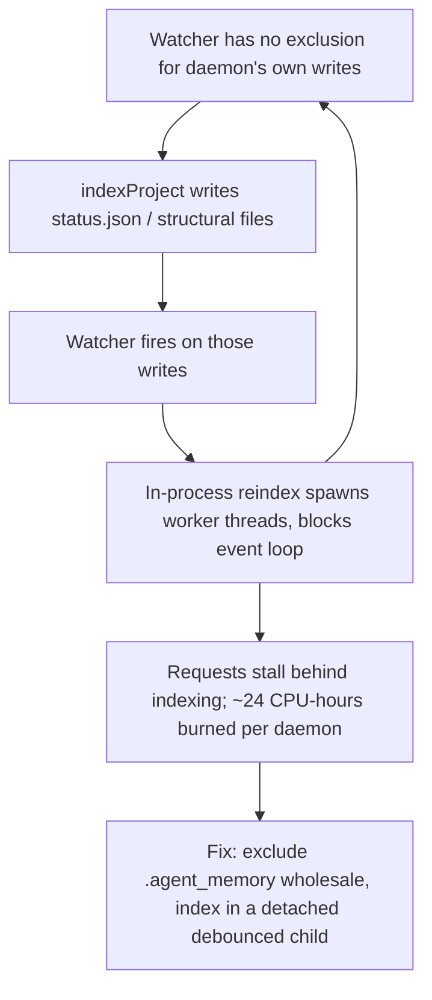

# Daemon Startup, Port Honesty, and Not Blocking the Serving Thread

**Confidence:** firm — every packet in this cluster is `approved`/`verified` with measured before/after evidence, and the fixes address distinct, non-overlapping bugs rather than restating one fact.

Kage's local daemon (`mcp/daemon.ts`) has repeatedly needed the same kind of discipline applied to different corners: whatever the daemon tells the outside world about itself — its port, its allowed origins, its liveness — has to be computed from what actually happened, not from what was requested or assumed. The clearest instance is port resolution: `ensureAppDaemon`'s old default parameter silently resolved every no-args call (including the real project-switch path) to the same fixed port the caller's own daemon already held, so a fresh daemon died on `EADDRINUSE` and the switch timed out; the fix is to request an ephemeral port (`--port 0`) when starting fresh, and to make `startDaemon` read the *actual* bound port from `server.address()` inside the `listen()` success callback and thread that real port into everything downstream — the `status.json` file other processes poll, the guard's allowed-origins list (previously computed from the requested port *before* `listen()` ran, which would have wedged on 0 forever), the self-warm fetches, and the printed URL. The daemon's authenticated-but-loopback-only REST server extends this discipline to identity and security, and the security model itself deserves stating plainly because it was built from a real attack-surface walkthrough, not assumed: binding to `127.0.0.1` is not by itself a security boundary — a browser on the same machine can send a cross-site POST to a localhost port with no CORS permission needed (CORS gates *reading* the response, not sending the request), and DNS rebinding resolves an attacker-controlled hostname to loopback so the packet genuinely arrives locally even though the browser thinks it's talking to another site. Before any run-control route could safely exist, the daemon had eight unauthenticated POST routes, so the guard in `mcp/delegation/guard.ts` was built as a pure, server-independent function that (1) refuses any request whose `Host` header is not loopback, which is specifically what catches rebinding; (2) refuses a foreign `Origin` while allowing a missing one, since curl, the CLI, and the desktop shell all send none; and (3) requires a token, constant-time-compared, on every method other than GET/HEAD/OPTIONS. That token regenerates on every daemon start by design (nothing should trust it across restarts) and is written beside the status file with mode 600, because a credential that outlives its process is one nobody is tracking — a live rebinding attempt can't even be simulated with `node fetch` since `Host` is a forbidden header name there, so that case is proven by unit test rather than a live run. A LAN-pairing secret needs the opposite property from the mutation token — persisted and reused so a paired phone isn't locked out every restart — which only holds because the two secrets are generated and stored through genuinely different code paths (`provisionDaemonToken` vs. `provisionPairingSecret`). That same guard was later extended, not replaced, to support an opt-in LAN mode (letting a phone reach the daemon the way it reaches AO's mobile pairing): `GuardContext` is a plain interface untouched by any off-limits file, so adding optional `lanHosts`/`lanToken` fields was a safe, additive change against the existing Origin/Host/token tests, which were required to keep passing in spirit rather than being loosened. The other half of "the daemon must stay honest and responsive" is not blocking its own event loop: a file watcher that triggers re-indexing on any repo change had an incomplete exclusion list, so the daemon's own index writes (and even its own `status.json` rewrites) retriggered the watcher, producing an index→write→event→index loop roughly every 4 seconds that burned ~24 CPU-hours per long-lived daemon and stalled requests behind synchronous, worker-thread-heavy indexing. The fix was not "index faster" but "get the work off the serving thread and out of its own blast radius": exclude `.agent_memory` wholesale from the watcher, run indexing as a detached child process invoked at boot and on refresh, debounce, and only stamp `last_indexed_at` when the child actually completes. A related, smaller instance of the same "measure spawns, don't assume" discipline: showing packet provenance was spawning one `git log` per packet (299 spawns, 12.4s) until it was collapsed into a single scoped `git log --name-only` walk, cached by a cheap mtime+count fingerprint — the lesson generalizes: process spawn count, not algorithmic complexity, is usually what makes CLI/daemon tooling feel slow, so measure spawns before optimizing anything else.

## Supporting evidence

- `.agent_memory/packets/bug_fix-ensureappdaemons-old-default-parameter-portoroptions-default-app-port-meant-ever-6e921d94.md` — root-causes the project-switch hang: the default-parameter port always resolved to the current daemon's own port, causing `EADDRINUSE` on the child.
- `.agent_memory/packets/bug_fix-startdaemon-in-mcp-daemon-ts-computed-loopbackorigins-restport-and-wrote-status--4fa836c9.md` — the companion fix: `restPort` becomes a `let`, reassigned from `server.address()` inside the `listen()` callback, and every downstream use (status.json, guard origins, self-warm fetches, printed URL) picks up the real port via closure.
- `.agent_memory/packets/bug_fix-daemon-status-json-written-by-daemon-tss-startdaemon-at-agent-memory-daemon-stat-8314b854.md` — establishes `daemon/status.json` + a `process.kill(pid, 0)` check as the reliable "is a daemon actually running" pattern, reused verbatim in the CLI's `config` command rather than re-invented.
- `.agent_memory/packets/bug_fix-the-daemon-re-indexed-the-repo-every-4s-forever-a-watcher-triggered-job-must-exc-f6104c7e.md` — the self-feeding reindex loop: incomplete watcher exclusions plus in-process indexing burned ~24 CPU-hours per daemon; fixed by excluding `.agent_memory` wholesale and moving indexing into a detached, debounced child process.
- `.agent_memory/packets/decision-the-daemon-token-provisiondaemontoken-regenerates-every-daemon-start-by-design-a-6027a2b8.md` — states and preserves the deliberate asymmetry between the always-fresh daemon mutation token and the persisted, reused LAN-pairing secret, plus the security bar for exposing the daemon beyond loopback (explicit opt-in, host allowlist instead of a deleted check, secret required on every request, never logged).
- `.agent_memory/packets/bug_fix-provenance-must-be-one-git-pass-per-packet-git-log-made-the-console-13x-slower-d68ebef7.md` — the "measure spawns first" companion lesson: 299 per-packet `git log` calls (12.4s) collapsed into one scoped, mtime-fingerprint-cached pass (0.93s cold, 25ms warm).
- `.agent_memory/packets/decision-localhost-is-not-a-security-model-guard-origin-host-and-a-0600-token-ddecee65.md` — the full attack-surface rationale (CORS doesn't gate sending, DNS rebinding makes a remote packet look loopback), the three-part guard (Host/Origin/constant-time token), and the live-daemon verification (403 on cross-site POST, 401 on missing/wrong token, 200 on the real token, GET /health left open, token file mode 600).
- `.agent_memory/packets/decision-mcp-delegation-guard-tss-guardcontext-is-a-plain-interface-not-touched-by-any-of-3867ab63.md` — the later opt-in LAN-mode extension: `GuardContext` is a plain interface not constructed by `api.ts` directly, so adding `lanHosts`/`lanToken` was additive and safe against the existing Origin/Host/token tests.

## Contradictions / open questions

None found in the cited evidence — all packets remain `approved`/`verified` and describe distinct fixes with no overlapping claims; the LAN-mode guard extension is explicitly additive to, not a revision of, the original Origin/Host/token model.

## Causality

