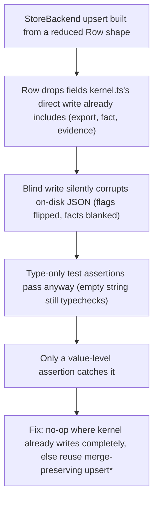

# Memory Store Backend Correctness (JSON/SQLite Port)

**Confidence:** firm — four of five packets are `approved`/`verified`, come from the same coherent M1→M3 build-out (design doc landed, then three sequential ports), and each documents a distinct, real bug caught by tests rather than a restated fact.

Kage's memory store was rebuilt (docs/design/MEMORY_STORE.md, landed August 2026) around one law: markdown packets on disk are the only source of truth, and everything under `.agent_memory/{indexes,graph,structural}` is a derived, rebuildable cache served through a `StoreBackend` seam with two implementations — a JSON backend that must stay byte-compatible with today's file layout, and an optional `node:sqlite` backend behind feature detection (absence is a normal, first-class state, never an error). Porting the existing kernel code onto that seam surfaced the same class of bug twice: the JSON backend's structural/knowledge-graph methods read and write the *same real files* that `kernel.ts` already writes directly and completely on every build, but the new `StoreBackend` methods worked from a reduced `Row` shape (e.g. `SymbolRow`/`KgEdgeRow`) that dropped fields like `export`, `fact`, and `evidence` — so a blind write from that shape silently corrupted the on-disk data (every symbol's `export` flipped false, every kg edge's `fact`/`evidence` blanked), caught only because a *value*-level test assertion happened to check real content rather than just `typeof`. The fix pattern is to either no-op when the direct kernel write already covers a file completely (append-only data with no safe merge key, like import/kg edges) or route through the existing merge-preserving `upsert*` methods that do `{...prior, ...reducedFields}` rather than defaulting missing fields. The SQLite side had its own version of the same "don't corrupt or duplicate silently" concern: a scoped vector query originally joined against `packet_paths`, which fans a single vector row out once per cited path when a packet cites multiple paths under the scope prefix — fixed by switching the join to an `EXISTS` semi-join, which can only keep or drop a candidate row, never multiply it. A third, adjacent bug came from key derivation rather than joins: the docs-FTS index keyed chunks by bare `${doc_path}#${anchor}`, which collapses when one long doc section under the same heading splits into multiple chunks — measured on this repo's own docs, 941 real chunks collapsed to 77 (one per doc) before the fix added an `#${index}` disambiguator; any future code deriving a docs-FTS id from doc_path+anchor alone needs the same discipline. The SQLite schema itself needed an explicit uniqueness fix to match JSON-backend semantics: `packet_paths` and `packet_symbols` needed `UNIQUE(packet_id, path)` / `UNIQUE(packet_id, symbol)` constraints plus `ON CONFLICT DO UPDATE`, because without them a repeat upsert of the same key silently duplicated rows in SQLite while the JSON backend — which merges into an object keyed by that same identity — stayed correct; this is the same class of cross-backend divergence as the Row-shape corruption above, just caught before it shipped rather than after. Finally, the store's phased rollout is kept honest by pairing each landed phase with two tests rather than one: a "shipped-code-and-doc-says-landed" test with per-file/per-symbol citation checks, and a separate "not-yet-built phases stay code-absent and doc-marked-not-built" test — trying to assert both directions in one test was found to be harder to read and to extend as later milestones land. The `mcp/` package's test suite (covering all of the above) is run with `npm test` from the `mcp/` directory, or `npm test --prefix mcp` from the repo root; it builds TypeScript first and then runs `node --test` over the compiled output, so a green run verifies compilation and behavior together, not just one or the other.

## Supporting evidence

- `.agent_memory/packets/decision-jsonstorebackends-structural-knowledge-graph-methods-files-json-symbols-json-imp-f462b7e1.md` — the JSON-backend corruption bug: a reduced Row shape used for a blind write dropped fields like `export`/`fact`/`evidence`; fixed by reusing merge-preserving `upsert*` methods or a deliberate no-op where the kernel's direct write already covers the file.
- `.agent_memory/packets/decision-sqlitestorebackends-queryvectorcandidates-scope-originally-used-a-join-against-p-12c7a947.md` — the SQLite vector-query fan-out bug: a JOIN against `packet_paths` multiplied rows for multi-path packets; fixed with an `EXISTS` semi-join that can only keep or drop, never multiply.
- `.agent_memory/packets/decision-mcp-store-rebuild-tss-loaddocschunks-m1-code-keyed-docs-fts-upsert-ids-as-bare-d-d849aff3.md` — the docs-FTS id collision: bare `${doc_path}#${anchor}` collapsed 941 real chunks to 77 before an `#${index}` disambiguator was added.
- `.agent_memory/packets/decision-the-store-doc-test-ts-guard-for-a-design-docs-rollout-phases-works-best-as-two-p-66d367cf.md` — the paired-test pattern for a phased rollout doc: one test for "landed" phases (code + doc agree), a separate test for "not yet built" phases, rather than one test asserting both directions.
- `.agent_memory/packets/decision-docs-design-memory-store-md-already-states-the-derived-rebuildable-framing-for-i-b1e6e8cd.md` — cites the design doc's own load-bearing sentence ("every artifact ... is, today, disposable — delete the whole tree and `kage index` regenerates it") as the exact anchor a doc-truth test should key off of, rather than re-deriving new prose each time a phase lands.
- `.agent_memory/packets/decision-packet-paths-and-packet-symbols-need-unique-packet-id-path-unique-packet-id-symb-7fa93da8.md` — the `packet_paths`/`packet_symbols` `UNIQUE(packet_id, path|symbol)` + `ON CONFLICT DO UPDATE` fix; resolves the open question this belief previously flagged (see below).
- `.agent_memory/packets/runbook-run-kage-mcp-tests-9b98df67.md` — how the `mcp/` test suite is invoked and why the command matters (build-then-test in one run).

## Contradictions / open questions

- `decision-mcp-store-rebuild-tss-loaddocschunks-...` is marked `deprecated`/unverified (files it cites changed under a later run); the disambiguator fix it describes is plausible and consistent with the rest of the M1→M3 sequence but should be re-checked against current `mcp/store/rebuild.ts` rather than assumed still in that exact shape.
- Previously open, now resolved by a citation found during consolidation: the specific `packet_paths`/`packet_symbols` UNIQUE-constraint + `ON CONFLICT DO UPDATE` mechanism is documented directly (see `7fa93da8` above) — it complements, rather than duplicates, the JSON backend's merge-preserving `upsert*` pattern and the SQLite EXISTS semi-join fix.

## Causality

