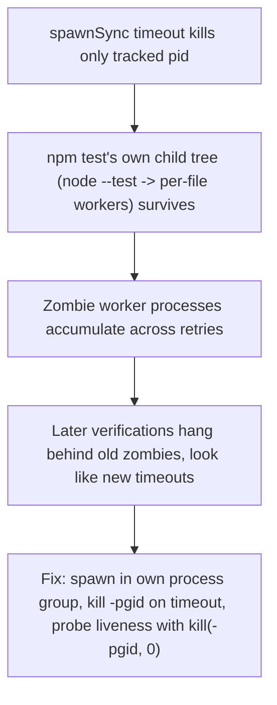

# Process Liveness and Kill Semantics

**Confidence:** provisional — the underlying mechanisms are demonstrated with live reproduction and fixed with tests, but most of the citing packets have since been auto-marked `deprecated`/unverified as the delegation code around them kept changing, so the exact current code shape should be re-checked rather than assumed.

Kage's delegation layer runs commands and coding-agent sessions as child processes, and a recurring lesson is that Node's built-in process primitives only ever see the single pid they were given, never the tree that pid spawns. `spawnSync`'s own `timeout`+`killSignal` option kills just the tracked child, so when that child is something like `npm test` (which forks `node --test`, which forks one worker per file), a timeout leaves the whole worker tree alive; three such zombie suites piling up from retried timeouts was enough to hang every later verification on the machine, because the "timeout" was really new work stalling behind old zombies. The fix pattern is to spawn checks detached into their own process group and, on timeout, signal the negative pid (`process.kill(-pgid, 0)` for a liveness probe, `process.kill(-pgid, 'SIGKILL')` to actually kill) so the whole group goes down together, with an explicit `env` passed through so the child doesn't silently drift onto whatever `process.env` happens to be. The same "does it just exist, or is it actually working" gap showed up one layer up in the Room's PTY-backed chat path: `alive:true` there meant only that the underlying process object still existed, not that it was answering, so a wedged Claude session sat quietly failing every ask for 6 minutes before the pipeline persisted an empty, falsely-"done" turn — the honest fix was to recycle the PTY supervisor on any timed-out ask rather than trust process existence as a liveness signal. A related architectural choice is that different subsystems pick different process-ownership models on purpose: take-over PTYs for a delegated run live directly inside the calling daemon process (so the API layer's own in-memory map is the only bookkeeping needed), while Room PTYs use a detached supervisor-plus-socket model — and one real incident showed why detachment matters: a CLI-dispatched run used the CLI process itself as its supervisor, so when the run blocked waiting on a steer answer and the CLI exited, the completed agent turn had nothing left to collect it, and the run was silently orphaned until redispatched on the detached-supervisor path.

## Supporting evidence

- `.agent_memory/packets/bug_fix-process-kill-pgid-0-signal-0-to-a-negative-pid-is-the-correct-liveness-probe-for-d7493a43.md` — establishes `process.kill(-pgid, 0)` (negative pid) as the correct "is this process group still alive" probe, vs. `process.kill(pid, 0)` on the original tracked pid which reports dead as soon as that one process is reaped.
- `.agent_memory/packets/bug_fix-spawnsyncs-own-timeout-killsignal-mechanism-only-ever-signals-the-single-pid-it--3253a869.md` — confirms `spawnSync`'s built-in timeout/killSignal only ever reaches the tracked pid, never descendants, even with `detached: true` available afterward; a real group sweep has to be done by hand post-return.
- `.agent_memory/packets/bug_fix-spawnwithtreekills-spawnoptions-object-previously-had-no-explicit-env-key-at-all-7e1b9fd5.md` — the reentrancy fix for the verification lock required adding an explicit `env` key to the tree-kill spawn options (it previously relied on implicit inherit-from-`process.env`), used to propagate a `KAGE_VERIFY_LOCK_HELD` marker into children so nested verifications don't deadlock on their own ancestor's lock.
- `.agent_memory/packets/bug_fix-the-reported-6-minute-timeout-blank-turn-bug-is-in-mcp-delegation-api-tss-resolv-11f82b98.md` — the Room's `resolvePtyReply` timeout persisted a normal, empty "done" turn on ask-timeout because PTY liveness only checked process existence, not whether it was answering; fix recycles the supervisor and marks the turn as a visible failure.
- `.agent_memory/packets/decision-run-pty-tss-take-over-pty-runs-directly-in-the-calling-daemon-process-unlike-roo-8c63353d.md` — documents the deliberate split between in-process take-over PTYs (daemon-resident, API layer owns the map) and detached-supervisor-plus-socket Room PTYs.
- `.agent_memory/packets/negative_result-rejected-approach-fix-project-switching-in-the-app-it-fails-with-the-daemon-did--d53b6300.md` — real incident where a CLI-dispatched run used the CLI process as its own supervisor; the CLI exiting while the run was blocked on a steer answer silently orphaned the completed turn, which is why the detached-supervisor architecture exists.

## Contradictions / open questions

- Four of the five bug-fix/decision packets above (`process-kill-pgid-0...`, `spawnsyncs-own-timeout...`, `spawnwithtreekills-spawnoptions...`, `run-pty-tss-take-over...`) are marked `deprecated`/unverified in their Kage state, not because a later packet explicitly superseded them, but because the files they cite (`mcp/delegation/verify.ts`, `static-checks.ts`, `run-pty.ts`) kept changing under later runs. The mechanisms they describe are internally consistent and none contradict each other, but none should be treated as a guarantee that today's code still matches — reverify against current source before relying on the exact function names.
- The 6-minute-timeout packet is also `deprecated`/unverified for the same reason; it is unclear from these packets alone whether the PTY-recycle fix actually landed as specified or was revised further.

## Causality

