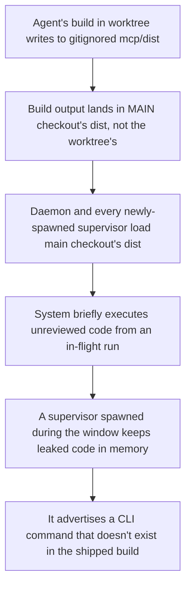

# Worktree Isolation and Git-Scoped Diffs

**Confidence:** firm — the core mechanism (a real `git worktree add` checkout has its own index) is `approved`/`verified` with a concrete regression test, and the build-escape gotcha is corroborated by two independent pieces of live evidence even though it has since been formally superseded by a follow-up fix.

Kage dispatches many delegated coding-agent runs concurrently, each into its own `.agent_memory/worktrees/<runId>` directory created with a real `git worktree add`. That matters mechanically: a genuine worktree checkout has its own git index even though it lives nested inside the main checkout's working directory, so `git add -A` (or any diff/measurement command) run with cwd set to the worktree only ever touches that worktree's own files — it can never accidentally stage or diff the main checkout. This is what makes per-run isolation real rather than cosmetic, and it is why test fixtures for worktree-scoped git logic must use an actual `git worktree add` checkout rather than a bare subdirectory faked as a worktree (a fake shares the main checkout's index and will pass tests that a real worktree would fail). The corollary discipline is in how diffs get measured against that isolated tree: `git diff <ref>` with a single ref and no `--cached` already folds in both committed history since that ref and any uncommitted staged/unstaged changes in one pass, which is why the diff-size check was rewritten to use it directly instead of summing two separate `numstat` calls (merge-base..HEAD plus HEAD..working-tree) — the two-call approach double-counts a file edited in both segments, and it was also the reason a completed-but-committed run's diff check was reporting "0 files, 0 changed lines" even though the claim admitted ~1,400 changed lines: by the time `kage reverify` ran, the run had already committed its own worktree at claim time, so the working tree was clean and only the uncommitted half was ever being measured. Isolation, however, is a convention enforced by tooling discipline, not a hard OS boundary: a hired agent's own build output escaped a worktree into the main checkout's gitignored `mcp/dist` (source stayed clean; only compiled output leaked), and because the daemon and every newly-spawned supervisor load `mcp/dist` directly, the running system briefly executed unreviewed code from an in-flight run — including a supervisor that, having been spawned during the contaminated window, kept advertising a command (`kage resume-run`) that didn't exist in the shipped build for the rest of its life, since rebuilding `dist` fixes the files but not an already-running process holding the old code in memory.

## Supporting evidence

- `.agent_memory/packets/bug_fix-a-real-git-worktree-add-checkout-has-its-own-index-even-when-nested-inside-the-m-480d8309.md` — establishes that a real `git worktree add` checkout has its own git index even nested inside the main checkout, so `git add -A` there only stages that worktree's files; a bare-subdirectory fake worktree shares the main index instead and breaks worktree-scoped git-diff tests.
- `.agent_memory/packets/bug_fix-git-diff-ref-a-single-ref-no-cached-compares-that-ref-straight-against-the-w-c38319df.md` — from the same fix: `git diff <ref>` alone already covers committed-since-ref plus uncommitted changes in one call, avoiding the double-counting risk of two separate `numstat` calls, and is the fix for the diff-size check reading "0 changed lines" on a worktree whose work was already committed at claim time.
- `.agent_memory/packets/gotcha-a-runs-build-can-escape-its-worktree-into-the-main-checkouts-dist-and-a-supervis-f601e41c.md` — the build-escape incident: a run's compiled TypeScript output leaked into the main checkout's `mcp/dist` (not source), was loaded by the daemon and new supervisors, and a supervisor spawned during the contamination window kept running the leaked code (advertising a nonexistent CLI command) even after the files were rebuilt clean, because rebuilding fixes files, not already-running processes.

## Contradictions / open questions

- The build-escape gotcha packet is explicitly marked `superseded` by a later packet (not in this cluster) titled "worktree isolation is enforced by worktree-guard and a dying supervisor now leaves..." — its own superseding note says the "no log anywhere when a supervisor dies" half is now false, since `dispatchDetached` was later given a real log file descriptor and a `worktree-guard.ts` boundary check was added. The core mechanism described here (build output escaping into the main checkout's `dist`, and an already-running process keeping stale code in memory) is stated to remain true and carried forward; only the "silently, with no trace" framing is outdated.

## Causality

