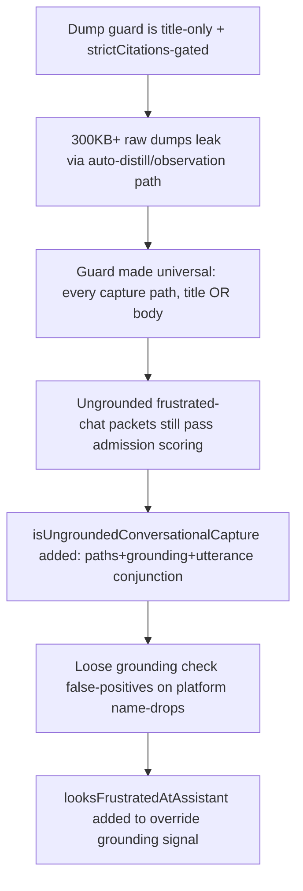

# Memory Admission Quality Floor

**Confidence:** firm — the guard logic has gone through several documented hardening passes with tests at each step, but its own history shows it keeps finding new junk shapes, so it should not be treated as closed.

Kage's capture path is intentionally permissive about content shape (paths do not have to exist to be admitted in non-strict mode) but has grown a layered set of guards against specific junk shapes discovered by dogfooding, rather than a single blanket quality filter. The earliest guard rejected "serialized dump" packets — raw transcripts, tool output, or file content pasted wholesale into a title or body (originally only checked when `strictCitations` was set, later made universal across every capture path including auto-distill/observation, because that path was how 300KB+ dumps were leaking in). A second, narrower guard (`isUngroundedConversationalCapture`) targets a different failure mode the dump guard missed: raw frustrated user chat utterances with no repo grounding at all, which could still score "admissible" under `evaluateMemoryAdmission` because trigger keywords like "issue"/"before"/"why" matched. That guard requires ALL of {zero cited paths, no grounding signal, looks like a raw/frustrated utterance} before firing, so it does not swallow real ungrounded decisions. It was hardened a second time after a false-positive: a loose grounding check let frustrated rants through when they happened to name a platform (github/pr/x/linkedin), so a stricter `looksFrustratedAtAssistant` check now overrides grounding-signal detection. A third guard closed a shell-paste leak (`user@host dir % cmd`-shaped titles/bodies re-creating junk packets). Separately, the product made an explicit admission-policy call that "would this change what an agent does" is not the only bar — source-backed rationale, bug causes, issue state, and non-obvious code explanations are durable memory even when they only change what an agent *understands*, not what it does next. Guarded/rejected content is not silently deleted: dump and ungrounded-conversational packets are routed to pending (or swept by GC) with a `needs-grounding`-style tag and a warning, and withheld from recall rather than hard-deleted outright.

The quality floor also applies to *generated* memory (repo-map, repo-overview, branch change-memory), which needed its own, separately-evolved admission rules rather than reusing the human-authored rules verbatim: it must carry structured context (fact/why/trigger/action/verification/risk_if_forgotten) to count toward audit/decision-intelligence coverage at all, and it must ground to concrete files — `package.json`, `README.md`, an actual source path — rather than a synthetic repo-root path standing in for "the whole project." Cross-branch change-memory overlap is deliberately exempted from the duplicate-memory warning that would otherwise fire on human-authored packets, because branch summaries are generated handoff metadata regenerated per branch, not durable hand-authored facts competing for the same claim.

Two of the quality-floor's guards are pattern-matching and precision detectors rather than admission-time filters, and both show the same "tune against real false positives" lifecycle as the dump/ungrounded guards above. The contradiction detector originally produced 786 phantom conflicts on this repo from two precision holes: a subject-similarity gate that let any two packets sharing a cited path plus two generic tokens through, and a negation-asymmetry heuristic that treated "one side says 'removed', the other doesn't" as contradiction rather than incidental difference. The fix required a stopword-aware distinctive-subject-token set, a higher similarity threshold, and explicitly removing the token-count bypass rather than adjusting it, since that bypass was the false-positive door — confirmed down to 0 phantom conflicts. A second, structurally similar detector — the duplicate-cluster detector — has an open false positive of its own: it flags `__init__`/`__repr__`/wrapper/decorator methods across *different* classes as "duplicate implementations, likely AI-era," discovered while writing content about a well-known repo; this one would visibly discredit the tool to any experienced developer, and was queued as a fix (task #34) but is not confirmed landed in this evidence.

## Supporting evidence

- `.agent_memory/packets/bug_fix-capture-with-a-nonexistent-path-in-paths-succeeds-status-approved-non-strict-mo-8ad8be71.md` — confirms capture() accepts a nonexistent cited path in non-strict mode (status `approved`, just a warning); this is also the quality-floor gap used deliberately to manufacture stale packets in test fixtures.
- `.agent_memory/packets/bug_fix-kage-context-bloat-dump-packet-capture-cause-and-fix-e5060da1.md` — origin of the serialized-dump guard (`isSerializedDumpTitle`/`isSerializedDumpBody`), originally gated behind `strictCitations` and title-only.
- `.agent_memory/packets/decision-injection-capture-hardening-sessionstart-pinned-context-universal-dump-guard-c6710261.md` — made the dump guard universal across every capture path (agent `kage_learn` and the auto-distill/observation pipeline), catching title OR body.
- `.agent_memory/packets/decision-capture-guard-ungrounded-conversational-user-utterances-routed-to-pending-withhe-ccf53f40.md` — added `isUngroundedConversationalCapture`, the conjunctive guard for raw frustrated chat text with no grounding.
- `.agent_memory/packets/decision-warm-start-is-task-driven-no-session-replay-ungrounded-capture-guard-hardened-vs-a6836ef9.md` — hardened the ungrounded guard against platform-name-drop false negatives via `looksFrustratedAtAssistant` overriding grounding detection; also swept 12 legacy junk packets.
- `.agent_memory/packets/decision-watcher-nudges-surface-to-the-agent-via-prompt-context-shell-paste-capture-leak--521f0b28.md` — closed a shell-prompt/terminal-paste title leak in the same dump-guard family.
- `.agent_memory/packets/decision-memory-admission-includes-rationale-issues-and-code-explanations-668d52d3.md` — the policy decision that admission should not be action-only; source-backed rationale/bug-cause/code-explanation content is durable memory.
- `.agent_memory/packets/decision-generated-repo-map-and-change-memory-packets-need-structured-context-918649a5.md` — generated repo-map/change-memory packets must carry structured fact/why/trigger/action/verification/risk_if_forgotten context to count toward coverage.
- `.agent_memory/packets/decision-generated-repo-overview-memory-should-be-grounded-to-real-source-files-such-as-p-f1b3afda.md` — generated repo-overview memory must ground to real files, not a synthetic root path.
- `.agent_memory/packets/decision-generated-change-memory-packets-should-not-duplicate-warn-across-branches-48805d0b.md` — cross-branch change-memory overlap is exempt from the duplicate-memory warning.
- `.agent_memory/packets/gotcha-contradiction-detector-require-distinctive-subject-paraphrase-not-generic-token--3886be09.md` — the contradiction detector's 786-phantom-conflict precision fix (confirmed 786→0).
- `.agent_memory/packets/reference-famous-repo-content-surfaced-a-real-duplicate-detector-false-positive-flask-dund-34c5c6c9.md` — the still-open duplicate-cluster detector false positive on Python dunder methods across different classes.

## Contradictions / open questions

None found among the original dump/ungrounded-capture guards — they are additive and each packet is explicit about what the prior guard missed rather than reversing it. The open question the evidence itself raises: each hardening pass was triggered by a *new* junk shape found live, not by a systematic audit, so it is reasonable to expect more shapes exist that no packet here has yet documented. Separately, the two precision detectors above are at different confirmation states: the contradiction detector's fix is verified (786→0 phantom conflicts), while the duplicate-cluster detector's dunder-method false positive is queued as a fix (task #34) but not confirmed landed in this evidence — treat that one as still open.

## Causality

