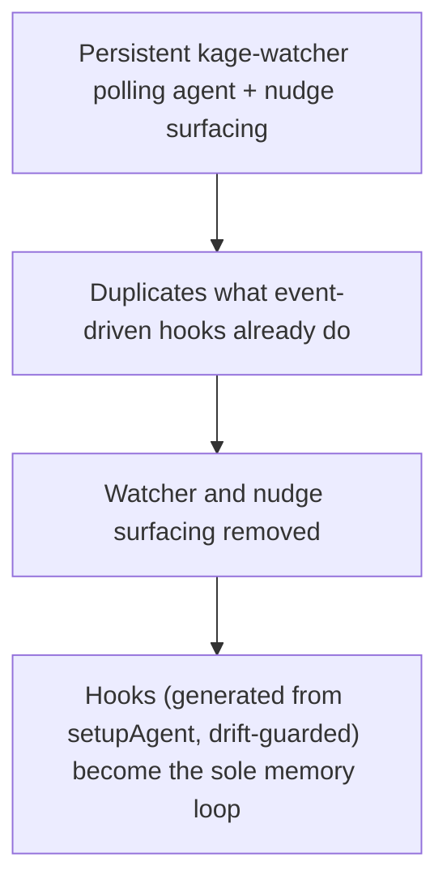

# Memory Governance: Audit, Lineage, Privacy, and the Hooks-Only Capture Loop

**Confidence:** provisional — individually verified at the time each piece was built, but several packets are from the earlier (May–June 2026) "Kage is a memory tool" era, and one packet in this same set signals the whole in-repo architecture may be reconsidered.

Kage governs *how* memory is mutated and surfaced, not just what is admitted. Every explicit mutation — capture, feedback, pending approve/reject, supersede, GC deprecate/delete — is appended as a JSONL entry to a first-class audit trail (`kage memory-audit`) carrying packet id, actor, branch, and details, so any change to memory has a who/when/why trail independent of git blame. Supersession is the companion mechanism for *correcting* memory rather than deleting it: `kage supersede` marks an old packet superseded, writes bidirectional lineage edges between old and new, and excludes the superseded packet from recall while keeping it inspectable for history — the same pattern this consolidation pass itself uses. On top of the audit/lineage layer sits a decision-intelligence surface (`kage_context` and related reporting) that tells a caller which decisions/gotchas/runbooks/conventions/code-explanations are grounded to real paths, which important files still lack why-memory, and which packets are weak or stale; a companion "memory access" feature converts hot/cold/ungrounded packet access telemetry directly into review recommendations, and the viewer's Memory page is built around the same packet-to-code workflow, including a relation filter that was fixed to mean actual memory-to-code links (symbol/route/test relations plus virtual bridge edges) rather than raw `affects_path`, which usually points at a memory-graph path node rather than a code node. Every write path (capture, learn, observe, distill) is required to route through one shared `stripPrivateSpans` sanitizer that redacts `<private>...</private>` or `[private]` spans before persistence — a convention captured twice, near-identically, in this packet set, and treated here as one fact rather than two.

Staleness has a second, distinct enforcement mechanism from the recall-time hard/soft-stale triage described elsewhere: `staleCatch` intersects working-tree changes with each packet's `path_fingerprints` at change time and feeds a `stale_caught` value-ledger event surfaced by `kage pr check` and by the `kage staleguard` pre-commit hook, catching drift before it's committed rather than only at recall time. This mechanism stayed stable through v2.2.0 with two later additions: quiet refresh on non-default branches computes staleness without persisting metadata rewrites (so working branches don't fight over packet metadata), and personal packets are excluded entirely from the check.

The capture loop's architecture was deliberately simplified during this period: a persistent polling `kage-watcher` background agent and its file-touch "nudge" surfacing (an earlier `surfacePendingNudges` path-filtered mechanism) were both removed in favor of event-driven Claude Code hooks — recall on `UserPromptSubmit`, verified-memory-at-file-touch on `PreToolUse`, capture on `Stop`. Those hooks are themselves generated, not hand-maintained, from `setupAgent("claude-code")`'s output and are byte-equality-guarded against drift, so any hook change must go through the generator and never edit `plugin/hooks/` directly; `kage_setup_doctor` extends this install-proofing to the MCP surface, surfacing the same ambient-hook-readiness summary (MCP config present vs. hooks missing) so a partial install is visible before a teammate relies on it. Two small but sharp packaging gotchas sit in the same generated-surface family: `claude plugin validate` rejects unrecognized keys in `plugin.json` (e.g. `displayName` — use `name` only), and `npx skills add owner/repo` copies the *entire* source repository into every agent's skills directory if `SKILL.md` sits at the repo root, so a skill must live under `skills/<name>/SKILL.md`. Separately, because the in-session MCP server loads once at agent start, a freshly published/installed global `kage-graph-mcp` build is not picked up until the agent restarts — the symptom before restart is `kage_learn`/`kage_refresh` crashing with a JSON-parsing error even though the CLI's new build works fine.

One packet in this set cuts against everything above: a direct owner-reported adoption signal that people refuse to commit AI memory into the same code repo as their source, which puts pressure on the entire in-repo `.agent_memory/` foundation that audit, lineage, staleCatch, and the hooks loop all assume — this was still an open design fork (external git-backed store vs. hosted service vs. staged rollout) as of its capture, not a settled answer, and should be read as an active caveat on this whole domain rather than a resolved footnote.

## Supporting evidence

- `.agent_memory/packets/decision-memory-audit-is-first-class-mutation-governance-ed50ecee.md` — the JSONL audit-trail design for explicit memory mutations.
- `.agent_memory/packets/decision-memory-lineage-is-first-class-repo-knowledge-governance-f114895c.md` — `kage supersede` and bidirectional lineage edges.
- `.agent_memory/packets/decision-decision-intelligence-is-kage-why-memory-coverage-3e1b0c37.md` — the why-memory grounding/coverage/weak-or-stale surface.
- `.agent_memory/packets/decision-memory-access-recommends-review-actions-cdc98133.md` — hot/cold/ungrounded packet access telemetry converted into review recommendations.
- `.agent_memory/packets/decision-memory-page-is-a-packet-to-code-workflow-24a597a5.md` — the viewer Memory page's intended packet-first workflow.
- `.agent_memory/packets/bug_fix-memory-code-relation-filter-excludes-path-only-edges-16ac4745.md` and `.agent_memory/packets/bug_fix-linked-code-reconciliation-unchanged-after-skip-list-cleanup-60335e2b.md` — the Memory↔Code relation-filter fix, plus confirmation that source-fingerprint-based staleness reconciliation was unaffected by an unrelated skip-list cleanup.
- `.agent_memory/packets/convention-privacy-private-2ef35b02.md` and `.agent_memory/packets/convention-privacy-private-tags-are-redacted-by-stripprivatespans-before-any-memory-write-e7c147f0.md` — near-duplicate captures of the shared `stripPrivateSpans` sanitizer required on every write path.
- `.agent_memory/packets/code_explanation-stale-catch-change-time-invalidation-heartbeat-current-through-v2-2-0-29ffe1bc.md` and `.agent_memory/packets/code_explanation-stale-catch-change-time-invalidation-heartbeat-stalecatch-kage-staleguard-b1f7baca.md` — near-duplicate explanations of the `staleCatch` mechanism and its surfaces.
- `.agent_memory/packets/decision-nudge-surfacing-and-the-kage-watcher-were-removed-hooks-are-the-memory-loop-563f61c9.md` and `.agent_memory/packets/decision-edit-time-nudge-surfacing-file-context-fires-a-files-watcher-nudge-at-the-pretoo-ef50382e.md` — the watcher-removal architecture decision, and the earlier edit-time nudge mechanism it superseded.
- `.agent_memory/packets/decision-claude-code-hooks-single-source-of-truth-plugin-hooks-generated-from-setupagent-f99cc1e4.md` — hooks are generated from `setupAgent`, drift-guarded, and must never be hand-edited.
- `.agent_memory/packets/decision-mcp-exposes-setup-doctor-audits-44369c0c.md` — `kage_setup_doctor` extends install-proofing to the MCP surface.
- `.agent_memory/packets/decision-setup-doctor-surfaces-claude-ambient-hook-readiness-355c5e14.md` — `kage setup doctor`'s ambient Claude Code hook-readiness summary.
- `.agent_memory/packets/gotcha-claude-code-plugin-schema-no-displayname-hooks-commands-ship-via-plugin-dir-d1a36c11.md` — the plugin schema's rejection of unrecognized keys.
- `.agent_memory/packets/gotcha-npx-skills-add-copies-the-whole-repo-if-skill-md-is-at-root-9edc3476.md` — the root-level `SKILL.md` install trap.
- `.agent_memory/packets/gotcha-restart-the-agent-after-upgrading-the-global-kage-mcp-build-cb2af802.md` — the agent-restart-required-after-global-upgrade gotcha.
- `.agent_memory/packets/decision-market-signal-people-refuse-to-commit-ai-memory-into-the-code-repo-collaborative-0288f38c.md` — the owner-reported adoption friction that questions the in-repo foundation underlying every other packet in this doc.

## Contradictions / open questions

- The market-signal packet is in direct tension with the rest of this domain: every other packet assumes `.agent_memory/` packets committed in the code repo are the durable substrate, while this one reports that assumption is itself a source of adoption resistance and records an *unresolved* design fork (external store vs. hosted service vs. staged rollout) rather than a settled answer.
- `decision-edit-time-nudge-surfacing...ef50382e.md` describes a mechanism the later `decision-nudge-surfacing-and-the-kage-watcher-were-removed...563f61c9.md` packet says was removed along with the watcher — the earlier packet is effectively superseded by the later one, though neither is formally linked via `kage_supersede`.
- The two `stale-catch` code-explanation packets and the two `privacy` convention packets are near-duplicate captures of the same fact from different sessions; both are cited for completeness but should be read as one fact, not two.
- `staleCatch` (pre-commit, change-time invalidation) and the recall-time hard/soft-stale triage described in the memory-staleness-triage belief are two distinct enforcement points over the same underlying problem (cited files moving out from under a packet); no packet in this set states how or whether their signals are reconciled into one number for a human to read.

## Causality

