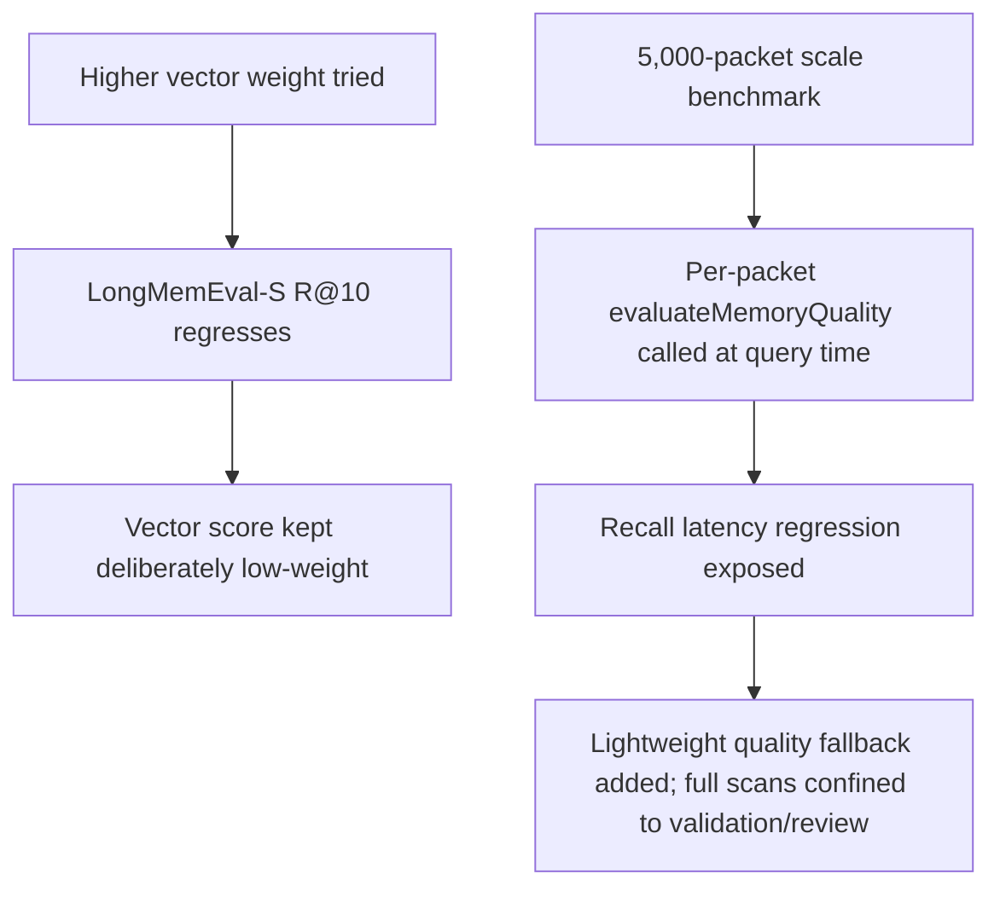

# Recall Retrieval Tuning

**Confidence:** firm — the scoring behavior is externally benchmark-validated (LongMemEval, MemoryArena) with concrete numbers, but several of these decisions were tuned against one benchmark generation and may need re-verification against the current kernel.ts.

Kage recall is a hand-tuned, zero-dependency lexical-first ranking system, not an embedding/API-based one: BM25-style text matching leads, with a deliberately low-weight local sparse-vector cosine score layered on top (over title/summary/tags/paths/type/body) that is intentionally kept subordinate — a benchmark run showed a *higher* vector weight actually regressed LongMemEval-S R@10 to 99.79%, so the low weight is a measured choice, not an oversight. On top of the lexical/vector base, recall does explicit query expansion along two axes that are scored and reported separately (not folded into one opaque number): temporal expansion from explicit query date metadata (e.g. "Question date: 2023/03/28", which is what the LongMemEval-S harness exploits for relative-date questions) and semantic expansion from built-in concept groups, with `why_matched` only citing semantic labels when a packet actually received semantic score. Reference-type memory (external, less code-grounded) is tuned differently from the general case: graph/path/tag boosts are capped or disabled for reference packets so BM25/lexical evidence leads, with a body-only BM25 fallback for raw-transcript-style references — because letting graph boosts dominate hurt reference-packet ranking on LongMemEval. Recall also does Unicode-aware tokenization with CJK bigrams so memory written in Chinese/Japanese/Korean or mixed code/prose stays searchable without adding a dependency. Two infra-level decisions bound recall's behavior at the edges: capture can declare `graph_nodes` references that recall stores as first-class code-graph edges, and recall accepts an opt-in hard token budget (`max_context_tokens`) that trims trailing lower-priority sections (a later Personal Memory section is trimmed first, ranking last) rather than truncating mid-content; and recall must never re-run expensive per-packet quality scans at query time — a synthetic 5,000-packet benchmark exposed recall calling `evaluateMemoryQuality` per packet when `quality.score` was unset, which recall now avoids via a lightweight fallback, keeping full duplicate-detection scans confined to validation/review reports. Recall's persisted `.agent_memory/indexes/vector-local.json` sparse-vector index (validated against approved-packet-count and `updated_at`, falling back to live scoring if missing/stale) and the knowledge graph it depends on are understood as *local rebuildable caches*, not committed derived state — `kage_context`'s MCP handler is confirmed to be a thin wrapper around `recall()` that rebuilds+persists the graph by default when the artifact is absent, so recall self-heals on a checkout with no prior indexes. Multi-repo "workspace" recall stays intentionally Kage-native (fan-out recall across sibling repos' own packet stores) rather than centralizing into a shared database, and per-packet recall access/reuse is tracked in a local, git-ignored report (`memory-access.json`) rather than mutating the shareable packet JSON, feeding usage-based ranking signals without polluting what gets shared.

## Supporting evidence

- `.agent_memory/packets/decision-recall-uses-low-weight-local-sparse-vector-scoring-227415ab.md` — establishes the local sparse-vector score is deliberately low-weighted; a higher weight regressed LongMemEval-S R@10.
- `.agent_memory/packets/decision-recall-reuses-persisted-local-sparse-vector-index-7127dd36.md` — the persisted `vector-local.json` index, validated then reused, with live fallback when stale/missing.
- `.agent_memory/packets/decision-recall-explanations-expose-temporal-and-semantic-contributions-245464f2.md` — splits temporal vs semantic expansion into separate, auditable score fields.
- `.agent_memory/packets/decision-longmemeval-temporal-retrieval-uses-question-date-metadata-d7e6ef6c.md` — temporal expansion driven by explicit question-date metadata; LongMemEval-S R@5/R@10/R@20 results cited.
- `.agent_memory/packets/decision-reference-recall-should-stay-text-led-for-external-memory-benchmarks-7e346dcc.md` — reference-packet-specific tuning: graph/path boosts capped, body-only BM25 fallback.
- `.agent_memory/packets/reference-recall-tokenizes-multilingual-memory-f67cd4ae.md` — Unicode/CJK-aware tokenization added without new dependencies.
- `.agent_memory/packets/decision-graph-nodes-at-capture-opt-in-recall-token-budget-still-true-in-v2-2-0-5f0eb25c.md` (supersedes `decision-graph-nodes-at-capture-and-opt-in-recall-token-budget-12d31c53.md`) — `graph_nodes` at capture + opt-in recall token budget, plus later layering of a Personal Memory section trimmed first over budget.
- `.agent_memory/packets/bug_fix-recall-must-not-run-full-duplicate-quality-checks-per-packet-696e26f2.md` — recall must use a lightweight quality fallback, not full duplicate-detection scans, at query time (5,000-packet scale benchmark).
- `.agent_memory/packets/decision-kage-contexts-mcp-handler-mcp-index-ts-is-a-thin-wrapper-around-recall-projectdi-47d9f383.md` — confirms `kage_context` delegates to `recall()`, and recall's default self-heal (rebuild+persist the graph) covers `kage_context`'s graph-freshness behavior; part of the broader decision that derived artifacts (indexes/graph/metrics) should never be committed to git and must rebuild locally.
- `.agent_memory/packets/decision-workspace-recall-stays-kage-native-08ffbd42.md` — multi-repo recall fans out across sibling repos' own packet stores rather than centralizing.
- `.agent_memory/packets/decision-recall-access-tracking-stays-local-and-ignored-168c207d.md` — per-packet usage/reuse tracked in a local, non-shared report file.
- `.agent_memory/packets/decision-decision-kage-now-has-a-coding-memory-quality-benchmark-inspired-by-memory-tools-f34f00b0.md`, `.agent_memory/packets/decision-decision-the-coding-memory-quality-benchmark-is-now-package-callable-not-only-a--598a8648.md`, `.agent_memory/packets/decision-full-memoryarena-context-recall-benchmark-results-5cb8cc2b.md`, `.agent_memory/packets/decision-memoryarena-context-recall-is-a-separate-non-official-benchmark-harness-8a2a6aa7.md` — establish the general pattern behind the "benchmark-validated" claim: Kage maintains its own synthetic coding-memory benchmark (packaged into the CLI, not just a repo script) plus a MemoryArena context-recall harness explicitly scoped as "context recall," not official task-solving accuracy — the discipline that produced the LongMemEval numbers cited above.

## Contradictions / open questions

No direct contradictions among the scoring-tuning packets — each documents a specific benchmark-driven adjustment without reversing an earlier one. One evolution worth flagging explicitly: the persisted `vector-local.json` index was originally described (packet `decision-recall-reuses-persisted-local-sparse-vector-index-7127dd36.md`) simply as something "written during indexing and refresh," which read at the time as potentially git-committed derived state. A later, more recent decision (`decision-kage-contexts-mcp-handler...-47d9f383.md`, part of the "derived state is never committed again" change) clarifies this index and the knowledge graph must be treated as local-only rebuildable caches, gitignored, with every reader tolerating their absence via local rebuild. This is not a contradiction of fact so much as a scope clarification that postdates the original packet — a future reader should not assume the vector-local index is (or should be) checked into git.

## Causality

