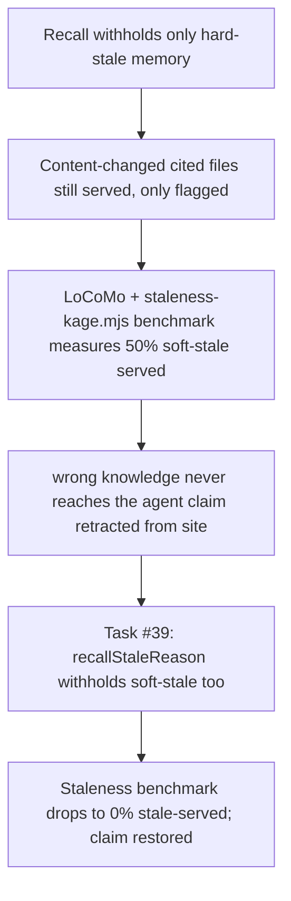

# Memory Staleness Triage

**Confidence:** firm — the hard-stale/soft-stale distinction is well-evidenced and benchmark-verified, but the multi-surface triage divergence (different callers computing different stale counts) was still an open, only-partially-fixed problem as of the most recent packets in this set.

Kage draws a hard line between two kinds of "stale": a packet is hard-stale when its cited evidence is gone in a way that cannot be silently reconciled — all cited files deleted, TTL expired, status deprecated/superseded, or a human/agent explicitly reported it stale — and it is soft-stale (content-drift) when a cited file still exists but its content changed since the memory was verified. For a long stretch this repo only withheld hard-stale memory from recall and *served* soft-stale memory with a flag ("linked path changed since memory was verified"), which a negative-result benchmark run (LoCoMo + a purpose-built Memory-Correctness-Under-Change benchmark) measured directly: content-changed memory was served 50% of the time, not withheld, which forced an explicit retraction of the marketing claim "wrong knowledge never reaches the agent" until the gap was closed. The fix ("task #39") made `recallStaleReason` withhold soft-stale content-drift the same as hard-stale, wired through recall's vector-score filter, the suppressed-memory report, skills generation, and personal recall — but deliberately NOT through `compactProject` or the stale-report builder, because a content-changed packet needs re-verification, not silent auto-deprecation. Separately from the withhold-vs-serve axis, this repo also has a *triage-count* problem: `classifyPacket`'s stale branch and the CLI's `staleTriage` both call the same `staleMemoryReasons` check but over different packet sets (one after `.kageignore` path-pruning, one before), so a packet whose only staleness reason is a kageignored path can show as stale under `kage stale` but not under refresh — documented as intentional, not a bug to converge. Compounding that, `metrics.json` (the file the app's Memory-tab health strip reads) was for a long stretch only written by `kage gc`/`kage compact`, never by `kage refresh` despite refresh's own help text promising it, so the health strip could read a stale, order-of-magnitude-wrong stale count even right after a user ran `kage refresh`. Staleness also degrades in a structural way that no per-packet detector catches: after a day of 28 merged delegated runs on this repo, roughly 20% of packets (93 of 466) were flagged stale because the code they cite moved — and this is *honest* behavior working as designed, not a bug. The uncomfortable part is that Kage loses a fifth of its own recall precision precisely after the kind of large, multi-file change it exists to help with, and there was no batch-triage workflow to recover it; bulk-reverifying would only clear the flags without re-checking whether each claim is still semantically true, converting an honest "not sure" into a false "verified" — so the right fix is a review workflow, not an auto-clear.

## Supporting evidence

- `.agent_memory/packets/negative_result-locomo-result-memory-correctness-under-change-benchmark-exposed-recall-serves-co-f593e003.md` — the original discovery: `staleness-kage.mjs` measured 50% content-changed memory served (soft-stale not withheld); naive capture-everything scores 100%.
- `.agent_memory/packets/decision-recall-withholds-hard-stale-only-content-changed-memory-is-served-flagged-do-not-1ab855a4.md` — the honest interim state this repo shipped with: hard-stale withheld, soft-stale served-but-flagged; the overclaimed marketing line was pulled from the site pending the fix.
- `.agent_memory/packets/decision-recall-withholds-content-changed-memory-too-task-39-shipped-f528d35e.md` — the fix (task #39): soft-stale content-drift is now withheld too, wired through recall/suppressed-report/skills/personal-recall but not compact or the stale-report builder; staleness benchmark went from ~50% to 0% stale-served.
- `.agent_memory/packets/decision-kage-1-1-8-adds-stale-memory-gc-bdf41feb.md` — the foundational `kage gc` command: dry-run preview, exact-file deprecation, forced delete, keeps helpful-voted stale memory unless `--force`.
- `.agent_memory/packets/bug_fix-classifypacket-s-stale-branch-and-staletriage-both-call-the-same-stalememoryreas-48fa7ae8.md` — documents the `classifyPacket` vs `staleTriage` divergence over kageignore-pruned vs unpruned paths, explicitly noted as intentional rather than a bug to converge.
- `.agent_memory/packets/bug_fix-kagemetricsshallow-used-by-refresh-gc-compact-for-performance-the-full-kagemetri-044cb6b5.md` — root-causes the Memory-tab's frozen/wrong stale count to `metrics.json` only being written by `gc`/`compact`, never by `refresh`, despite refresh's help text promising it; three surfaces (packet-store `quality.stale`, `kage stale`, the health strip) disagreed by an order of magnitude on this repo (8 vs 92 vs 142).
- `.agent_memory/packets/bug_fix-capture-with-a-nonexistent-path-in-paths-succeeds-status-approved-non-strict-mo-8ad8be71.md` — used as the source of the admission-quality-floor gap (see the admission belief) to deliberately manufacture stale packets for testing; relevant here as evidence of how staleness gets introduced at write time.
- `.agent_memory/packets/gotcha-a-big-refactor-silently-withholds-20-of-repo-memory-and-there-is-no-bulk-triage--ad670ee0.md` — the ~20%-stale-after-28-merged-runs measurement, and why bulk-reverify would be the wrong fix (converts "not sure" into false "verified" instead of actually re-checking each claim).

## Contradictions / open questions

The two "bug_fix" packets from the same delegated run (classifyPacket/staleTriage divergence, and the frozen metrics.json) are both marked `status: deprecated` in this packet set, meaning a later run may have already addressed or superseded them — the belief above documents the diagnosis, not a confirmed current fix state for the triage-divergence or metrics-write gap. Whether `kage refresh` now writes `metrics.json` on every branch (including quiet non-default-branch refreshes) is not directly confirmed by any packet in this cluster; the bug-fix packets describe the prescribed fix, not verified-after-merge behavior.

## Causality

