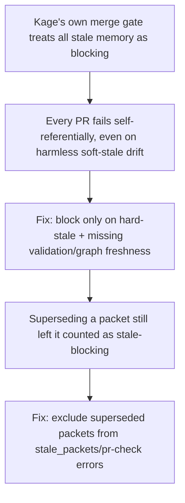

# PR-check gating and Kage's self-hosted CI reliability

**Confidence:** provisional — the hard/soft-stale blocking rule was repeatedly re-verified and looks stable, but every packet in this evidence set is itself now flagged stale against a much-grown `mcp/kernel.ts`, and the `kage sync` fix's current implementation status is unconfirmed given later, larger sync-mechanism changes elsewhere in the repo.

`kage pr check` is the merge gate Kage runs on itself, and its blocking rule has stayed consistent across at least two verified iterations: it fails (exit 2) only on hard-stale memory (cited evidence deleted, expired TTL, or explicitly reported stale), missing validation, or a stale graph — soft-stale (a linked path merely changed since the memory was captured) is downgraded to a non-blocking warning listed for human review. Superseded packets are explicitly excluded from this check too, so retiring a packet by writing a replacement no longer keeps a branch from merging just because the old, now-inactive packet still shows stale-path drift. A second, related gate was added later: `prCheck` also calls `kageSessionCaptureReport` and fails when a live session recorded durable observations that were never distilled into a reviewable memory packet — raw observations are fine as telemetry, but they must go through `kage distill` before a merge, preserving the rule that only reviewed packets, not raw transcripts, count as repo memory. Around this gating logic, the team also learned two lessons about keeping Kage's own CI infrastructure trustworthy: the `kage-pr` GitHub Actions workflow must keep its actual pass/fail decision deterministic (running `kage quality`/`kage pr check` directly and posting a plain PR comment) rather than delegating the gate itself to an LLM-agent summarization step, because that step can hit `max_turns` and fail the workflow even after every real check already passed; and the `kage sync` bot's rebase step needs an explicit git identity (`-c user.name=kage-sync -c user.email=kage-sync@localhost`) on every rebase/`--continue`/`--skip` invocation plus a self-healing retry (re-fetch, `branch -M`, rebase, one retry push) on non-fast-forward pushes, because CI runners have no ambient git identity the way a developer's Mac does.

## Supporting evidence

- `.agent_memory/packets/bug_fix-ci-kage-pr-check-must-block-only-on-hard-stale-memory-f9e2c269.md` — original fix establishing hard-stale-only blocking (soft-stale becomes a warning), verified by 187 tests and CI green on PRs 21/22.
- `.agent_memory/packets/bug_fix-ci-kage-pr-check-blocks-only-on-hard-stale-memory-still-true-in-v2-2-0-63f0c191.md` — re-verification through v2.2.0 confirming later repair/signal-gate/personal-memory work did not move the blocking boundary; also notes personal packets are structurally excluded from pr-check.
- `.agent_memory/packets/bug_fix-pr-check-should-ignore-superseded-stale-packets-f1e59b8a.md` — superseded packets are excluded from `stale_packets`/stale-memory errors so retired memory can't block a branch after a replacement exists.
- `.agent_memory/packets/decision-pr-checks-now-block-undistilled-session-learnings-bb54682d.md` — adds the second gate: undistilled durable session observations block merge readiness via `kageSessionCaptureReport` + required `kage distill`.
- `.agent_memory/packets/bug_fix-fix-kage-pr-check-ci-max-turns-failure-f836cbf0.md` — the `kage-pr.yml` workflow must run validation deterministically rather than let an agent-summarization step (which can hit max_turns) be the actual gate.
- `.agent_memory/packets/bug_fix-kage-sync-rebase-needs-the-kage-sync-identity-fallback-ci-had-no-git-identity-3a43ed2b.md` — diagnoses the CI-only sync test failure as a missing git identity on rebase, first partial fix (identity args only).
- `.agent_memory/packets/bug_fix-kage-sync-ci-fix-rebase-identity-fallback-self-healing-non-fast-forward-push-ret-53e8be25.md` — completes the fix: identity args on every rebase invocation plus a self-healing retry loop on non-fast-forward push rejection.

## Contradictions / open questions

- `bug_fix-ci-kage-pr-check-must-block-only-on-hard-stale-memory` was itself superseded by `bug_fix-ci-kage-pr-check-blocks-only-on-hard-stale-memory-still-true-in-v2-2-0`, which in turn was superseded again (by a v2.2.1 packet not in this cluster) — the hard/soft-stale rule appears to be a stable, repeatedly-reverified invariant rather than something that changed, but each packet in this evidence set is itself now flagged stale because `mcp/kernel.ts` has grown substantially since (from ~844KB to 900KB+ per later packets in other clusters), so the exact line locations are no longer trustworthy even if the policy itself likely still holds.
- Both `kage sync` packets are marked `deprecated`/`superseded` with stale path fingerprints. Given other repo activity visible around the same period (a later, larger overhaul stopped committing derived state entirely and restricted the sync bot to packets-only), it is plausible the sync mechanism changed again after these two fixes — this cluster's packets do not confirm whether the identity-fallback/self-healing-retry code is still the current implementation, only that it was the verified fix at the time.

## Causality

