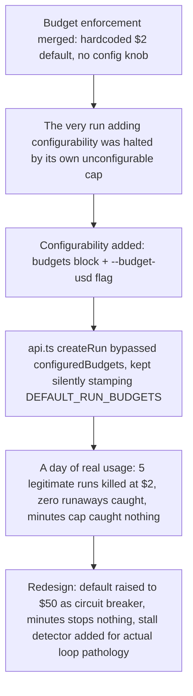

# Delegated-run budgets evolved from an unconfigurable $2 cap into a stall-detecting circuit breaker

**Confidence:** firm — the redesign is backed by concrete before/after usage data (real spends, real overshoot ratios), but the concurrency-cap N-1 bug and the steer.jsonl delivered-vs-stored honesty gap are documented as found without a confirmed-fixed follow-up in this evidence set.

A delegated run (`kage dispatch`) carries a `budgets` object (`usd`, `minutes`, `diff_lines`) that the kernel can enforce mid-run, but the history of this feature is a story of the enforcement mechanism being built ahead of the plumbing it depended on, and then being redesigned once real usage showed it was stopping good work instead of bad work. Enforcement can only act where a live, streamed usage signal exists (the supervisor's live-spawn path parsing `total_cost_usd` off each stream-json turn); a single-shot `Adapter.run()` call only reveals usage after the agent is already done, so true mid-run stopping was only ever possible on the live-supervised path. When enforcement first shipped with a hardcoded $2 default and no way to configure it, it immediately halted the very run that was supposed to add that configurability — an honest, non-agent-failure case where the operator had to verify and merge the finished work by hand outside the normal claim gate. Configurability was then added (a `budgets` block in `DelegationConfig`, a `--budget-usd` flag), but a second, independent bug meant it didn't fully take effect: `api.ts`'s `createRun` call (used by the app/room/daemon dispatch path, as opposed to `kage dispatch`'s own `dispatchRun`) never read `configuredBudgets()` at all and silently stamped every run with the hardcoded `DEFAULT_RUN_BUDGETS`, regardless of what was configured. Budget enforcement's minutes side went through its own quieter bug before the redesign: the minutes meter originally counted wall-clock time including time a run spent stopped, so a recovered run was already "over cap" the instant you tried to resume it, `resume-run`'s `--budget-minutes` flag was silently ignored, and refusal messages sometimes named the wrong cap entirely — the idle-time-counting bug was duplicated across `report.ts` and `tui/app.ts` and had to be fixed at the meter itself (count only running intervals) before the minutes budget could even be evaluated fairly, let alone redesigned. The practical result, observed over a day of real usage, was that legitimate runs kept getting stopped at the stale $2 cap and later merging cleanly anyway ($5.22, $4.85, $8.62, $25.47, $6.04 spends, all good work, zero runaways actually caught), while the minutes cap — even after the idle-time fix — caught nothing at all and enforcement itself overshot the cap by 2.6x-12.7x before a stop even landed. The team's conclusion was that cost is a bad proxy for the actual hazard (an agent looping — retrying the same failing command, or making zero progress unattended). The fix raised the default budget to $50 as a circuit breaker rather than a per-task allowance, removed minutes as a stopping condition entirely (keeping it as a display-only figure), and added a dedicated stall detector in `mcp/delegation/supervisor.ts` that trips on three consecutive identical-command-and-exit-code failures or six consecutive turns with no worktree diff change — the actual signal budgets were being asked to approximate. A separate but related admission-control mechanism, the run concurrency cap, had its own two-stage bug history in the same period: it originally checked the cap *after* an agent child was already spawned, so a full slate could kill the supervisor and orphan a live agent rather than refusing the dispatch outright, and even once that ordering was fixed, a run's own just-written "dispatched" record counted against its own admission check, silently turning a configured cap of N into N-1. This same run-lifecycle machinery also governs steering a live run: `steerRun` appends every steer message to `steer.jsonl` unconditionally, before checking whether it was actually delivered to a live supervisor socket, so the log alone cannot yet distinguish a delivered steer from one that only landed in storage.

## Supporting evidence

- `.agent_memory/packets/negative_result-rejected-approach-budget-enforcement-can-now-stop-a-run-and-there-is-no-way-to-t-b08eb1b3.md` — the origin story: budget enforcement merged with a hardcoded, unconfigurable $2 default, and eight minutes later halted the very run meant to make it configurable; establishes the "enforcement without a lever is worse than no enforcement" framing.
- `.agent_memory/packets/bug_fix-mid-run-budget-enforcement-is-only-possible-where-a-live-streamed-usage-signal-e-f2500c22.md` — the technical constraint that made partial enforcement inevitable: only the live-streamed supervisor path sees usage incrementally, everything else only sees it after the agent finishes.
- `.agent_memory/packets/decision-api-tss-createrun-call-never-passed-a-budgets-option-at-all-independent-of-daemo-e8f3b4de.md` — root-causes why configurability still didn't help the app/room/daemon dispatch path, and lays out the full redesign: raise default to $50, stop stopping on minutes, add the stall detector.
- `.agent_memory/packets/decision-contract-ts-documents-a-real-historical-bug-now-fixed-default-run-budget-usd-rai-f3fd740d.md` — confirms the historical bug (stale $2 cap applied regardless of real config) as fixed, citing a concrete casualty: a 159-commit release-notes chore run killed by the stale cap before succeeding on retry with the correct $40 budget.
- `.agent_memory/packets/decision-the-default-per-run-budget-is-50-mcp-delegation-config-ts-default-run-budget-usd-4470a346.md` — the settled state recorded for release notes: default is $50, minutes is measured/displayed but never halts a run, only `usd_est` or the stall detector stops a run now.
- `.agent_memory/packets/decision-the-stall-detector-added-by-the-budget-circuit-breaker-run-lives-entirely-in-mcp-4c213175.md` — pins down the stall detector's actual location and identifiers (`STALL_SAME_COMMAND_STREAK=3`, `STALL_NO_DIFF_STREAK=6`, `evaluateStallTurn`, `SupervisorState.stallHalted`), and that its evidence rides the existing `state_history` note field rather than a new schema field.
- `.agent_memory/packets/bug_fix-steer-jsonl-never-distinguishes-a-steer-that-was-delivered-live-from-one-that-wa-03cfe634.md` — the steer-delivery-tracking gap in the same supervisor/run-lifecycle subsystem: a future "resume with all pending steers" feature needs a per-message `delivered` flag that does not exist yet.
- `.agent_memory/packets/decision-when-an-operators-diff-size-budget-is-set-with-explicit-awareness-of-the-actual--ad3ee92f.md` — a related but distinct budget type (a diff-size ceiling on a build task, not a run's USD spend): the same honesty convention applies — report the precise remaining gap when still over budget after real trimming, rather than silently cutting required work to force a number under the ceiling.
- `.agent_memory/packets/bug_fix-revert-check-for-the-new-tests-added-this-turn-reverting-displayelapsedms-its-wi-9e5dcd22.md` — the minutes-meter idle-time bug: `resume-run`'s `--budget-minutes` flag was silently ignored and refusal messages named the wrong cap.
- `.agent_memory/packets/bug_fix-the-wall-clock-counts-idle-time-bug-was-not-confined-to-recordspend-the-enforcem-6bbeb84b.md` — the same idle-time-counting bug duplicated in `report.ts` and `tui/app.ts`, fixed to count only running intervals.
- `.agent_memory/packets/decision-claude-codes-live-stream-json-protocol-emits-exactly-one-result-event-per-full-a-6260e051.md` — the final budget-as-circuit-breaker redesign with the measured overshoot (2.6x-12.7x) that made the dollar cap itself suspect even after the meter was fixed.
- `.agent_memory/packets/decision-the-concurrency-cap-had-two-independent-compounding-bugs-a-checked-after-the-age-5efeeb6b.md` — the two compounding run-admission bugs (checked-after-spawn ordering; a run's own dispatched record counting against its own cap, turning N into N-1) in the related concurrency-cap mechanism.

## Contradictions / open questions

- The diff-size-budget packet is evidence of the same "honest overrun reporting" culture as the USD/stall work, but it is a genuinely different budget mechanism (bytes of diff on one build task vs. a per-run dollar circuit breaker) — it is included here as a supporting convention, not as part of the same enforcement code path.
- The concurrency cap is likewise a distinct admission-control mechanism (how many runs may execute at once) from the USD/minutes/stall budgets (whether one running run should be stopped) — grouped here because both are part of the same period's lifecycle-control bug history and both were redirected toward the same conclusion: prefer catching the actual pathology (an orphaned agent; a looping agent) over enforcing a proxy number.
- None of the packets in this cluster confirm whether `steerRun`'s missing `delivered` flag was ever added; it is recorded here as an identified gap, not a resolved one.

## Causality

