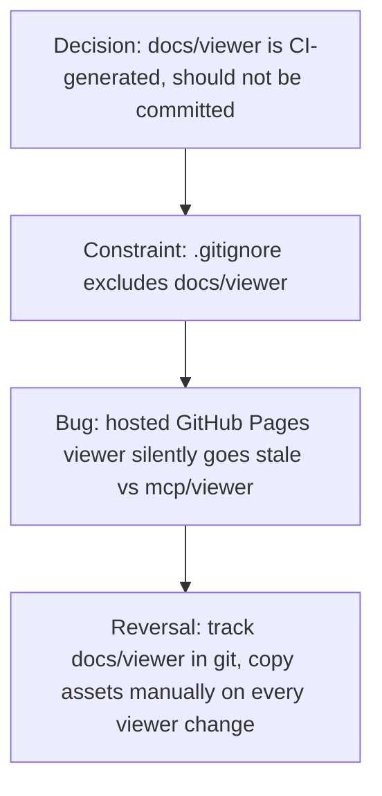

# Local daemon routing vs. hosted GitHub Pages viewer

**Confidence:** firm on the routing/security mechanics (each has a regression test); provisional on the GitHub Pages tracking policy, where the evidence contains a direct, dated contradiction that was never explicitly reconciled in these packets.

The viewer runs in two shapes: a local daemon (`mcp/daemon.ts`) serving a real repo's live data, and a static `docs/viewer` copy hosted on GitHub Pages for anyone without the CLI installed. Both had to solve the same root problem — the viewer's HTML uses relative asset paths like `./app.js`, so serving `index.html` directly at `/` or bare `/viewer` resolves those assets to `/app.js` and 404s. The fix, proven with `curl` (bare `/app.js` → 404, `/viewer/app.js` → 200) and later locked in with a pure unit test (`viewerRedirectLocation`), is that `/`, `/viewer`, and `/viewer/` all 302-redirect to `/viewer/index.html`, carrying forward either an explicit query string or the daemon's generated `graph`/`code`/`metrics` params — while concrete pages like `/viewer/graph.html` must NOT redirect. The daemon also serves every static response with conservative security headers (CSP blocking inline scripts/script attributes, `nosniff`, `no-referrer`, same-origin COOP, `frame-ancestors: none`) — deliberately without nonce complexity, since `app.js` is always loaded as an external script, so a strict CSP doesn't need per-request nonces. A live-updating feed rides on the same daemon: `GET /kage/events` is a `text/event-stream` backed by `fs.watch` on `.agent_memory/packets` (new file → `packet_written`, rewrite → `packet_updated`) and `.agent_memory/reports` (new value-ledger entries → `value_event`), debounced 100ms per file, with a `: connected` comment on attach and `: heartbeat` every 25s; the viewer's Gains-tab live panel only unhides after the `EventSource` actually opens, so on a static host with no daemon (the GitHub Pages demo) the connection errors before opening and the panel correctly stays hidden. The hosted side has its own quirks: with no `graph`/`code` URL params, a hosted viewer is useless, so it auto-loads a bundled `mcp/viewer/demo/graph.json` + `demo/metrics.json`; and the hosted graph format is *compact* (memory entities/edges/episodes stored by ref) so it must be loaded through `loadGraphPath`, not a raw `fetchJson` — using the wrong loader silently drops all memory nodes even when the split `entities.json`/`edges.json`/`episodes.json` files are correctly published. Underneath all of this sits an unresolved policy tension about whether `docs/viewer` itself should be committed: one decision states `docs/viewer` is generated by the Pages workflow and "should not be committed," while three days later a bug fix found `docs/viewer` was `.gitignore`d and that was exactly why the hosted viewer kept going stale relative to `mcp/viewer` — the fix was to keep `docs/viewer` tracked and manually copy `mcp/viewer` assets into it on every viewer UI change. Neither packet references or supersedes the other.

## Supporting evidence

- `.agent_memory/packets/gotcha-viewer-root-must-redirect-to-parameterized-viewer-index-html-2dcb1d52.md` — the root cause (relative asset paths break at `/` and `/viewer`) and the redirect fix, verified with curl.
- `.agent_memory/packets/bug_fix-local-viewer-viewer-route-must-redirect-to-index-with-params-626de899.md` — extending the redirect to the trailing-slash `/viewer/` case, verified with full Playwright click-through across every page.
- `.agent_memory/packets/bug_fix-viewer-route-redirect-has-a-pure-regression-test-2678aca3.md` — locking the redirect behavior into a pure unit test (`viewerRedirectLocation`) independent of a running server.
- `.agent_memory/packets/bug_fix-local-viewer-responses-include-browser-security-headers-4aac607c.md` — CSP/nosniff/referrer/COOP/frame-ancestors headers added to all static viewer responses.
- `.agent_memory/packets/workflow-viewer-live-feed-sse-kage-events-from-fs-watch-on-agent-memory-818902c2.md` — the SSE live-feed mechanism, its debounce/heartbeat behavior, and the static-host-vs-daemon distinction for the live panel.
- `.agent_memory/packets/decision-hosted-viewer-must-auto-load-a-demo-graph-29fd5e52.md` — hosted viewer falling back to a bundled demo graph when opened without params.
- `.agent_memory/packets/bug_fix-hosted-viewer-must-hydrate-compact-memory-graph-530c1dc5.md` — the compact-graph-format bug: hosted loader must use `loadGraphPath`, not raw `fetchJson`, or memory nodes silently vanish.
- `.agent_memory/packets/bug_fix-hosted-github-pages-viewer-must-be-tracked-8497f2eb.md` — `docs/viewer` was gitignored and stale; decided it must be tracked and manually synced.
- `.agent_memory/packets/decision-website-docs-need-dark-docs-style-reference-and-viewer-backlinks-d51ff0ca.md` — states, three days earlier, that `docs/viewer` "is generated by the Pages workflow and should not be committed."

## Contradictions / open questions

Direct, unreconciled contradiction: `decision-website-docs-need-dark-docs-style-reference-and-viewer-backlinks-d51ff0ca.md` (2026-05-12) asserts `docs/viewer` should NOT be committed (generated by CI). `bug_fix-hosted-github-pages-viewer-must-be-tracked-8497f2eb.md` (2026-05-15) found that exact policy caused the hosted viewer to silently go stale, and reversed it: `docs/viewer` must be tracked in git and manually copied on every viewer change. No later packet in this set says whether a CI-generation step was ever restored to remove that manual-copy burden, or whether "tracked and manually copied" is still the live policy today.

## Causality

