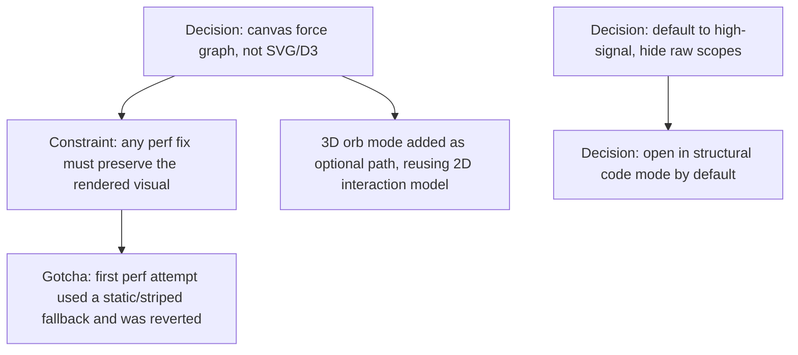

# Viewer graph canvas: rendering approach and default density

**Confidence:** firm — the core rendering decisions read as settled (canvas over SVG/D3, bounded 3D orb, high-signal-by-default), but none of these packets confirm whether the rendering engine survived the later "viewer is now legacy" pivot recorded in the product-design-evolution belief.

The viewer's primary graph surface is a hand-rolled canvas force-graph, not an SVG/D3/Cytoscape renderer — a choice made after directly inspecting a competing memory tool's single-file canvas implementation and adopting the same interaction vocabulary (drag, pan, wheel zoom, hover tooltips, double-click focus, zoom-aware labels) while keeping Kage's own repo/code/memory semantics and shape/color encoding by node type. An optional 3D "Graph Mode = 3D Space" path was added later, lazy-loading Three.js (with a CDN fallback for hosted pages) without replacing the 2D canvas as the default. The 3D mode was deliberately built to *feel* like an orb, not a tilted 2D layout: deterministic spherical start positions, node repulsion, edge springs weaker than a radial orb-gravity constraint (so the shape stays spherical rather than dissolving into a generic force cloud), and code-code edges rendered with visible cyan opacity and depthTest=false so structure is visible before any node is selected — all while preserving the exact same click/drag/hover/selection interaction model as 2D. A hard-learned performance lesson sits underneath both renderers: when a large graph felt slow, the fix must optimize the existing visual (cached edge/degree lookups, throttled redraws, adjacency caches, bounded simulation) rather than swap in a cheaper-looking static/striped fallback — a first attempt at "faster" that visually degraded the graph was reverted as worse than the original. On top of rendering, the graph defaults to a high-signal, filtered view: dependency paths, node_modules, generated artifacts, and lockfile noise are hidden unless explicitly opted into; raw "Focus selection"/"Everything" graph scopes are not exposed as normal controls (memory-code edges stay available internally for recall/ranking/evidence, but only as capped grouped evidence in the inspector); and the local viewer opens in Code mode with an explicit "structural code graph" label by default because Combined mode made the newer, leaner structural code graph look like the old memory-heavy graph. Search over this graph is natural-language rather than exact-substring: queries are tokenized, stop-worded, lightly stemmed, and matched as synonym/concept groups (e.g. run/running/npm, test/tests/vitest) so a plain-English question can find the right runbook or command memory.

## Supporting evidence

- `.agent_memory/packets/decision-decision-kage-viewer-uses-canvas-force-graph-for-interactive-exploration-16a751bc.md` — the founding decision to use a custom canvas force graph, informed by competitor inspection.
- `.agent_memory/packets/reference-reference-memory-tool-viewer-uses-canvas-force-graph-e5e7391a.md` — the competitor research (external tool's canvas implementation) that directly informed the above decision.
- `.agent_memory/packets/gotcha-viewer-performance-fix-must-preserve-graph-visuals-b422fc2a.md` — a reverted performance fix that degraded the graph's visual identity; establishes the constraint that perf work must not change the rendered shape.
- `.agent_memory/packets/code_explanation-viewer-3d-graph-mode-architecture-7402734e.md` — how 3D mode is bolted on: same filtering/selection state, lazy Three.js load, daemon-served vendor path.
- `.agent_memory/packets/code_explanation-3d-viewer-orb-keeps-2d-style-interactions-246bf75c.md` — the "orb, not tilted 2D" design goal and its interaction parity with 2D.
- `.agent_memory/packets/code_explanation-3d-viewer-physics-and-edge-visibility-f9173468.md` — the physics tuning (repulsion, springs weaker than orb gravity, code-edge visibility before selection).
- `.agent_memory/packets/decision-decision-viewer-search-accepts-natural-language-graph-queries-12214ae2.md` — natural-language tokenizing/stemming/synonym search over the graph.
- `.agent_memory/packets/decision-decision-viewer-hides-raw-full-graph-scopes-cafadd16.md` — hiding raw Focus/Everything scopes as product controls.
- `.agent_memory/packets/decision-decision-viewer-must-default-to-high-signal-graph-24bfa4ff.md` — hiding dependency/node_modules/generated noise by default.
- `.agent_memory/packets/decision-viewer-opens-structural-code-graph-mode-by-default-242b6e41.md` — default view=code so the structural code graph artifact is what users see first.

## Contradictions / open questions

None found in the cited evidence — these decisions build on each other chronologically (canvas choice → 3D extension → perf constraint → default-scope decisions) without reversing one another. What remains open: whether this rendering stack was still in place by the time the viewer itself was declared legacy (see `portal-product-design-evolution`); none of these 10 packets say.

## Causality

