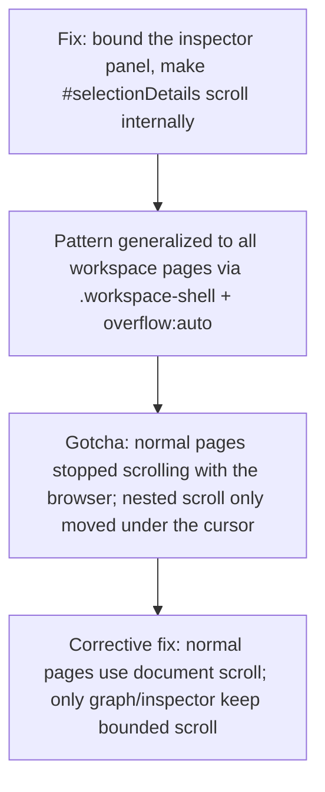

# Viewer layout: bounded scroll regions and explicit navigation

**Confidence:** firm — a small, consistent set of layout bugs with clear before/after fixes and Playwright verification; all are marked deprecated in their frontmatter status (superseded by the later product redesign, not because the underlying lesson was wrong).

A recurring class of viewer bugs came from not deciding, page by page, whether the *document* should scroll or an *inner container* should scroll — and from assuming that page navigation and node selection were the same user action. The inspector/detail panel was the worst offender: a selected node with long detail rows or many connected-relation summaries could blow out the whole page height, making the canvas appear to jump or vanish, because only the outer inspector was bounded, not its content. The fix pattern that emerged and repeated was consistent: make the details panel a bounded flex container, make the actual content region (`#selectionDetails`, later per-section `.detail-section-list` wrappers for "Connected Relations" and "Memory-Code Evidence") the internal scroll region with a capped height (260px lists), and cap individual long rows/link bodies — verified each time by a Playwright check that body/page height stays constant before and after selection. The same principle generalized to whole pages: the Memory page had felt "flimsy" because lifecycle/review/timeline/audit/lineage/session-capture sections all expanded above the actual memory list, leaving only ~220px of list height in a 1000px viewport — fixed by collapsing governance reports behind a `.memory-governance` toggle and keeping workspace pages viewport-bound, revealing the inspector only after selection. But this collapsing-container pattern was then over-applied: normal pages (not just Graph/Inspector) had been given fixed-height `.workspace-shell` containers with `overflow:auto`, which created nested scroll regions where the browser page itself wouldn't move unless the cursor was directly over the right panel — the corrected rule is that *normal* pages use ordinary document scrolling (`height:auto`, `overflow:visible`) and only graph-specific and inspector-specific surfaces keep bounded internal scroll. Separately, selection and navigation were untangled: selecting an entity or edge in the viewer should update selection/inspector state without changing the active page — memory packet rows stay on the Memory page when clicked — while a small set of intentional actions (path-focus from Owners/Intel) still explicitly switch to the Graph page and update the URL, so URL, nav state, and visible panel always agree. A final QA pass across the whole viewer reinforced that pages must be checked by actually clicking/searching/selecting, not just loading them — that pass is what surfaced and fixed graph zero-result recovery, visibly-selected memory rows, consolidated review-count badges, a real details panel for data diagnostics, and non-inert risk rows.

## Supporting evidence

- `.agent_memory/packets/bug_fix-bug-fix-the-viewer-inspector-could-explode-the-page-height-when-a-selected-node--95f90fca.md` — the original inspector page-height-explosion bug and its bounded-flex-container fix.
- `.agent_memory/packets/bug_fix-bug-fix-inspector-connected-relation-sections-need-their-own-scroll-containers-92bf3faa.md` — follow-up: high-degree nodes still overflowed until each relation section got its own `.detail-section-list` scroll container.
- `.agent_memory/packets/bug_fix-viewer-memory-page-keeps-scrollable-content-bounded-9c94491d.md` — the Memory page's governance/lifecycle sections crowding out the actual list, fixed by collapsing them.
- `.agent_memory/packets/bug_fix-viewer-normal-pages-use-document-scroll-not-nested-workspace-scroll-4ed18571.md` — the corrective generalization: normal pages must use document scroll, not a nested fixed-height workspace shell.
- `.agent_memory/packets/bug_fix-viewer-selection-should-not-imply-page-navigation-0e41beca.md` — selection state must not silently change the active page; only explicit actions navigate.
- `.agent_memory/packets/bug_fix-viewer-qa-repairs-make-page-actions-visible-a307bede.md` — a broader QA pass that required interacting with each route, not just loading it, and the resulting visibility fixes.

## Contradictions / open questions

The document-scroll fix (`4ed18571`) directly overturned an earlier layout approach — every normal page had been given the fixed-height `.workspace-shell overflow:auto` treatment that the inspector fixes had established as a good pattern for bounded panels, and it took a separate bug report ("scrolling felt broken... page didn't move unless the cursor was over the right panel") to recognize that pattern shouldn't have been applied globally. The lesson that survives is narrower than the first fix suggested: bound scroll only where content is genuinely open-ended within a fixed frame (inspector detail lists, graph canvas), not on every page.

## Causality

