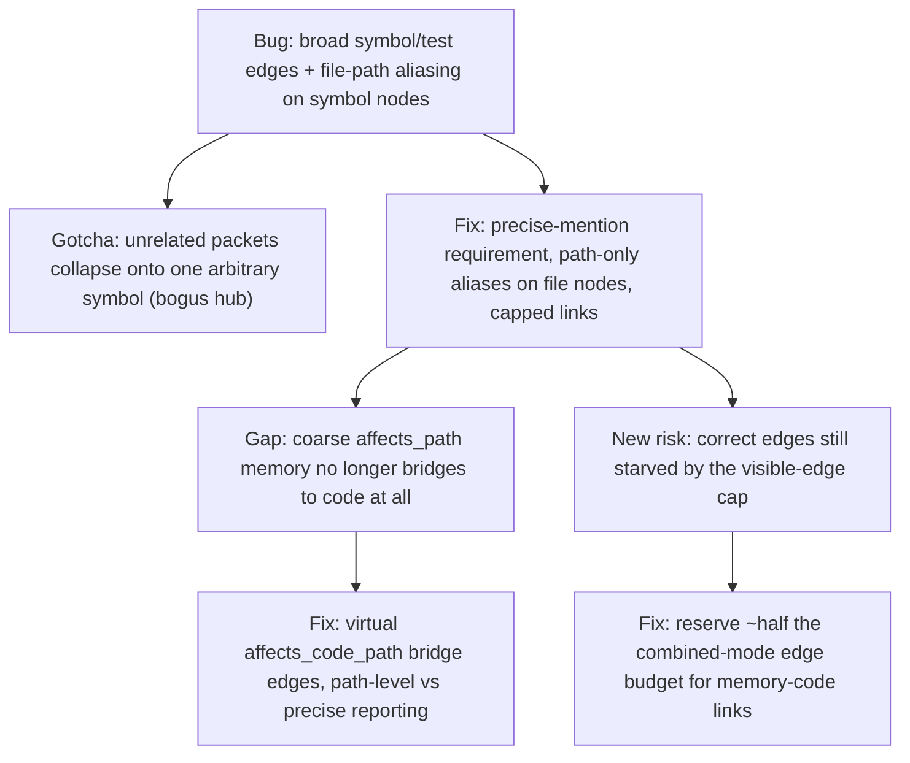

# Making the memory-code graph visually trustworthy

**Confidence:** firm — this is a coherent sequence of bug fixes, mostly still "approved," that converges on a specific, testable definition of what counts as a real memory-code link; the underlying kernel.ts logic they describe is not re-verified here beyond the packets' own path fingerprints.

Kage's combined viewer view is supposed to show memory and code as one connected graph, but for a stretch of development that view kept looking like two unrelated graphs glued together, and the fixes for this form a single throughline: be precise about what counts as a memory-code edge, and make sure the visible-edge budget doesn't crowd those edges out. The root bug was that knowledge-graph generation created broad symbol/test edges from packet paths, and viewer canonicalization let stale symbol/test aliases fall back to generic file nodes — the fix requires explicit non-generic symbol/test mentions for a "precise" link, caps precise links per packet, and strips file-path aliases off symbol/route/test entities entirely (file paths belong only to file nodes). That last point had its own sharp edge: letting a symbol or route node advertise its own file path as an alias meant many unrelated memory packets that merely mentioned that path could all canonicalize onto the same arbitrary symbol — e.g. everything mentioning a file collapsing onto one function like `byDate` — creating a bogus mega-hub with thousands of spurious memory-code edges. Beyond exact-path precision, coarser "affects_path: src"-style memory needed a different bridge: since path nodes don't canonicalize to `file:src/...` code nodes on their own, the viewer adds capped *virtual* `affects_code_path` edges from packet to representative matching files at merge/render time, and audits report path-level and precise links as separate categories so broad grounding isn't misreported as zero. Even with correct edges computed, the canvas edge-count cap could still visually starve them: default combined mode now reserves roughly half the visible-edge budget for memory-code links specifically, adds memory-code peer nodes before spending the remaining budget on code-code edges, and ranks path-bridge/file peers above generic high-degree symbols — code-code edges stay visible for structure, but memory-to-code is made the dominant visual story. Signal-mode ranking had a parallel failure on the code-only side: keeping only high-degree symbols/tests could drop file endpoints entirely, making valid file-to-symbol/import/call relations show as zero visible edges under the node cap; the fix adds connected peers from visible edges so those endpoints survive. Underneath all of this, recall itself moved from raw keyword presence to BM25 as the lexical ranking stage, and the viewer coalesces memory-graph code entities with code-graph nodes through aliases specifically so that correctness — because a graph that has memory-code edges in its JSON but hides them visually, or a recall that scores on keyword presence instead of a real ranking function, both make the product's retrieval claims stronger than its actual behavior. Once an edge is trustworthy, the node inspector was also upgraded to show type-specific metadata (file: path/language/parser/size/lines/hash; symbol/test: path/parser/line/export/signature; route: method/path/framework/handler) rather than generic ID/summary rows, and combined mode selects connected code endpoints so memory, code, and their relations stay visible together.

## Supporting evidence

- `.agent_memory/packets/bug_fix-bug-fix-viewer-memory-code-graphs-looked-disconnected-because-knowledge-graph-ge-bec25d3d.md` — root-cause fix: require explicit precise symbol/test mentions, cap precise links, strip file-path aliases from symbol/route/test nodes.
- `.agent_memory/packets/bug_fix-viewer-must-not-map-file-path-aliases-to-arbitrary-symbols-1f76273b.md` — the specific aliasing bug (bare file path collapsing onto an arbitrary symbol, creating bogus hubs) and its fix.
- `.agent_memory/packets/bug_fix-viewer-bridges-path-level-memory-to-code-files-bafb4993.md` — virtual `affects_code_path` bridge edges for coarse path-level memory, plus separated path-level vs precise audit reporting.
- `.agent_memory/packets/bug_fix-viewer-combined-mode-must-prioritize-visible-memory-code-links-a9eb1584.md` — reserving visible-edge budget for memory-code links so combined mode doesn't look code-only.
- `.agent_memory/packets/decision-viewer-combined-mode-must-balance-memory-and-code-d7364ca2.md` — the earlier decision-level statement of the same combined-mode budget problem on a large repo.
- `.agent_memory/packets/bug_fix-viewer-signal-mode-must-preserve-code-graph-endpoints-075ba83c.md` — code-view signal ranking dropping file endpoints, fixed by adding connected peers.
- `.agent_memory/packets/decision-recall-ranking-uses-bm25-and-viewer-coalesces-memory-code-nodes-612d2efa.md` — BM25 as the lexical ranking stage plus alias-based node coalescing, framed explicitly as a correctness/honesty fix.
- `.agent_memory/packets/bug_fix-viewer-node-inspector-shows-type-specific-code-details-f9763e07.md` — type-specific inspector metadata and combined-mode connected-endpoint selection.

## Contradictions / open questions

None found in the cited evidence — each fix narrows or corrects the one before it (broad edges → precise edges → path bridging → visible-budget balancing → endpoint preservation) rather than reversing prior work.

## Causality

