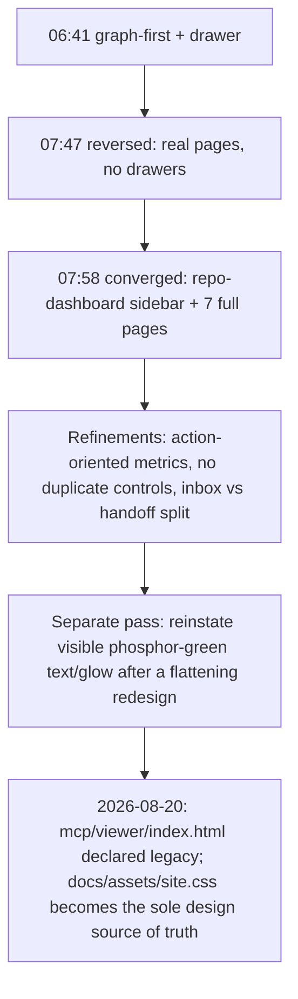

# The viewer's product-shell redesign, and its later retirement

**Confidence:** firm on what happened and roughly when; the "why the whole cluster reads as churny" part is inference from packet status/timestamps, not stated explicitly anywhere — and the endpoint (the viewer becoming legacy) is well evidenced but its full replacement is out of scope for these packets.

On a single day (2026-05-15) the viewer's information architecture flip-flopped several times before converging, and the packet trail makes the flip-flopping visible: at 06:41 the decision was "stay graph-first" (canvas primary, floating toolbar, one active side workspace/tab); twelve minutes later, "workspace should be a drawer" (canvas-first, workspace hidden until opened); by 07:09 that inverted to "overview dashboard first, then a dedicated graph workspace"; by 07:47 the drawer idea itself was reversed — "use separate pages instead of drawer panels," because drawer overlays didn't read as a real product. By 07:58 these converged on the shape that stuck: a repo-dashboard-style frame with a persistent left sidebar, route navigation, a status strip, and separate full pages for Overview, Graph, Memory, Owners, Intel, Review, and Data — explicitly modeled on an external repo-dashboard tool's IA rather than invented from scratch. The rest of that day's decisions are refinements on top of that converged shell rather than reversals: avoid duplicate controls and alias pages (the graph "quickbar" and hidden workspace tabs were removed once Graph already had a normal controls panel); pages should lead with compact, decision-tied action metrics instead of raw lists (memory grounding, source-map coverage, handoff blockers, ownership concentration) with Debug explicitly relabeled as raw diagnostics, not a normal workflow; every metric, card, or row should sit next to a concrete "what should I do next" cue rather than raw numbers; and actionable UX means *fewer* choices, not more instructional labels — Overview capped to a few primary decisions, Intel capped to top-priority signals, no per-row action spam. A later pass (05-18) pushed the same philosophy further: Overview capped to three top metrics/cards, Memory hiding overview charts and governance by default, diagnostics kept fully out of the default workflow. Two content-model decisions rode alongside the shell work: repo-intelligence reports (risk with co-change warnings and ownership silos, module health, workspace links, blast radius) became a navigable "Repo Intelligence cockpit" rather than flat summary counts, with a "Workspace Map" sub-view for cross-package dependencies, route contracts, and cross-repo co-change pairs; and — after the review page had been conflating them — the Memory "inbox" count (pending/stale/duplicate blockers, a trust signal) was explicitly separated from broader handoff review items (lifecycle/audit/timeline/lineage warnings), with copy standardized on "Before You Edit" instead of a stale "Open risks" label. In parallel with the layout churn, the visual identity got its own late-day pass: a "clean redesign" mandate had started flattening the brand, so green was reinstated as a first-class identity element — visible in text (headings, active nav, panel titles, status values), not just borders/glow, on the original phosphor palette (`#41ff8f` strong, `#b9fbc0` normal, `#6ea77d` dim) rather than a paler mint, plus deliberate glow on the logo, active nav, graph frame, memory nodes, and memory-code edges. That entire viewer design language — the repo-dashboard shell, the terminal-green phosphor theme, the action-first page philosophy — was itself later declared legacy: a 2026-08-20 packet states plainly that `mcp/viewer/index.html` is "a LEGACY surface being retired," and that the product's actual visual source of truth is now `docs/assets/site.css` (the marketing site's "V2 receipts theme": dark-first, green reserved narrowly for gains/primary-action figures, editorial serif display type, soft 10-22px radii) — a different green-black palette, different mark (a glowing eye rather than a kanji character), and different fonts than anything the May 15 viewer-theme decisions established. The general lesson recorded there: when told to match "the" design language, confirm which surface the product is actually sold on — two internal surfaces can both look plausible and only one is canonical.

## Supporting evidence

- `.agent_memory/packets/decision-viewer-should-stay-graph-first-ed2ee06f.md` — 06:41, graph-first / floating toolbar / one active side workspace.
- `.agent_memory/packets/decision-viewer-workspace-should-be-a-drawer-4bba52c3.md` — 06:53, workspace hidden as a drawer, opened by quick controls.
- `.agent_memory/packets/decision-viewer-uses-overview-dashboard-plus-graph-workspace-be4b4d2c.md` — 07:09, overview-dashboard-first, then dedicated graph workspace.
- `.agent_memory/packets/decision-viewer-uses-separate-pages-instead-of-drawer-panels-d6a906e3.md` — 07:47, reversal of the drawer approach in favor of real pages.
- `.agent_memory/packets/decision-viewer-adopts-repo-dashboard-repo-sidebar-e3454461.md` — 07:58, the converged shell: persistent sidebar + route nav + Overview/Graph/Memory/Owners/Intel/Review/Data pages.
- `.agent_memory/packets/decision-viewer-pages-should-avoid-duplicate-controls-6a7f60dd.md` — removing the graph quickbar/hidden tabs once pages had their own controls.
- `.agent_memory/packets/decision-viewer-metrics-should-be-action-oriented-bf76d7e5.md` — user-actionable metric labels over raw implementation counters.
- `.agent_memory/packets/decision-viewer-pages-should-lead-with-action-metrics-7a93ae5a.md` — pages leading with decision-tied compact charts; Debug relabeled as diagnostics.
- `.agent_memory/packets/decision-viewer-components-must-show-action-next-to-insight-400a902b.md` — every metric/card/row needs a nearby action or decision cue.
- `.agent_memory/packets/decision-actionable-viewer-ux-means-fewer-choices-not-more-labels-0f56c8d6.md` — fewer choices, not more labels; caps on Overview/Intel/Debug.
- `.agent_memory/packets/decision-viewer-defaults-favor-focused-pages-over-diagnostic-walls-30e57baa.md` — 05-18 follow-up pushing the same sparse-page philosophy further.
- `.agent_memory/packets/decision-viewer-graph-ux-is-task-first-not-graph-engine-first-26fdaad6.md` — Graph page as a small task workflow, not a diagnostics engine; Inspector/Path Finder only after selection.
- `.agent_memory/packets/decision-viewer-cockpit-surfaces-repo-intelligence-reports-1c11099b.md` — repo intelligence reports (risk, module health, graph insights) as a first-class cockpit.
- `.agent_memory/packets/decision-viewer-surfaces-repo-dashboard-repo-intelligence-maps-16fd13d8.md` — intelligence reports as navigable operational maps, not flat summaries.
- `.agent_memory/packets/decision-viewer-workspace-map-exposes-repo-links-f29a4f27.md` — Workspace Map rows for package deps, route contracts, cross-repo co-change pairs.
- `.agent_memory/packets/decision-viewer-must-separate-inbox-blockers-from-handoff-review-items-ea1b70e3.md` — separating the Memory inbox trust signal from broader handoff review items; "Before You Edit" copy standard.
- `.agent_memory/packets/decision-viewer-workflows-stay-action-first-8192db16.md` — full-width Memory library until selection, compact mobile primary tabs, graph visible early.
- `.agent_memory/packets/decision-viewer-needs-visible-kage-green-glow-bae85adf.md` — reinstating visible green glow on logo/nav/graph/nodes/edges after a flattening redesign.
- `.agent_memory/packets/decision-viewer-green-theme-includes-text-264312ce.md` — green must appear in text (headings, nav, status), not only borders/glow.
- `.agent_memory/packets/decision-viewer-uses-original-phosphor-green-a45fdbaa.md` — exact phosphor palette values, rejecting a paler mint substitute.
- `.agent_memory/packets/convention-docs-assets-site-css-is-kages-design-source-of-truth-not-the-viewer-decb504e.md` — 2026-08-20: `mcp/viewer/index.html` declared legacy; `docs/assets/site.css` (different palette, mark, and type system) is now the canonical design source.

## Contradictions / open questions

The 05-15 sequence directly contradicts itself in short order: graph-first-with-drawer (06:41–06:53) was reversed to dashboard-first-with-pages (07:09–07:47) within about an hour, before both settled into the repo-dashboard-sidebar shell at 07:58. All four of the reversed early decisions carry `x-kage-status: deprecated`; the shell, action-metrics, and task-first-graph decisions that followed are `approved` — status here is a reasonably reliable proxy for "what actually shipped," but none of the packets narrate the reversals explicitly as reversals. Separately, the entire cluster's premise — that this repo-dashboard shell and phosphor-green theme is "the" viewer design — is itself superseded by the 2026-08-20 packet, which does not describe what (if anything) replaced this IA, only that the surface is retired and a different app now uses a different design source.

## Causality

