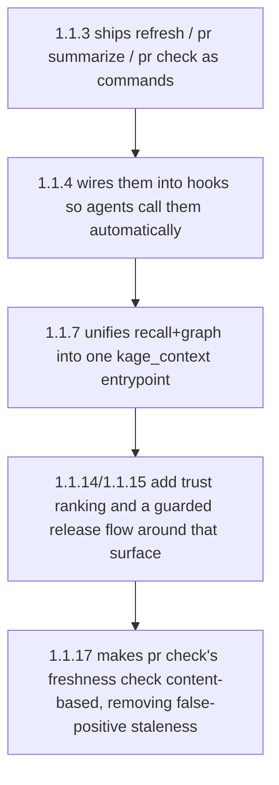

# Release: the 1.1.x Feature Train and Changelog Convention

**Confidence:** firm — each release is individually verified (npm test/pack/publish/smoke-install cited per decision), and the sequence reads as one coherent build-out rather than disconnected facts.

Between versions 1.1.3 and 1.1.17, Kage's npm package went through a tight, sequential feature build-out, each shipped and verified the same way (`npm test --prefix mcp`, `npm pack --dry-run`, `npm publish`, then a version/smoke check). 1.1.3 landed the core memory-lifecycle commands — `kage refresh` (rebuild indexes/code graph/memory graph/metrics, mark staleness), `kage pr summarize` (branch change memory), `kage pr check` (freshness/staleness/validation gate) — plus their MCP tool equivalents and a `kage upgrade` path. 1.1.4 wired those commands into the ambient agent policy itself, teaching Codex/Claude hooks to call `kage_refresh` after changes and `kage_pr_check` before merge claims, via both SessionStart and Stop hooks (the Stop hook best-effort refreshes and writes PR summary memory whenever git changes exist). 1.1.5 added same-task A/B benchmarking (`kage benchmark --compare --task`, `kage_benchmark_compare`), with a self-benchmark showing 115,334 baseline tokens vs. 1,906 Kage-context tokens (98% smaller) as the headline proof number. 1.1.7 was a launch-readiness pass: it introduced the combined `kage_context` MCP entrypoint (validate+recall+code-graph+knowledge-graph in one call, which is now the documented preferred tool order) and fixed a repo_map duplicate-packet bug in refresh. 1.1.12 was purely a documentation/launch-notes patch (adding a "Latest Release" section to `mcp/README.md` so npm actually surfaces release notes). 1.1.14 published the BM25 lexical-recall and memory/code-graph trust pass. 1.1.15 added a guarded release helper (dry-run-by-default, ancestor/clean-worktree checks, GIT_EDITOR forcing — see the companion belief on the publish flow) and fixed `kage propose --from-diff` to include reviewable packet/pending diffs instead of filtering them out as noise. 1.1.17 closed the loop with content-based graph freshness: `kage pr check` now hashes source/config/packet/code-index inputs, so push-only or same-tree commits stop demanding a redundant refresh while real content changes still correctly stale the graph.

Underlying all of these, `CHANGELOG.md` follows a specific convention: entries are living documents while a version is still unpublished — new work gets appended as new bullet sections under the *existing* version heading (e.g. continuing to add to a "## v3.2.0" heading) rather than creating a new version heading, because nothing has shipped under that number yet; only once a version is actually on the npm registry does the next version get its own new heading. This convention was reinforced negatively: a delegated attempt to write "the next version's" release notes from a `git log` of 159 commits since a stale two-day-old snapshot was explicitly rejected as "stale by two days — dozens of merges behind," with the correct fix being to redispatch a fresh changelog run once the release wave was actually complete, rather than patch a changelog written against an outdated commit range.

## Supporting evidence

- `.agent_memory/packets/decision-release-1-1-3-memory-lifecycle-dff31776.md` — kage refresh/pr summarize/pr check/kage upgrade shipped.
- `.agent_memory/packets/decision-release-1-1-4-ambient-policy-and-claude-hooks-d93a1d4e.md` — SessionStart/Stop hooks wired to the new commands.
- `.agent_memory/packets/decision-release-1-1-5-same-task-a-b-benchmark-fb0381fc.md` — A/B benchmark tooling and the 98%-smaller-context proof number.
- `.agent_memory/packets/decision-release-1-1-7-launch-readiness-alignment-78721468.md` — combined kage_context entrypoint, repo_map dedup fix.
- `.agent_memory/packets/decision-release-1-1-12-npm-docs-and-launch-notes-4755a6c9.md` — npm README release-notes surfacing patch.
- `.agent_memory/packets/decision-release-1-1-14-bm25-and-memory-code-graph-package-dcea3799.md` — BM25 recall and code-graph trust pass.
- `.agent_memory/packets/decision-release-1-1-15-adds-guarded-npm-release-flow-316458ad.md` — guarded release helper, propose --from-diff packet inclusion fix.
- `.agent_memory/packets/decision-release-1-1-17-content-based-graph-freshness-b3b879ac.md` — hash-based freshness, eliminating redundant refresh demands.
- `.agent_memory/packets/decision-changelog-mds-per-version-entries-in-this-repo-are-meant-to-be-living-updated-in-8de6f350.md` — the living-changelog-entry convention while unpublished.
- `.agent_memory/packets/negative_result-rejected-approach-write-the-release-notes-for-the-next-version-159-commits-have--4bafe531.md` — a stale changelog-writing attempt rejected, and why staleness (not correctness) was the failure mode.

## Contradictions / open questions

- None found in the cited evidence — the eight 1.1.x decisions read as a clean, non-overlapping sequence with no contradicting claims.

## Causality

