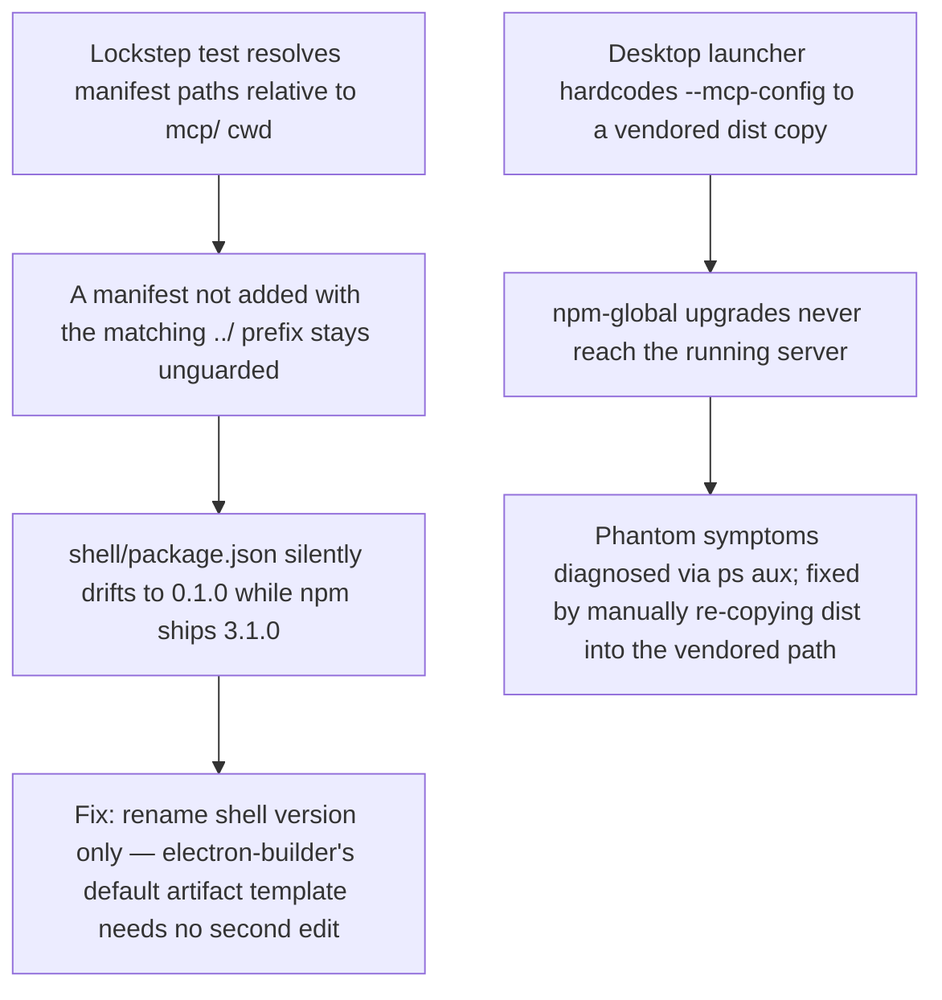

# Release: Version Lockstep and the Burned npm Lineage

**Confidence:** firm — the drift incident and the test that now guards it are both directly evidenced, though we only have the aftermath/fix, not a first-hand account of the original bad publish.

Kage's version number has to agree across several independently-edited files at once: `mcp/package.json` (the source of truth, read at test runtime), `server.json`, both plugin manifests, and `shell/package.json` for the desktop app — plus a vendored copy of the MCP server that the Claude desktop launcher pins directly and that npm upgrades never reach automatically. `mcp/release.test.ts` enforces this with a "distribution manifests stay in version lockstep" test that has no hardcoded version literal: it reads `mcp/package.json`'s version dynamically and diffs it against every other manifest, comparing only `version` (and `packages[].version`) fields, so touching description text elsewhere is safe but a version left un-bumped anywhere is not. The test's one real weakness is that it resolves every manifest path relative to `mcp/` (the suite's cwd) — a new manifest added without matching the same `../` prefix convention silently sits unguarded. That gap is exactly what caused the lineage's actual "burn": `shell/package.json` drifted all the way down to `0.1.0` while npm's published package was already at `3.1.0`, unnoticed because nothing in the lockstep test's path set was watching it. The recovery path made two moves: renaming the shell version alone is sufficient to fix downstream artifact names, since no file in the repo bakes a literal version string like `Kage-3.2.0` — electron-builder derives artifact filenames from `shell/package.json`'s version via its default `${productName}-${version}-${arch}` template, so there is no second place to edit.

A second, unrelated flavor of version skew hits the *running* MCP server rather than the published package: the Claude desktop app launches sessions with an inline `--mcp-config` flag that hardcodes a vendored copy at `~/.claude/kage-mcp/dist/index.js` (dating back to an old `install.sh`), which overrides both `~/.claude.json` and any project `.mcp.json`. This means npm-global upgrades and config edits never reach the actually-running server — producing confusing phantom symptoms (validation errors for types the new server would accept, an oversized code graph including files the new server would exclude) that look like a bug in the new version but are really just the old vendored version still running. The fix is the same "upgrade the vendored copy in place" step now folded into the release runbook, and diagnosis is `ps aux | grep kage` to see which config path actually won. Adjacent to both of these is the unscoped `kage-graph-mcp` alias package, published because X and Reddit auto-mangle `@kage-core/...` into a user mention — it depends on `@kage-core/kage-graph-mcp` and must have its own version bumped and republished at every release, or social copy silently starts serving a stale dependency.

## Supporting evidence

- `.agent_memory/packets/bug_fix-mcp-release-test-tss-version-lockstep-test-reads-every-manifest-path-relative-to-caff67dd.md` — the relative-path convention gap and the concrete shell/package.json 0.1.0-vs-npm-3.1.0 drift it caused.
- `.agent_memory/packets/decision-mcp-release-test-tss-distribution-manifests-stay-in-version-lockstep-test-reads--9e1465ad.md` — the test reads mcp/package.json's version dynamically, no hardcoded literal.
- `.agent_memory/packets/decision-mcp-release-test-tss-version-lockstep-test-only-compares-version-fields-and-pack-5c26d569.md` — scope of the comparison (version fields only, not descriptions).
- `.agent_memory/packets/decision-no-file-in-the-repo-contains-a-literal-kage-3-2-0-or-version-embedded-artifact-f-60bb1099.md` — artifact filenames derive from shell/package.json via electron-builder's default template; no second edit point.
- `.agent_memory/packets/gotcha-mcp-version-skew-launcher-mcp-config-pins-vendored-claude-kage-mcp-overriding-al-e6178d3c.md` — the separate vendored-copy skew story: launcher config override, diagnosis, and fix.
- `.agent_memory/packets/gotcha-social-sites-mangle-scoped-npm-commands-use-unscoped-alias-kage-graph-mcp-in-all-b69bc9d6.md` — the unscoped alias package and the discipline of bumping it alongside every main release.

## Contradictions / open questions

- None found in the cited evidence, but the packets only document the *fix* for the shell/package.json drift, not who introduced it or when — the original bad publish itself is inferred, not directly witnessed.

## Causality

