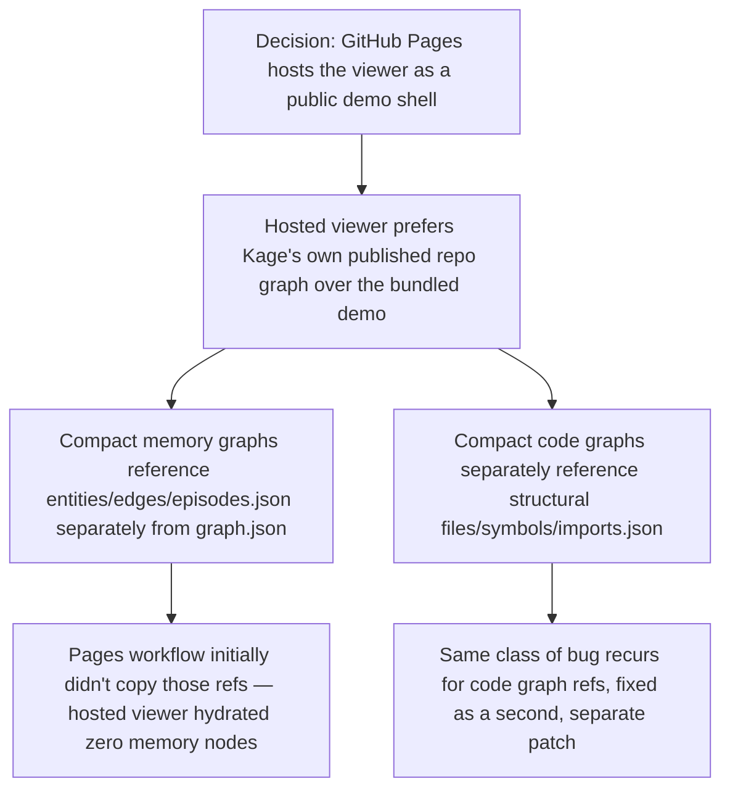
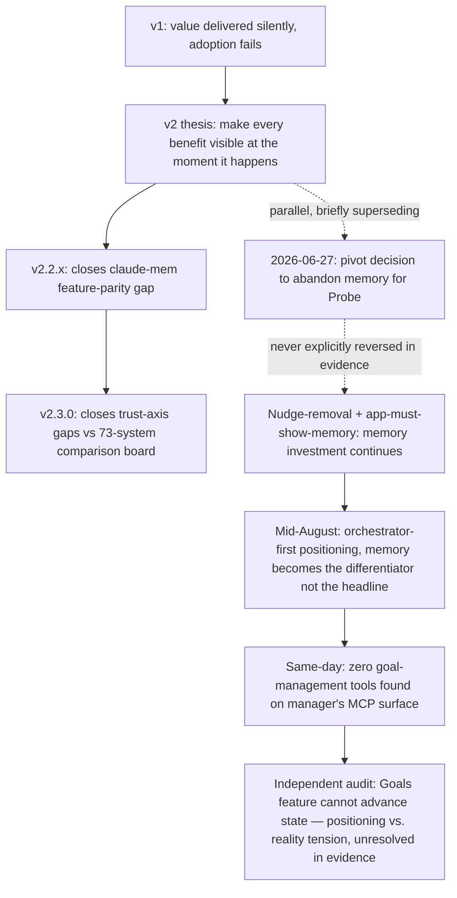

# Release: Website, Hosted Viewer, and Public Positioning

**Confidence:** firm for the mechanical/hosting facts (GitHub Pages behavior, viewer publish steps, registry auth) and for decisions stated plainly as decisions (license, benchmark policy, website revamp, messaging rules); provisional for the strategic positioning arc (v2 visibility thesis → parity releases → Probe pivot → orchestrator-first pivot), which has changed direction multiple times and whose most recent framing rests on a goal-execution engine an internal audit found to be a shell; also provisional for launch-marketing effectiveness claims, which are self-reported from a single launch window rather than independently re-verified over time.

Kage's public-facing surface — the GitHub Pages site and the hosted viewer it serves — is built by a Pages workflow that copies static content into `docs/` at deploy time: it copies `mcp/viewer` into `docs/viewer` (triggered on viewer changes) so `https://kage-core.github.io/Kage/viewer/` stays live as a demo shell, while the actual local `kage viewer` remains the preferred way to auto-load a repo's real graph, code graph, metrics, review, and pending queue. The hosted viewer is designed to load Kage's *own* published repo graph/code graph/metrics by default (from `viewer/data/kage`, populated by copying `.agent_memory/graph/graph.json`, `.agent_memory/code_graph/graph.json`, and `.agent_memory/metrics.json` at deploy time), falling back to a bundled demo graph only when those aren't present. This "copy the compact graph plus its referenced parts" pattern turned out to be a recurring gap rather than a one-time fix: compact memory graphs reference `entities.json`, `edges.json`, and `episodes.json` alongside `graph.json`, and separately, compact code graphs reference `../structural/files.json`, `symbols.json`, and `imports.json` alongside their own `graph.json` — each is a distinct set of files the Pages workflow had to be taught to copy, and missing either one silently hydrates zero memory or code nodes in the hosted viewer with no visible error. Separately, the plain marketing pages (`docs/guide.html`, `docs/benchmarks.html`, `docs/releases.html`, `docs/demo.html`) share an identical hand-copied nav and footer with no shared partial or include, so any homepage section rename has to be propagated to all four files by hand or they silently diverge. Two more Pages mechanics carry the same "static hosting has sharp edges" flavor: GitHub Pages serves `docs/` with no Jekyll processing, so linking directly to a `.md` file (e.g. from `index.html`) serves raw, unrendered markdown rather than a formatted page — confirmed unchanged across at least one site redesign, first found against `TRUST.md`/`BENCHMARKS.md` and reconfirmed later against other doc links — so anything user-facing needs a dedicated `.html` page added to the nav rather than a bare markdown link; and the custom domain (`kage-core.com`, wired via `docs/CNAME` plus DNS pointing the apex at Pages) needs HTTPS enforcement explicitly turned on in the Pages settings, since the CNAME redirect can silently resolve to a broken `http://` URL even when the underlying deployment and assets are completely healthy — a defect that reads as "the site is broken" when it's actually one settings toggle. The launch site's brand mark is a glowing, blinking boxed-eye logo (`docs/assets/kage-eye.svg`) implemented with lightweight CSS rather than a heavier animation dependency, and the public repo is deliberately kept free of generated launch artifacts (one-off marketing/demo render scripts, raw terminal recordings, generated videos, internal launch-planning docs, generated `docs/viewer` output) — only assets that README/docs/site/viewer actually reference get committed, and stale memory packets that only explain now-removed artifacts get deleted so public memory doesn't dangle.

On the positioning side, several standing decisions govern what the public site and launch materials are allowed to claim. Messaging is own-story-only: outbound and repo marketing describe Kage's own value (verified, git-native, team-shared, code-grounded memory) and never frame it against named competitors or post teardown/comparison content — a rule that was reactively enforced once, not gotten right the first time, by removing a "Kage vs claude-mem" comparison set that had already shipped. Future releases license under GPL-3.0-only (commercial use and selling remain allowed, but distributed modified versions must keep source available under GPL; older MIT releases keep their original terms) — README and npm metadata should say so explicitly. Benchmark numbers are governed by a strict rule: a score is only valid relative to the harness that produced it, so comparing Kage's number to a competitor's published number is invalid across different protocols/datasets; the only sound options are running both through one harness or publishing only Kage's own numbers, leading with the Trust Benchmark. The broader website revamp direction is to present Kage as a serious CLI + MCP tool for AI coding agents — npm package proof, real docs and releases pages, repo-local trust signals — rather than a "neon hive" launch-page aesthetic, with the CLI treated as the product interface embedded in quickstart/workflow examples rather than a separate top-level nav category. CHANGELOG.md entries follow their own fixed voice ("## vX.Y.Z — short human title" with bold-led, user-facing bullets, not file-content bullets), with a real process gap found while writing one: an entry for a version can already exist mid-stream from release-prep, covering only what had landed by that point, so "write the release notes since vLast" must check for a stale same-version entry already present rather than assuming the changelog's last line is the true starting point.

Underneath the site-level decisions sits a strategic positioning arc that moved through several distinct stances over a few months. The founding "v2 thesis" (mid-June 2026) was that v1 failed adoption because its value was invisible by design — recall and stale-withholding fired silently inside the agent loop — so v2 made every benefit visible at the moment it happened: a 60-second `kage scan` shock report, a token receipt on every recall, a dollar-denominated gains ledger, staleguard firing at change-time, and a viewer that lands on the savings receipt. That thesis drove a run of comparison-driven releases (each measured against, but never publicly framed against, competitors — consistent with the own-story-only messaging rule): v2.2.0 and the fuller v2.2.x closed a feature-parity gap against claude-mem/CMEM across eleven PRs in about a day (one-shot install, hooks+commands plugin, signal-gated auto-capture, session continuity), and v2.3.0 closed specific gaps against a 73-system public comparison board (contradiction detection, docs search, three more platform integrations, layered memory), landing at roughly #2 behind the field leader. Running in parallel to — and briefly superseding — that memory-first thread was a full pivot decision, dated 2026-06-27, to abandon "verified memory for coding agents" (judged a category being commoditized free by native IDE/agent memory, with no monetization surface and near-zero conversion) in favor of "Probe," a deterministic cross-vendor blast-radius PR gate with a real hosted-and-billable surface; this was the outcome of a structured multi-agent evaluation scoring six pivot theses, with Probe the only one both evaluators rated as surviving. Later packets show the product in practice stayed on the memory-plus-delegation combination rather than executing the Probe pivot — a nudge-surfacing removal in v2.5.4 and a decision that "the app must show memory" (and must not silently render an unmeasured metric as zero) both post-date the pivot and both invest further in memory — though no packet in this evidence explicitly documents a decision to reverse the Probe pivot. By mid-August, positioning shifted again: an owner decision stated Kage now leads as an *orchestrator* — the way AO (Agent Orchestrator) and Conductor do — with memory as the differentiator that comes bundled with it, not the headline, inverting the emphasis the product had shipped with days earlier ("repo memory, and an orchestrator that uses it"). That decision was made the same day a direct measurement showed zero goal-management tools existed anywhere on the manager's MCP surface, and an independent audit (detailed in the companion desktop-shell/delegation-app-UX belief doc) confirmed the underlying goal-execution engine cannot actually advance a goal's state — so the orchestrator-first positioning claim and the audited capability underneath it are in direct, and as of this evidence, unresolved, tension.

Launch execution and distribution operations round out the picture. Publishing to the official MCP registry under namespace `com.kage-core` requires auth scoped to the domain `kage-core.com` specifically (the `kage-core.github.io` subdomain 404s the well-known proof file the registry checks), and the resulting JWTs expire within hours, so re-login is needed before essentially every publish. The website deliberately avoids one common overclaim: GitHub cannot be silently starred from a static link (starring requires an authenticated user action), so the launch site uses a single GitHub nav button that opens the repo directly rather than an official Star widget that would imply otherwise. A recurring internal audit method — cross-checking every documented `kage <command>`/`kage_<tool>` mention in the public docs against the real dispatch tables in `mcp/cli.ts` and `mcp/index.ts` — has caught concrete doc lies more than once, including references to deleted MCP tools and one outright nonexistent command name; the method is explicitly meant to be rerun after any CLI/MCP surface change. Actual launch execution, captured mid-June 2026, shows a mix of fully autonomous channels and channels structurally blocked from automation: the "scan-first" story launched simultaneously on X (a pinned thread), a dev.to article, and passive registry listings (mcp.so, glama.ai), with an `awesome-mcp-servers` PR pending only on maintainer merge, plus a later X reply with a demo CTA. Reddit and Hacker News were explicitly gated on manual human action rather than automated: the browser tooling used hard-blocks `reddit.com` regardless of login state, and a first automated-adjacent Reddit post was removed by the subreddit's own spam filter on account-age/link-count signals — the recovery playbook that resulted was modmail-first (never delete the removed post), build account signal with a few genuine comments, then repost a single-link variant after roughly 24 hours, since a single link is the strongest filter-avoidance signal available. Explicit kill-criteria were set for the whole sprint rather than left open-ended: under 10% scan-rate from repo visitors, or under 5 second-session users within two weeks, was defined in advance as the threshold for archiving the effort honestly — though none of the cited runbooks confirm whether those criteria were ever actually evaluated against real post-launch numbers, so whether the launch "passed" its own bar is unknown from this evidence. The competitive read informing much of this was that claude-mem/CMEM's growth to 81.8K GitHub stars (roughly double mem0, with an order-of-magnitude larger npm download count than Kage) proved that demand for agent memory at the free tier was real and large — the claimed lesson being that Kage's adoption problem was distribution and simplicity, not the category being unwanted, since claude-mem's own architecture does no verification, staleness-checking, or diff-time invalidation at all, leaving an explicit trust/verification wedge open; this is a single team's strategic read at one point in time, not an independently verified claim. The first outside engagement on launch content (a dev.to commenter) is recorded as evidence the channels were reaching real readers, not just posting into a void.

## Supporting evidence

- `.agent_memory/packets/bug_fix-bug-fix-github-pages-viewer-must-publish-split-memory-graph-refs-e4e4eb10.md` — Pages must copy entities/edges/episodes.json alongside graph.json or the hosted viewer hydrates no memory nodes.
- `.agent_memory/packets/bug_fix-bug-fix-github-pages-viewer-must-publish-structural-code-graph-references-4c7d131f.md` — the same gap recurring for structural code-graph refs (files/symbols/imports.json).
- `.agent_memory/packets/decision-github-pages-publishes-the-viewer-shell-382a108c.md` — the base Pages-publishes-the-viewer decision and local-viewer-preferred stance.
- `.agent_memory/packets/decision-hosted-viewer-loads-published-kage-repo-graph-first-a1a5bd82.md` — hosted viewer prefers Kage's own published graph/code-graph/metrics over the bundled demo.
- `.agent_memory/packets/decision-docs-guide-html-docs-benchmarks-html-docs-releases-html-and-docs-demo-html-all-s-9b511cba.md` — the four marketing HTML pages' duplicated nav/footer with no shared partial.
- `.agent_memory/packets/gotcha-github-pages-serves-docs-statically-markdown-links-render-raw-still-true-b4266923.md` — confirms the raw-markdown-rendering behavior held across a redesign pass.
- `.agent_memory/packets/gotcha-github-pages-serves-docs-statically-markdown-renders-raw-73ff264a.md` — the earlier version of the same finding, applied to `TRUST.md`/`BENCHMARKS.md`.
- `.agent_memory/packets/gotcha-github-pages-custom-domain-needs-https-enforcement-87a83226.md` — the HTTPS-enforcement setting as the actual cause behind an apparently-broken custom-domain site.
- `.agent_memory/packets/decision-launch-site-uses-kage-core-com-custom-domain-4ecfb5a6.md` — the custom-domain/DNS/Pages configuration for the launch site.
- `.agent_memory/packets/decision-launch-website-eye-logo-glows-and-blinks-6ed2bbf7.md` — the glowing/blinking eye-logo brand asset and its lightweight-CSS implementation.
- `.agent_memory/packets/decision-keep-public-repo-free-of-generated-launch-artifacts-acf4ba6f.md` — the repo-hygiene rule for launch/demo artifacts and stale-packet cleanup.
- `.agent_memory/packets/decision-license-changes-to-gpl-3-0-only-for-future-releases-50593245.md` — GPL-3.0-only for future releases, MIT grandfathered for old ones.
- `.agent_memory/packets/decision-never-compare-kage-benchmarks-to-competitors-published-numbers-ba635395.md` — benchmark scores are only valid relative to their own harness.
- `.agent_memory/packets/decision-website-revamp-positions-kage-as-serious-oss-cli-and-mcp-tool-ffb1232f.md` — the CLI + MCP, non-neon-hive positioning direction.
- `.agent_memory/packets/convention-kage-messaging-is-own-story-only-no-competitor-comparison-teardown-content-fe1fe800.md` — the own-story-only messaging rule and its real enforcement incident.
- `.agent_memory/packets/decision-changelog-md-already-contained-a-v3-2-0-entry-commit-18b11cf-2026-08-19-written--e40643bd.md` — the changelog voice convention and the check-for-a-stale-same-version-entry-first gotcha.
- `.agent_memory/packets/decision-v2-thesis-value-must-be-visible-at-the-moment-it-happens-or-users-churn-a5e6e35a.md` — the founding v2 visibility thesis and its validated feature bar.
- `.agent_memory/packets/decision-v2-2-0-closed-the-claude-mem-parity-gap-full-feature-map-and-what-remains-9e93027f.md` — the first claude-mem parity release.
- `.agent_memory/packets/decision-v2-2-x-closed-the-claude-mem-parity-gap-feature-map-and-what-remains-c225e114.md` — the fuller parity feature map across releases 2.0.2-2.2.1.
- `.agent_memory/packets/decision-v2-3-0-closed-the-trust-axis-vs-the-73-system-comparison-fbe27c37.md` — the trust-axis wins against the 73-system comparison board.
- `.agent_memory/packets/decision-pivot-decision-kage-probe-deterministic-blast-radius-pr-gate-38f374f2.md` — the abandoned-in-practice pivot to Probe and its scoring rationale.
- `.agent_memory/packets/decision-nudge-surfacing-removed-in-v2-5-4-file-context-already-covered-the-high-value-ca-07a09b00.md` — evidence the memory/delegation product line continued past the Probe pivot date.
- `.agent_memory/packets/decision-the-app-must-show-memory-and-must-not-render-an-unmeasured-metric-as-zero-f5ccfbf9.md` — further evidence memory stayed central, plus the observed-vs-estimated and measured-vs-unmeasured presentation rules.
- `.agent_memory/packets/decision-positioning-decision-kage-is-an-orchestrator-that-manages-your-work-memory-comes-fc177fde.md` — the August orchestrator-first positioning call and the same-day zero-goal-tools measurement.
- `.agent_memory/packets/runbook-official-mcp-registry-auth-namespace-com-kage-core-requires-domain-kage-core-com-770c13ea.md` — the domain-scoped auth requirement and the fast-expiring JWT.
- `.agent_memory/packets/decision-website-uses-explicit-github-star-button-7ba56cbd.md` — the deliberate choice to avoid a misleading Star-widget affordance.
- `.agent_memory/packets/runbook-doc-truth-audit-method-cross-check-every-documented-kage-command-tool-against-cl-89a1e0c1.md` — the doc-truth audit method and the three doc lies it caught.
- `.agent_memory/packets/runbook-launch-round-2-live-x-reply-w-demo-cta-dev-to-article-published-reddit-blocked-b-9a200563.md` — launch execution runbook: X reply, dev.to publish, Reddit blocked by extension policy.
- `.agent_memory/packets/runbook-2-0-user-acquisition-sprint-channels-live-baselines-and-what-each-channel-needs-81c82450.md` — channel-by-channel launch state and baselines/kill-criteria.
- `.agent_memory/packets/runbook-launch-state-2026-06-12-x-post-live-hn-reddit-copy-ready-demo-form-active-cover--66b4508b.md` — the specific live-post state and the X-scoped-package-name linkification gotcha.
- `.agent_memory/packets/runbook-marketing-complete-all-autonomous-channels-live-funnel-unified-on-scan-first-hn--05535742.md` — the fuller channel-completion state and posting-cadence rules.
- `.agent_memory/packets/gotcha-reddit-filter-removal-playbook-modmail-first-one-link-repost-variant-karma-via-c-9fa945b9.md` — the Reddit filter-removal recovery playbook.
- `.agent_memory/packets/reference-claude-mem-cmem-exploded-to-81-8k-stars-category-demand-proven-distribution-is-t-fbe4d6cd.md` — the competitive star/download comparison and its "category proven, distribution is the gap" reading.
- `.agent_memory/packets/reference-first-stranger-engagement-on-launch-content-dev-to-commenter-mehmet-can-farsak-b-1c7442e7.md` — the first outside engagement on launch content, evidence the channels were reaching real readers, not just posting into a void.

## Contradictions / open questions

- The two "must publish split refs" bug fixes are not contradictory but are notably the *same class of bug* recurring twice for two different artifact types (memory graph, then code graph) — worth flagging as a pattern: any future third graph-like artifact added to the viewer should be assumed to need the same explicit copy step rather than inheriting it automatically.
- The two GitHub Pages "markdown renders raw" packets (`73ff264a` and `b4266923`) are sequential confirmations of the same fact at different dates rather than a contradiction — the later one explicitly states the finding is "still true," so both are cited as one continuous fact rather than a change.
- The messaging convention (no competitor comparisons) is at some tension with its own evidence trail, which references a real prior violation (a "Kage vs claude-mem" comparison set) that had to be removed — this rule was reactively enforced, not something the team got right the first time.
- The Probe pivot decision (2026-06-27) reads as a full strategic abandonment of the memory product, but later-dated packets (nudge-surfacing removal in v2.5.4, the app-must-show-memory decision in August) show continued, active investment in memory and delegation — no packet in this evidence explicitly records a decision to reverse the Probe pivot, so the reader is left inferring it was superseded rather than seeing the reversal stated.
- The August orchestrator-first positioning decision asserts Kage should compete with AO/Conductor on "running a real workday of parallel agent work," while the same-day audit (see the companion desktop-shell/delegation-app-UX belief doc, packet `gotcha-the-goals-orchestrator-plans-and-displays-but-never-executes-no-state-advance-no-7ea8c2a4.md`) shows the goal-execution engine underneath that claim cannot advance a goal's state at all — the positioning and the audited capability are in direct tension, and this evidence set does not show which one changed first to resolve it, or whether it has been resolved.
- None of the cited launch-sprint runbooks confirm whether the stated kill-criteria (under 10% scan-rate or under 5 second-session users in two weeks) were ever actually evaluated against real post-launch numbers — the criteria are recorded as a plan, not as a completed evaluation.
- The competitive framing around claude-mem (their growth proves demand, Kage's problem is distribution) is a single team's strategic read at one point in time, not a verified/tested claim — it is treated here as a stated belief rather than an established fact.

## Causality

