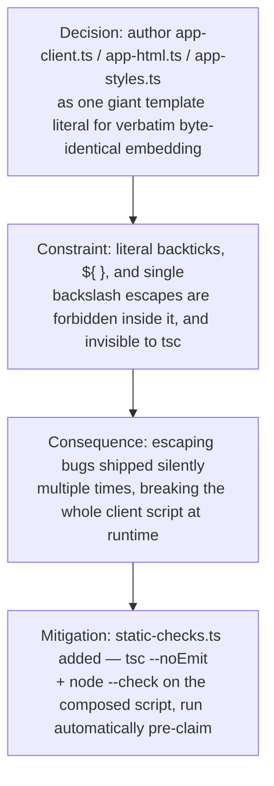

# App Renderer Template-Literal Constraints

**Confidence:** firm — the underlying structural fact has been independently rediscovered and confirmed by many separate runs over a week, but the hazard it describes keeps causing new bugs despite being documented, so vigilance (not just belief) is still required.

mcp/delegation/app-client.ts (and its siblings app-html.ts and app-styles.ts, plus MANAGER_CONSTITUTION in manager-prompt.ts) are authored as a single, giant, un-terminated backtick template literal in TypeScript — the whole ~2800-line browser client script is `APP_CLIENT = \`...\`` and is composed verbatim, with no minification or transform, into the served page's `<script>` tag. This makes the served client script byte-identical to the TS source text between the backticks, which is convenient for testing (string-containment assertions against the raw TS source of app-client.ts are valid checks against what the browser actually runs) but dangerous for editing: a literal backtick or `${` anywhere in that range — including inside a comment, not just live code — silently terminates the literal or triggers interpolation and breaks `tsc` compilation, usually with a confusing "expected ,/;" error far from the real offending line. Because a literal backtick can never appear in the source, one is appended programmatically via `String.fromCharCode(96)` whenever the browser script itself needs one (e.g. a markdown code-fence delimiter). Likewise, every backslash escape meant to reach the browser (`\n`, `\d`, `\$`, regex escapes generally) must be doubled in the TS source (`\\n`, `\\d`) — a single backslash either becomes a literal newline that kills the composed script's parse at runtime, or is silently dropped by the template-literal parser at compile time so the browser's own regex engine sees the wrong pattern entirely. This whole bug class is invisible to a normal text/regex read of the `.ts` source: it only exists once the literal is evaluated to its runtime string, so `tsc` and grep-based review cannot catch it — only evaluating the composed script (`vm.runInNewContext`, or `node --check` on the extracted `<script>` body) can. That gap is exactly why the repo added an automated `static-checks.ts` step that runs `tsc --noEmit` plus a `node --check` parse of the composed inline script before any delegated run's claim is accepted. One more consequence of "the whole file is the served script": comment prose is not exempt from production safety gates either — string-containment checks (e.g. an "no innerHTML" gate) scan the composed script including comments, so comment wording has tripped a gate meant for real code.

A second, related silent-failure class comes from the same root fact — TypeScript never typechecks the JS/CSS text inside the literal — but shows up as semantic wrongness rather than a parse break, so neither `tsc` nor the syntax-focused `static-checks.ts` gate catches it either. Three flavors have each shipped silently, been found only by looking at a screenshot, and been closed with a dedicated textual gate in `mcp/delegation-api.test.ts`: (1) a rendered string comparison against vocabulary the kernel never emits, e.g. `r.ownership === "human"` when the real `Ownership` union is `working | needs_you | done` — the branch just never fires, with no error anywhere; (2) an undefined CSS custom property, e.g. `var(--warn)` referenced when the palette only defines `--amber`; (3) a styled class selector no element actually carries, e.g. `.mem-health` styled as a grid while the markup only sets `id="mem-health"`. The fix is one gate per bug class: one scans the composed HTML for `ownership ===`/`display_state ===` comparisons and checks each literal against the real state union imported from `contract.ts` — never hand-copied, since a hand-copied list would carry the same defect it's meant to catch; one asserts every `var(--x)` used in the stylesheet is defined in it; one collects CSS class selectors and requires each to appear in the markup. Every gate is mutation-tested — the bug is reintroduced into `dist` and the gate must fail with the specific right message — and each also asserts it found a minimum number of matches, because a gate whose slice matches nothing silently passes vacuously forever (this happened once, to the CSS-variable gate itself).

## Supporting evidence

- `.agent_memory/packets/bug_fix-app-client-is-embedded-verbatim-no-minification-transform-into-app-html-tss-comp-b857f2b0.md` — APP_CLIENT embedded verbatim means source-text string assertions are valid checks on the served script.
- `.agent_memory/packets/bug_fix-app-client-ts-is-a-2800-line-raw-browser-js-blob-living-inside-one-giant-per-lin-a43bd226.md` — confirms the ~2800-line, per-line-unterminated literal shape and a dead-end hypothesis about a stripper tool not seeing inside it.
- `.agent_memory/packets/bug_fix-app-client-tss-whole-client-script-is-one-un-terminated-template-literal-app-cli-39984539.md` — a bare backtick or `${` anywhere in a comment breaks `tsc` with a confusing distant error.
- `.agent_memory/packets/bug_fix-because-app-client-ts-is-embedded-verbatim-as-the-pages-inline-script-body-any-c-14509582.md` — comment text is subject to the same string-containment gates as real code (the "no innerHTML" gate caught its own prose).
- `.agent_memory/packets/bug_fix-mcp-delegation-app-client-ts-and-app-styles-ts-are-ts-template-literals-the-exis-2bd19ab8.md` — the doubled-backslash convention for any browser-bound regex escape.
- `.agent_memory/packets/bug_fix-mcp-delegation-app-client-ts-is-one-continuous-ts-template-literal-app-client-fr-98acad46.md` — backtick delimiters must be appended via `String.fromCharCode(96)`, never written literally.
- `.agent_memory/packets/bug_fix-mcp-delegation-app-client-tss-tokenizetext-function-new-in-this-reference-diff-a-475f39e0.md` — a sibling under-escaped-backslash defect rode in on the same diff as a named one; recommends grepping the whole file, not just the reported line.
- `.agent_memory/packets/decision-app-client-app-client-ts-is-one-giant-backtick-template-literal-a-literal-backti-222121f0.md` — same hazard confirmed again, extended to MANAGER_CONSTITUTION in manager-prompt.ts.
- `.agent_memory/packets/decision-mcp-delegation-app-client-tss-app-client-string-is-untyped-js-text-embedded-in-a-3f2319f1.md` — `tsc` only checks the outer `.ts` file, never the JS-in-string contents; safety comes only from runtime checks and the parse-gate test, not the type system.
- `.agent_memory/packets/decision-mcp-delegation-app-client-tss-whole-body-is-one-ts-template-literal-a-bare-backt-6a1aa588.md` — reconfirms bare backticks inside comments break the parse with oddly specific TS1005 columns.
- `.agent_memory/packets/decision-mcp-delegation-app-client-tss-whole-body-is-one-ts-template-literal-and-single-b-c92b1eb5.md` — single-backslash regex escapes are silently dropped at compile time, not just at runtime — the browser regex engine ends up matching the wrong pattern.
- `.agent_memory/packets/decision-the-app-client-ts-template-literal-escaping-bug-class-an-under-escaped-n-killing-57f09f3c.md` — states plainly the bug class is invisible to static/text review and motivates the `static-checks.ts` addition (`tsc --noEmit` + `node --check` on the composed script, run automatically pre-claim).
- `.agent_memory/packets/gotcha-app-html-lives-in-a-ts-template-literal-client-n-must-be-n-and-a-parse-test-guar-526e48cf.md` — the original, earliest-dated instance of this gotcha (2026-08-15): an un-doubled `\n` killed the whole app silently; introduced the composed-script `new Function()` parse test as the permanent guard.
- `.agent_memory/packets/decision-in-this-codebases-ts-formatting-style-top-level-declarations-always-start-at-col-5f8efdae.md` — a repo-wide reachability/dead-code checker that finds top-level declaration boundaries by a "declarations start and end at column 0" brace-depth heuristic cannot apply that heuristic naively to `app-client.ts`/`app-styles.ts`/`app-html.ts`, because the whole file is one un-terminated backtick with no closing point; it special-cases these files by detecting the odd unclosed-backtick count on a `const NAME = \`` line and treating the entire rest of the file as one scope.
- `.agent_memory/packets/gotcha-renderer-string-comparisons-fail-silently-two-textual-gates-now-catch-them-992b00e3.md` — the original two textual gates (bogus state-comparison values, undefined CSS custom properties) closing a sibling silent-failure class, both found by screenshot rather than any compiler error.
- `.agent_memory/packets/gotcha-three-gates-now-cover-silent-renderer-failures-comparisons-custom-properties-and-af4ae0ab.md` — supersedes/extends the above with a third gate (orphan CSS classes with no markup match); same gate file, later point in time.

## Contradictions / open questions

None of the packets disagree on the underlying fact — they are unusually consistent near-duplicates. The open question is process, not fact: this exact hazard (bare backtick/`${`/single-backslash inside the literal) was independently rediscovered and separately documented by at least five different runs across roughly a week (2026-08-15 through 2026-08-21), including two runs that shipped the bug into the composed script before catching it. Documentation alone was not preventing recurrence; the `static-checks.ts` automated gate (see Causality below) is the first mitigation that acts structurally rather than relying on an agent remembering the rule. Separately, `992b00e3` and `af4ae0ab` describe the same `delegation-api.test.ts` gate file at two points in time — the second adds a third gate (orphan classes) to the first's two; they are sequential, not contradictory, and this belief treats the three-gate version as current. It remains unclear whether this textual-gate strategy is applied anywhere outside `mcp/delegation-api.test.ts`, or is a reactive fix scoped only to where bugs were already found.

## Causality

