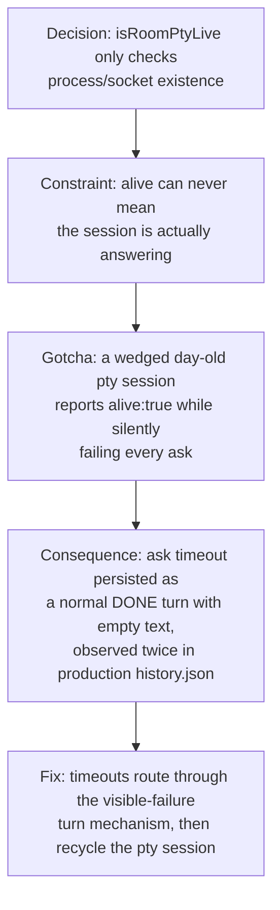

# Room Honesty Guards

**Confidence:** firm — each guard here was added in direct response to a reproduced live incident (real timestamped log entries or a real flaky-test run), not speculative hardening.

The Room's honesty problem has one recurring shape: a probe or a test says "alive" or "passing" when the thing that actually matters — will this answer, did this really fail — is a different question, and the fix is always to stop conflating the two. The clearest case: `isRoomPtyLive`'s status probe only checks that the pty process/socket exists and answers a control-plane ping; it can never detect that the `claude` session inside it has stopped answering (for example, wedged on a permission prompt). This was not theoretical — two real incidents in `.agent_memory/room/history.json` showed a NORMAL kage turn persisted with empty text after exactly `ROOM_ASK_TIMEOUT_MS` (6 minutes), rendered in the app as a blank reply marked DONE, while `/room/pty/status` still reported `alive:true` because the process existed even though the underlying session was a day old and wedged. The fix has three parts that all reflect the same principle — never let a void look like a completed answer: (1) an ask that times out must never be persisted as a normal turn; it must flow through the same "visible failure turn" mechanism already used for other manager failures, extended explicitly to cover the timeout-empty case; (2) after a timeout, the pty session must be recycled (killed and respawned) so the next message gets a fresh manager rather than another silent void, and the failure turn should say so; (3) sessions get recycled proactively — either older than 12 hours at ask time, or whose last completed ask timed out — before being asked again, rather than waiting for another failure. The same honesty discipline extends to Kage's own verification process: a room-queue race test in `delegation-api.test.ts` failed once under full-suite parallel load but passed twice solo on the same tree — a genuine timing sensitivity, not a real regression — and the honest, cheap response when a run's diff cannot plausibly touch room messaging is `kage reverify <run-id>` (the kernel re-runs checks against the same worktree, no agent involved) rather than either hand-waving "flaky" without evidence or blindly re-dispatching the agent; this exact sequence flipped a real run from failed to ready. A related but separate honesty gap surfaced in the same incident investigation: the Room manager's headless permission-denial bug (spawned without `--allowedTools`, covered in the supervisor-lifecycle belief) meant the manager had been looping asking the user to "approve" a permission dialog that could not exist in `-p` mode — every earlier measurement of "manager tax" had actually been the manager silently failing, not doing slow work.

## Supporting evidence

- `.agent_memory/packets/bug_fix-isroomptylives-own-status-probe-room-pty-ts-only-checks-that-the-pty-process-soc-56a945a8.md` — the core honesty gap (process-exists probe conflated with "will answer"), the two real timestamped incidents, and the three-part fix (never persist empty-timeout as normal, recycle on timeout, proactively recycle stale/previously-timed-out sessions).
- `.agent_memory/packets/bug_fix-superviserooms-firstturnpending-room-supervisor-ts-was-previously-tied-to-digest-84719acd.md` — companion fix from the same investigation: history replay must trigger on any fresh-session start, not only a digest change, so a wedge-rotation recycle doesn't produce an amnesiac manager.
- `.agent_memory/packets/gotcha-delegation-api-test-tss-room-queue-race-test-can-fail-under-full-suite-load-but--cc0cb237.md` — the flaky-under-load room test and the `kage reverify` practice for distinguishing real regressions from timing noise.
- `.agent_memory/packets/bug_fix-the-room-never-dispatched-until-now-headless-managers-need-allowedtools-reaprun--3126bffa.md` — evidence that a permission-denial loop had been silently masquerading as normal (slow) manager behavior in production.

## Contradictions / open questions

None found in the cited evidence. Open question: the timeout-recycle fix and the flaky-test packet both come from the same general period of Room hardening; it isn't stated in either packet whether the queue-race test's occasional failures were ever traced back to the wedge/timeout behavior itself, or are a wholly separate timing issue in test infrastructure.

## Causality

