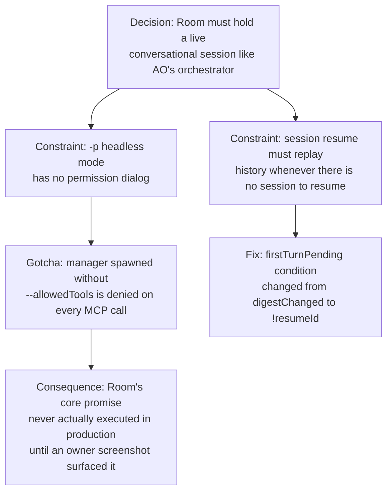

# Room Supervisor Lifecycle

**Confidence:** firm — the held-session model is empirically proven (a standalone probe confirmed cross-turn memory) and shipped, but several of its edges (allowedTools, first-turn replay, tool-surface split) were each fixed only after a live production failure, suggesting the model is still accumulating hardening.

The Room's manager is not a one-shot process: `mcp/delegation/room-supervisor.ts` spawns a single `claude --input-format/--output-format stream-json` child and holds it open for the room's whole life, talking to it over a control socket (`op:ask` / `op:status` / `op:stop` — there is no lightweight fire-and-forget op, so the goal/run event bridge reuses `op:ask` and treats a busy manager as an accepted drop). This design exists because the app's "room is the front door" positioning (mirroring Agent Orchestrator's single live-conversation primitive rather than Kage's older Inbox/Board-first shape) required a manager that remembers context across turns the way AO's orchestrator does; the held-process pattern itself was validated first with a throwaway probe script before any production code was written, then reused for the room from the same mechanism the per-run worker supervisor already used (stdin carries the prompt as a user frame — never `-p` — and the `result` event, not process death, is what ends a turn). `superviseRoom` is genuinely the PRIMARY path a browser chat message reaches when `claude` is installed; the one-shot `askManager` fallback in `manager-client.ts` is reached only when the held session cannot be used, which is why tests that inject `ctx.askManagerFn` alone were for a long time only exercising the untested fallback leg while production traffic ran through the live leg. Two lifecycle correctness bugs came from that path: (1) a session that starts fresh for any reason other than a digest change (e.g. a session_id cleared by a wedge-rotation) still needs its history replayed into the first turn, so the resume condition had to become `!resumeId` rather than `digestChanged` alone; (2) `superviseRoomPty`'s interactive/pty leg writes session identity (`session_id` + `native_transcript_path`) via `writeRoomSessionMeta` *before* it opens its control socket, so by the time any caller can reach the socket at all the identity should normally already be on disk — narrowing what was once treated as a structural gap to a narrow startup race. Held sessions also needed `--allowedTools` explicitly: `-p` (headless) mode has no permission dialog, so a manager spawned with only `--permission-mode acceptEdits` and no allow-list silently failed every MCP tool call — this went unnoticed until an owner screenshot showed the manager looping on "approve in the permission prompt" with nothing to approve into, meaning the Room's core promise had never actually executed in production. The manager's own output-sanitizing guard (`guardManagerProse`, which strips restated card numbers from the manager's prose) is scoped to `room-supervisor.ts`'s stdout parsing of the headless stream-json protocol only; the interactive pty leg has no post-processing step at all (raw terminal bytes broadcast straight through), so the guard structurally cannot and does not apply there. The manager's MCP tool surface itself (`kage_room_state`, `kage_merge_run`, etc.) is registered in `mcp/index.ts`'s `DELEGATION_TOOLS` array and dispatched through `runDelegationTool` — a separate location from `MANAGER_ALLOWED_TOOLS` in `manager-client.ts`, which only governs the manager's *permission* to call an already-registered tool; adding a new manager-facing capability means touching both files. The manager is also woken by events outside the chat turn itself: `notifyManagerOfRunEvent` writes a compact system-context frame into the held stdin when a goal-owned run changes state, rate-limited to one frame per run per 30 seconds keyed only on run+session (not run+session+state), so a rapid second event for the same run can be silently dropped by the window — though the durable pending-event log is written before the rate-limit check, so a dropped notification is still recoverable on the next idle drain.

## Supporting evidence

- `.agent_memory/packets/decision-the-room-is-the-apps-front-door-runs-are-its-bookkeeping-not-its-purpose-f997ed57.md` — why the Room exists as a held conversational manager at all, and its relationship to the pre-existing askManager/MANAGER_CONSTITUTION toolset.
- `.agent_memory/packets/decision-the-room-now-holds-a-live-claude-session-across-turns-like-aos-orchestrator-with-9e00e538.md` — the held-session design, the standalone cross-turn-memory probe, and the `isProduction = !ctx.askManagerFn` test-seam gate that keeps existing tests from spawning a real process.
- `.agent_memory/packets/bug_fix-mcp-delegation-room-supervisor-tss-superviseroom-the-held-resumable-headless-ses-b4a43d1a.md` — confirms superviseRoom is the PRIMARY production path, not the fallback, and why tests via askManagerFn alone under-covered it.
- `.agent_memory/packets/gotcha-supervisor-protocol-stdin-carries-the-prompt-result-ends-the-turn-sockets-go-in--cc23711f.md` — the general held-process protocol facts (stdin as prompt carrier, `result` event ends the turn, socket path length limits) that the room supervisor reused from the run supervisor's already-proven mechanism.
- `.agent_memory/packets/bug_fix-superviserooms-firstturnpending-room-supervisor-ts-was-previously-tied-to-digest-84719acd.md` — the `!resumeId` fix for history replay on any fresh-session start, not only a digest change.
- `.agent_memory/packets/bug_fix-superviseroompty-mcp-delegation-room-pty-ts-writes-session-identity-session-id-n-04f05f41.md` — identity is written before the control socket opens, narrowing the "hasn't recorded its identity yet" deflection to a genuine startup race.
- `.agent_memory/packets/bug_fix-the-room-never-dispatched-until-now-headless-managers-need-allowedtools-reaprun--3126bffa.md` — the missing `--allowedTools` bug that meant the Room had never actually dispatched in production.
- `.agent_memory/packets/decision-guardmanagerprose-only-runs-inside-room-supervisor-tss-stdout-parsing-of-the-hea-acaf57a2.md` — guardManagerProse's scope is the headless leg only; the pty leg has no post-processing at all.
- `.agent_memory/packets/decision-the-rooms-mcp-tool-surface-kage-room-state-kage-merge-run-etc-is-registered-in-m-25ada3db.md` — tool registration lives in `mcp/index.ts`, separate from the permission allow-list in `manager-client.ts`.
- `.agent_memory/packets/decision-the-room-supervisors-control-socket-protocol-only-supports-op-ask-which-requires-e4e6fa6c.md` — the control socket's op vocabulary and why the goal/run event bridge reuses `op:ask` rather than adding a new op.
- `.agent_memory/packets/decision-notifymanagerofrunevent-mcp-delegation-room-supervisor-ts-rate-limits-to-one-fra-d6a95e92.md` — the rate-limit window's keying gap and why it doesn't cause a permanent loss.

## Contradictions / open questions

None found in the cited evidence — the facts build on each other chronologically (design, then successive live-bug fixes) rather than conflicting. Note that the reapRun half of the `bug_fix-the-room-never-dispatched...` packet is a general run-reaping fix unrelated to the room specifically; it is cited here only for the allowedTools half.

## Causality

