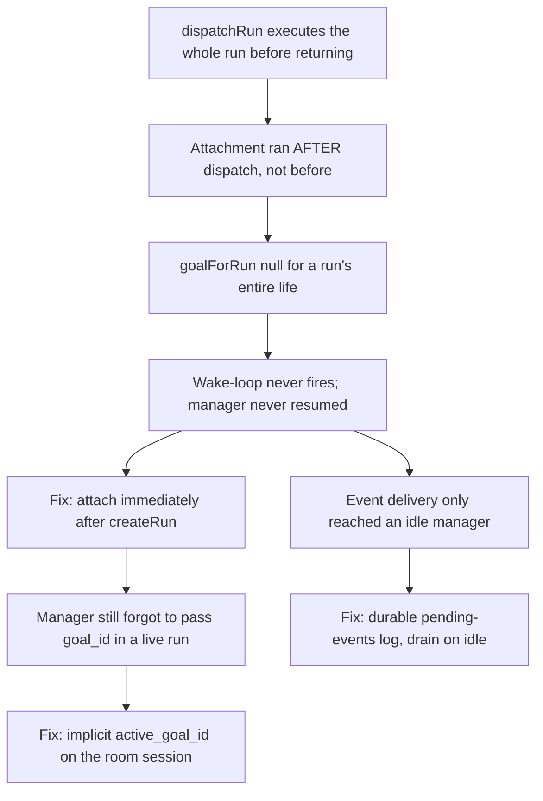

# Goal Attachment and the Orchestrator Wake-Loop

**Confidence:** firm — the failure mode was reproduced live at least three separate times before the fix stuck, and the fixed state was verified end-to-end with a harness, but the goal subsystem is still young and the budget-raise gap shows the surface is incompletely built.

A Goal is a durable record (`GoalRecord`: intent, `state` of planning/executing/done/abandoned, `plan.waves[]`, `run_ids`, `autonomy`, `budgets`) that outlives any single manager session, and the entire design problem this cluster solves is keeping that record honest despite a manager agent that can forget, die, or get busy. Early builds attached a dispatched run to its goal only *after* `dispatchRun` returned — but `dispatchRun` runs the whole agent turn plus verification before returning, so for a run's entire life `goalForRun()` returned null, the durable event log was never written, and the wake-loop that is supposed to resume the manager when a wave changes state never fired. The fix moved attachment to immediately after `createRun`, before the brief is even written, and this ordering law ("attach before anything depends on the attachment") was then applied everywhere a run is created. But ordering alone wasn't enough: even with attachment fixed, a live orchestration attempt showed the manager doing everything asked of it — including *stating* it would pass `goal_id` — and still dispatching without it. A loop whose closure depends on an agent remembering to pass a parameter is a loop that will open, so the real fix was structural: a room session now carries an `active_goal_id`, and `kage_dispatch` running under `KAGE_ROOM=1` attaches to that session's active goal automatically unless a caller passes an explicit `goal_id` override — the manager is no longer able to forget. Event delivery has the matching problem, and it was caught live rather than by inspection: the first real goal orchestration (2026-08-18) proved the planning and cleanup layers worked — the manager compiled per-intent briefs, warned that two runs' predicted touch sets collided on the same test file, dispatched the approved wave, then on its own stopped a run that had landed in an empty sandbox and rejected it with an accurate reason — but disproved the wake layer entirely: zero `[kage event]` frames ever appeared in `.agent_memory/room/history.json`, so the cleanup only happened because it fell inside the manager's own still-running turn, not because anything woke it. Root cause: `notifyManagerOfRunEvent` sends through `askRoomSupervisor`'s `op:ask` path, which requires `busy===false` — the control socket protocol supports only `op:ask`/`op:status`/`op:stop`, with no lightweight fire-and-forget op, so the event bridge had no choice but to reuse `op:ask` and treat a busy manager as an accepted drop. But a wave's runs change state immediately after the very turn that dispatched them, while the manager is still busy — exactly when events matter most, so a wake mechanism that only reaches an idle listener cannot orchestrate. The fix is a durable per-goal pending-events log (append first, attempt delivery second) drained and coalesced into one frame when the manager's turn goes idle, scoped to the thread's *active* goal (a known narrow gap: a background, non-active goal's events are only ever covered by immediate delivery, never swept). Both `notifyManagerOfRunEvent` and the idle-drain path (`drainPendingGoalEvents`) compose their `[kage event]` message text from data already sitting on the `GoalRecord` plus a live `readRun` call, rather than from any separate event stream — which is why wave-completion detection could later be added as a pure message-formatting helper (`waveCompletionNote`) shared by both paths, with no new persisted event type required. Making goal attachment implicit (the `active_goal_id`-on-session fix above) had its own knock-on infrastructure cost: `writeRoomMcpConfig`'s output had been a single shared file (`.agent_memory/runs/room-mcp.json`) for every room thread even though each thread is a separately supervised process — making the config content thread-specific (carrying `KAGE_ROOM_SESSION`) without also splitting the file per thread would have created a write race between threads at room-open time, so the implicit-attachment fix required per-thread config filenames as a prerequisite, not an afterthought. Because goal state used to advance only on a live `onRunTransition` hook, any goal whose runs finished before that hook fired stayed stuck in `planning` forever; `readGoal`/`listGoals` now reconcile state on read using the same legality table runs use (there is no direct `planning`→`done` edge, so a stuck goal must be walked through `planning`→`executing`→`done` in sequence), guarded by private raw-read helpers so the reconcile-on-read path can't recursively call itself. Two other structural gaps remain unresolved as of this writing: the run objects the app polls never carried `goal_id` (the API computes it explicitly via a batched map), and a goal that hits its spend budget mid-flight has no raise affordance at all — unlike a run's `kage resume-run --budget-usd`, there is no route, CLI verb, or app control to raise a goal's cap, so the only workaround is hand-editing `goal.json`.

## Supporting evidence

- `.agent_memory/packets/bug_fix-the-orchestrator-wake-loop-stayed-dead-because-goal-attachment-happened-after-th-461c7bd0.md` — root cause: attachment ran after `dispatchRun` returned, so `goalForRun` was null for a run's entire life; general lesson that a caller existing isn't enough if it runs too late.
- `.agent_memory/packets/negative_result-rejected-approach-attach-runs-to-their-goal-at-creation-not-after-they-finish-th-e2ee2d06.md` — the delegated run that was meant to fix the above never even started (no supervisor spawned); documents a related gap that the reaper only covers runs with a dead pid, not runs that never got one.
- `.agent_memory/packets/code_explanation-the-goal-wake-loop-is-proven-end-to-end-the-drain-is-scoped-to-the-threads-activ-b5664974.md` — verified, post-fix state: attachment provably precedes execution; `notifyManagerOfRunEvent` appends before testing liveness (false means "not delivered now," never "lost"); the drain is scoped to the session's `readActiveGoal` result, and the default session key is the literal string `"main"`, not `"default"`.
- `.agent_memory/packets/gotcha-goal-attachment-must-not-depend-on-the-manager-remembering-goal-id-the-orchestra-c2596e88.md` — first live orchestration: the manager did everything the constitution asked (planned, warned about a conflict, cited memory, stated it would pass `goal_id`) and still dispatched without it; motivates the implicit `active_goal_id` fix.
- `.agent_memory/packets/negative_result-rejected-approach-make-goal-events-durable-the-orchestrator-wake-loop-currently--75756e08.md` — the run meant to build the durable pending-events queue was itself killed by concurrent-run resource contention before producing any transcript; the underlying design (append-first, drain-on-idle, coalesce by run) was later built successfully (see the fix packets).
- `.agent_memory/packets/bug_fix-goal-tss-atomic-rewrite-pattern-for-a-jsonl-log-read-all-mutate-temp-rename-the--a44863e0.md` — the durable pending-events log reuses the exact atomic temp+rename JSONL pattern `dispatch.ts`'s steer log already used (`writeSteerRecords`/`readSteerRecords`).
- `.agent_memory/packets/bug_fix-goal-legal-transitions-has-no-direct-planning-done-edge-so-a-read-time-reconcile-e0fae88c.md` and `.agent_memory/packets/bug_fix-goal-tss-transitiongoal-patchgoal-must-read-from-disk-directly-not-through-the-p-e85b1990.md` — the read-time reconcile fix: two real goals sat in `planning` forever because `syncGoalCompletion` had exactly one caller (the live hook); the state-machine functions (`transitionGoal`, `patchGoal`) must read from disk directly via private `loadGoalRaw`/`listGoalsRaw`, or `readGoal → reconcile → transitionGoal → readGoal` recurses infinitely.
- `.agent_memory/packets/bug_fix-no-code-path-in-the-repo-currently-transitions-a-goal-to-the-done-state-only-aba-a180294f.md` — at the time this was written, no code path transitioned a goal to `done` at all (only `abandoned` was reachable via the API); motivates keeping the active-goal-clearing logic inside `transitionGoal` itself so a future `done` transition inherits it automatically.
- `.agent_memory/packets/bug_fix-api-tss-withwavestatus-ships-goal-wave-status-as-a-top-level-array-on-the-goal-o-dab6f47e.md` — the wave-status API shape: `goal.wave_status` is a top-level array (one entry per `plan.wave`, `{status: string, failed_run_ids?}`), never a field on the wave object; a client that read `wave.status.due` (a shape the server never produced) meant the due-wave banner had never rendered for any goal since inception.
- `.agent_memory/packets/bug_fix-attachruntogoal-throws-via-readgoals-no-goal-found-error-for-an-unknown-goal-id--bae0e3ab.md` — `attachRunToGoal` throws on an unknown goal id rather than returning a result; callers (the `kage_dispatch` handler) must wrap it and degrade to a non-fatal warning rather than failing the dispatch, since the run itself is already real by that point.
- `.agent_memory/packets/decision-runview-withactivity-never-carried-goal-id-api-ts-had-to-compute-it-explicitly-a-118b2ca1.md` — `RunView`/`withActivity` never carried `goal_id`; the API computes it explicitly (a batched map for the list route to avoid O(runs×goals) per-poll cost, a single `goalForRun()` call for the detail route).
- `.agent_memory/packets/gotcha-a-goal-that-hits-its-spend-budget-mid-flight-has-no-raise-affordance-dispatch-wa-c752d315.md` — confirmed product gap: goals default to `{usd: 20, runs: 10}`, dispatch-wave hard-refuses once cumulative spend exceeds the cap, and there is no route/CLI/app control to raise it — only a hand-edited `goal.json` unblocks it.
- `.agent_memory/packets/bug_fix-readactivegoal-in-room-sessions-ts-takes-a-required-sessionkey-string-not-an-opt-df8d25b4.md` — minor API-shape note: `readActiveGoal` takes a required `sessionKey: string` even though it normalizes internally; callers with an optional session must normalize before calling, not rely on the function accepting `undefined`.
- `.agent_memory/packets/bug_fix-the-manager-event-bridge-drops-every-event-fired-while-the-manager-is-busy-which-e76143d4.md` — the live 2026-08-18 orchestration incident itself: what worked unaided (briefing, collision warning, dispatch, self-initiated stop/reject of a duplicate run) versus the proof that zero `[kage event]` frames ever reached the manager; root-causes the drop to `askRoomSupervisor`'s `op:ask` path requiring `busy===false`.
- `.agent_memory/packets/decision-the-room-supervisors-control-socket-protocol-only-supports-op-ask-which-requires-e4e6fa6c.md` — confirms the control socket has no lightweight fire-and-forget op, which is why the event bridge had no choice but to reuse `op:ask` and treat a busy manager as an accepted drop.
- `.agent_memory/packets/decision-notifymanagerofrunevent-and-drainpendinggoalevents-both-compose-their-kage-event-e675bbdc.md` — both delivery paths compose `[kage event]` text from `GoalRecord` + live `readRun` state rather than a separate event stream, which is what let wave-completion detection ship later as a shared pure-formatting helper (`waveCompletionNote`) instead of a new persisted event type.
- `.agent_memory/packets/bug_fix-writeroommcpconfigs-output-path-was-previously-a-single-shared-file-agent-memory-e33d5a2e.md` — the per-thread MCP config prerequisite for implicit goal attachment: a single shared `room-mcp.json` across threads would race once its content became thread-specific, so the fix required per-thread filenames alongside the `active_goal_id` change.

## Contradictions / open questions

- The status field on several of these packets reads `deprecated` in their frontmatter (they were reverified against a later commit and marked stale), yet the underlying design they describe was the one that shipped and is corroborated by the later, still-`approved` `code_explanation` packet — read the `deprecated` status here as "superseded by a later version of the same file," not "the design was wrong."
- The two `negative_result` packets in this cluster (attach-at-creation, durable-events) were rejected for *infrastructure* reasons (a run that never got a supervisor process; a run killed by concurrent-run resource contention) rather than because the proposed design was flawed — the design in both cases was later built successfully. Do not read "rejected" as "bad idea" here.
- As of the most recent evidence, the goal-budget-raise gap and the `RunView`-never-carries-`goal_id` gap were both still open; no packet in this set documents them being closed.

## Causality

