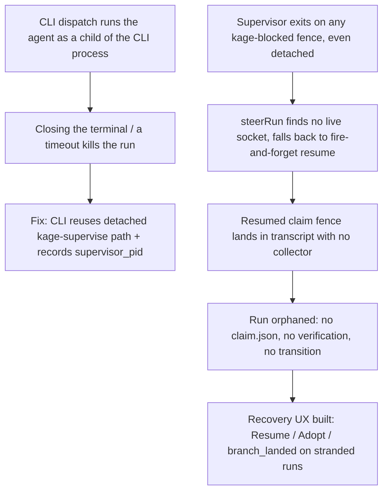

# Run Recovery and Orphan Semantics

**Confidence:** firm — the core detach/survive fix is verified live with real supervisor_pid evidence, and the recovery-UX decision was driven by two concrete, named stranded runs in the repo; the process-tree-kill and diagnostic techniques are each verified by direct reproduction.

A dispatched run's process lifecycle has two independent axes that this repo learned to keep separate: whether the *agent* process outlives the process that launched it, and whether a *failure* the run's checks report is actually the run's own doing. On the first axis, a run dispatched from the CLI used to be a child of the CLI process itself, so closing the terminal or hitting a command timeout killed real, paid-for work with no way to recover it — the fix was to route the CLI path through the same `detached: true` + `child.unref()` spawn plus `supervisor_pid` bookkeeping that `kage supervise`/`superviseRun` already used for the daemon/app path, rather than building a second detach mechanism from scratch. A related but distinct failure was that ALL supervisors — including already-detached ones — used to exit the moment a run emitted a `kage-blocked` fence, even though the parity spec explicitly required the opposite (the agent process should stay alive with stdin open while blocked); once the supervisor exited, `steerRun` found no live socket, fell back to a fire-and-forget `claude --resume`, and the resumed turn's eventual claim fence landed in the transcript with no collector to catch it — an invariant that was specified in prose but never pinned by a test, so it silently orphaned three real runs in one day. The fix redefined `blocked` as a genuine *waiting* state rather than a terminal one for the supervisor: the agent child stays alive with stdin held, a later `tell` is injected as a user-message frame straight into that open stdin, and the supervisor's loop continues until a claim fence, an explicit stop, or the child actually dying — but this exposed a subtler race, since Claude Code's live stream-json protocol emits exactly one `result` event per full agent turn and a stray or duplicate `result` event (for example one triggered by a control-plane write like an interrupt) is not sole authority for ending a live child's stdin; the persisted run state has to be consulted too, or an answerable, still-open session can get severed out from under a later `tell`. (`transitionRun`'s legal-transition table separately forbids a state transitioning to itself, so any code path that can reach this blocked-handling branch twice for the same run needs an explicit state guard before transitioning again — see the run-state-machine reachability-discipline doc for that mechanism.) On the second axis, a run's own checks can go red for reasons that have nothing to do with that run's diff: if a parallel run merges a fix to a shared guard (e.g. a doc-truth-maintenance run) before this run's base, the run's worktree can show a failing test that traces to the BASE commit, not the run's own changes — the tell is that `git diff <base> -- <the failing file>` is empty and the failure is a doc/guard assertion rather than a runtime one; the fix in that situation is to rebase onto a fresher base, not to explain away or patch around a red that isn't actually yours. A closely related discipline is to never trust a task record's claimed state over git history: one goal's task.json read `state=merged` with all checks passing, yet `git log -S <symbol>` across every ref and the reflog turned up zero hits, and the branch itself had been silently repointed — metadata claiming a merge landed is not proof the code exists, and this must be checked directly before building on a dependency another run claims to have shipped. Two smaller-scope but concrete fixes round out the recovery story: timed-out check commands used to leave their process tree alive (the check-runner killed its direct child, but a `npm → node --test → per-file worker` tree survived), which accumulated zombie suites that poisoned every later verification on the machine until manually killed — the fix spawns command checks in their own process group and kills the whole group on timeout (Node's `spawnSync`/`spawn` accept `detached: true` at runtime even though `@types/node`'s sync options type omits it); and once work is genuinely stranded, the product-level recovery affordances that were missing — Resume on a budget-stopped run, Adopt on an orphan-shaped failed run whose worktree still holds real changes, and a `branch_landed` detection for a run whose branch was already merged by hand — were built directly from two concrete runs that had no way back, using the existing resume/adopt machinery rather than re-dispatching, and were deliberately kept inside the existing state vocabulary (an "already landed" run is closed via the existing reject transition with an explanatory note, never a new state).

## Supporting evidence

- `.agent_memory/packets/bug_fix-cli-dispatched-runs-now-detach-and-survive-the-launching-shell-41d79cdc.md` — confirms the shipped fix: `dispatch.ts` line 383 sets `detached: true`, line 386 calls `child.unref()`, and live runs carry a populated `supervisor_pid` in `task.json`.
- `.agent_memory/packets/bug_fix-dispatchdetached-kage-supervise-superviserun-already-existed-fully-tested-and-al-98923282.md` — the design rationale: `dispatchDetached()`/`kage supervise`/`superviseRun` already existed and were fully tested; rerouting the CLI's `kage dispatch` to reuse that path was lower-risk than building a second detach mechanism. Documents the destroyed run that proved the bug (SIGTERM to the CLI killed a live, paying run).
- `.agent_memory/packets/bug_fix-the-stub-adapter-delegation-adapters-stub-ts-has-no-built-in-delay-hook-i-added--4e348fe7.md` — a second, independently-captured record of the same CLI-dies-with-its-shell defect, reproduced live; corroborates the fix rather than adding a new fact.
- `.agent_memory/packets/bug_fix-root-cause-of-every-orphaned-run-all-supervisors-exit-at-blocked-spec-said-hold--570ae7c2.md` — root-cause correction: ALL supervisors, detached ones included, exited on a `kage-blocked` fence, contradicting the parity spec; three real orphans in one day, each with a claim fence stranded in the transcript with no collector.
- `.agent_memory/packets/bug_fix-a-pipe-write-followed-immediately-by-process-exit-in-node-is-not-guaranteed-to-f-60e32e9c.md` — the shipped fix redefining `blocked` as a waiting state: the agent child is held open with stdin live, a later `tell` is injected as a user-message frame, and the loop continues until a claim fence, a stop, or child death.
- `.agent_memory/packets/decision-a-result-stream-events-in-memory-signals-this-lines-own-fence-state-waiting-are-32d4a3e6.md` — the race this redefinition exposed: a stray or duplicate `result` stream event is not sole authority for ending a held child's stdin; the persisted run state must be consulted too.
- `.agent_memory/packets/decision-claude-codes-live-stream-json-protocol-emits-exactly-one-result-event-per-full-a-6260e051.md` — confirms the protocol invariant (exactly one `result` event per full agent turn) that makes a stray/duplicate `result` event diagnosable as anomalous rather than normal.
- `.agent_memory/packets/bug_fix-a-rebased-away-red-is-a-distinct-failure-shape-from-a-self-caused-one-a-runs-own-e798d79d.md` — the rebased-away-red diagnostic: `git diff <base> -- <file>` empty plus a doc/guard-shaped failure is the tell that a fresher base already fixes it.
- `.agent_memory/packets/decision-wave-1s-first-merge-of-this-same-goal-was-a-ghost-merge-task-json-read-state-mer-5c825172.md` — the "ghost merge" case: task-record metadata claimed a merge landed; `git log -S` and the reflog found nothing, and the branch had been silently repointed. General rule: verify against git history directly before trusting a claimed prior merge.
- `.agent_memory/packets/bug_fix-nodes-spawnsync-and-spawn-does-accept-detached-true-at-runtime-and-it-works-exac-eeb0c793.md` — the zombie-process-tree fix: a timed-out check's direct child was killed but the process tree survived; fix spawns checks in their own process group and kills the group on timeout; documents that `spawnSync`'s runtime behavior accepts `detached: true` despite the sync options TS type omitting it.
- `.agent_memory/packets/bug_fix-no-zero-commit-detection-helper-exists-in-recovery-ts-despite-the-briefs-memory--e8c3b3d8.md` — corrects a stale assumption about where zero-commit detection lives: the real prior art is `api.ts`'s unexported `branchHasRealCommits` (reflog-count based), serving `branch_landed`/`worktree_adoptable`, not a helper in `recovery.ts`.
- `.agent_memory/packets/bug_fix-dispatchdetached-gives-its-supervisor-child-a-log-file-to-die-into-is-load-sensi-e1e7ffc8.md` — a load-sensitive flake noted while landing the two verification-honesty guards (merge-refuses-empty-diff, slash-joined-citation-splitting): a supervisor log-file-existence check failed once under concurrent full-suite load and passed clean solo — a known flake shape, not a regression from those changes.
- `.agent_memory/packets/decision-the-mcp-test-suite-has-at-least-three-distinct-process-timing-sensitive-tests-di-0f9c76cc.md` — names this as a pattern, not a one-off: at least three distinct process/timing-sensitive tests (SIGTERM survival, detached-dispatch, and the supervisor-log-file check above) are known to flake under the full `npm test` run while passing reliably in isolation, worth knowing before treating one red run as a real regression.
- `.agent_memory/packets/decision-mcp-delegation-recovery-tss-resumestoppedrun-only-gates-on-the-usd-cap-checkrunb-23655251.md` — the "every dead end gets a next step" recovery-UX decision: builds Resume on stopped runs (with cap-aware prefill), Adopt on orphan-shaped failed runs with a recoverable worktree, and `branch_landed` detection that closes a run via the existing reject transition rather than a new state; notes that `resumeStoppedRun` only gates on the USD cap since the minutes cap is now inert.
- `.agent_memory/packets/negative_result-rejected-approach-a-run-that-is-stopped-or-orphaned-has-no-way-back-two-runs-are-16c8fcc1.md` — the two concrete stranded-run cases (budget-stopped with real work in the worktree; supervisor-died-agent-lived with the run showing as healthy for 20 minutes with zero spend counted) that motivated the Resume/Adopt UX above; also documents `worktree` on the run record being declared but never assigned or read anywhere, and that reaping the second case on schedule would have destroyed 196 lines of correct, unrecovered work.

## Contradictions / open questions

- None found in the cited evidence — the negative_result documenting the two stranded runs and the decision documenting the recovery UX built to fix them are consistent (the decision packet's own findings even reference the same two run IDs).

## Causality

