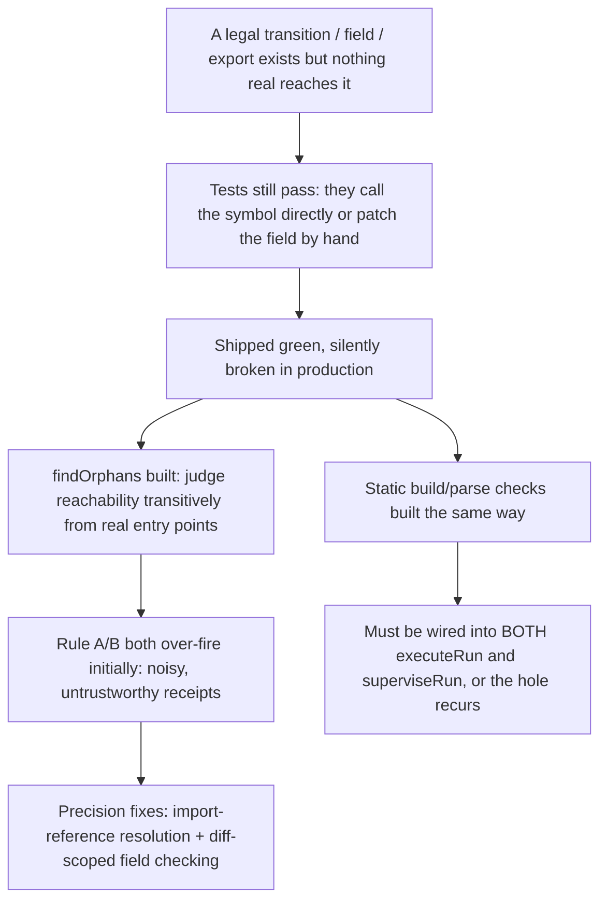

# State-Machine Reachability Discipline

**Confidence:** firm — the reachability checker's own self-test example was re-verified against a later HEAD and found to no longer reproduce, which is itself evidence the discipline works: earlier gaps get closed and the checker's evidence must be re-confirmed against current code, not assumed stable.

This repo discovered, the hard way, that its single most repeated defect class was code that exists, compiles, and passes tests while being unreachable from anything real: a legal state transition with no command that ever performs it, a struct field that is written but never read (or read but never written outside tests), or a function whose only callers are its own test file. Seven instances of this shape were found in one pass — `transitionGoal`'s only caller was `abandonGoal`, so a goal could never legally reach `executing` or `done`; `supervisor_pid` was read by `liveState` but written only by the detached-supervisor path, never the CLI dispatch path that needed it most; goal attachment existed as code but ran after the run it was attaching had already finished; `reapRun`, `looksLikeGitRepo`, and `resolveWorkspaceKind` shipped with zero production callers; and `LEGAL_TRANSITIONS` allowed `failed → running` with a comment explaining why, but no command anywhere ever performed it. In every case the tests passed because the test called the new symbol directly or patched the field by hand — nothing ever asked whether the code was reachable from a *real* entry point (`cli.ts`, the MCP tool surface, HTTP routes, a `bin` entry). The response was a purpose-built `findOrphans` checker with two rules judged transitively from those real roots rather than "something imports it": Rule A flags an exported symbol whose only references are its own definition and test files; Rule B flags an interface field that has readers but no non-test writer, or vice versa. Both rules needed real calibration after shipping — Rule A's precision problem was that a genuinely-imported, genuinely-called symbol could still be reported unreachable when the import-resolution approximation misfired, and it does not check `type`/`interface` declarations at all, only function/const/class scopes; Rule B's bigger problem was that flagging *any* field on an interface declared in a changed file (rather than only fields the run's own diff actually touched) produced up to 198 names on a single receipt when a run touched a large-interface file like `contract.ts`, which is noisy enough that an operator stops trusting the check — the fix scoped Rule B to only the lines the run's own `git diff --cached` hunks actually added or modified. This checker, and the static build/parse checks that were built alongside it (a run's code must actually compile and its composed client script must actually parse before its claim is accepted), are deliberately wired into *both* of the two independent places a run's work gets assembled and judged — `dispatch.ts`'s `executeRun` (foreground runs) and `supervisor.ts`'s `superviseRun` (detached runs) — because those two call sites hand-roll `ClaimRecord` assembly independently and have already drifted out of sync once before; a kernel-executed check that only runs on one of the two paths is not really a check, it is a check with a hole in it half the time.

A related discipline governs the state machine's own legality, distinct from but adjacent to reachability: `transitionRun`'s legal-transition table (`mcp/delegation/contract.ts`) forbids a state transitioning to itself — confirmed for both `blocked -> blocked` and, separately, `running -> running` — so any code path that can reach a state-handling branch twice for the same run (for example, the supervisor's blocked-fence handling) needs an explicit `if (task.state !== target)` guard before calling `transitionRun` again, or it throws instead of no-op-ing. A deliberate escape hatch exists alongside that table: `patchRun` merges arbitrary fields, including `state`, directly onto a run record without walking the legality check at all — it exists so test fixtures can force a run into an arbitrary state to set up a scenario, and its bypass is intentional, not a gap in the same class as the orphaned-code findings above.

## Supporting evidence

- `.agent_memory/packets/decision-the-reachability-check-briefs-flagship-self-test-example-transitiongoal-its-only-928ed037.md` — the origin story: seven instances of the "shipped, tested, unreachable" defect class in this repo, including `transitionGoal`, `supervisor_pid`, goal attachment ordering, `reapRun`, `looksLikeGitRepo`, `resolveWorkspaceKind`, and the unwired `failed → running` legal transition; the `findOrphans` design (two rules, judged transitively from real entry points, with a mandatory-reason `// reachability: <reason>` escape hatch). Also documents that by the time this run executed, the brief's own flagship example (`transitionGoal`) no longer reproduced — `abandonGoal` had since been wired to a live route — which is direct evidence that reachability findings must be re-verified against current HEAD, not assumed to still hold.
- `.agent_memory/packets/bug_fix-reachability-tss-rule-a-findorphanexports-only-checks-exported-function-const-cl-66283b7a.md` — Rule A's scope limitation: only exported function/const/class scopes are checked; exported `type`/`interface` declarations are never evaluated for orphan status regardless of reachability. Also documents the false-positive fix (an imported, called symbol in a reachable file must count as a reference).
- `.agent_memory/packets/bug_fix-rule-b-findorphanfields-in-delegation-reachability-ts-now-calls-git-diff-cached-4f02199f.md` — Rule B's precision fix: scoping field evaluation to only the lines a run's own `git diff --cached --unified=0` hunks touch, rather than every field on every interface in a changed file — the root cause of receipts reaching 198 reported names. Confirms three concrete false positives (`autonomy`, `files_scope`, `delivered_at`) that had become genuinely two-sided by later work the rule never noticed.
- `.agent_memory/packets/decision-dispatch-tss-executerun-foreground-runs-and-supervisor-tss-superviserun-detached-d8998a60.md` — the dual-wiring law: `dispatch.ts`'s `executeRun` and `supervisor.ts`'s `superviseRun` independently hand-roll claim assembly and have already drifted once before, so any new kernel-executed check (here: `runStaticChecks` — a `tsc --noEmit` pass plus a composed-client-script parse check) must be wired into both call sites to actually apply on every run, motivated by two agents independently shipping `import.meta` into a CommonJS project and one shipping an under-escaped template literal that silently blanked the entire app.
- `.agent_memory/packets/decision-transitionruns-legal-transition-table-forbids-a-state-transitioning-to-itself-co-1d72ffac.md` — confirms `running -> running` is also a forbidden self-transition, generalizing the `blocked -> blocked` case.
- `.agent_memory/packets/bug_fix-transitionruns-legal-transition-table-forbids-a-state-transitioning-to-itself-bl-ab6ba834.md` — the originating `blocked -> blocked` illegal-self-transition gotcha, found while redesigning blocked-fence handling in the supervisor.
- `.agent_memory/packets/decision-patchrun-projectdir-runid-patch-in-contract-ts-merges-fields-including-state-wit-5d6e329d.md` — documents the `patchRun` escape hatch that intentionally bypasses the legality table for test fixtures.

## Contradictions / open questions

- The reachability-check decision explicitly notes its own flagship example stopped reproducing between when the defect was cataloged and when the checker was built — not a contradiction between packets, but a documented instance of the exact discipline this belief describes: verify current reachability, don't trust a stale finding.
- None found beyond that self-noted staleness.

## Causality

