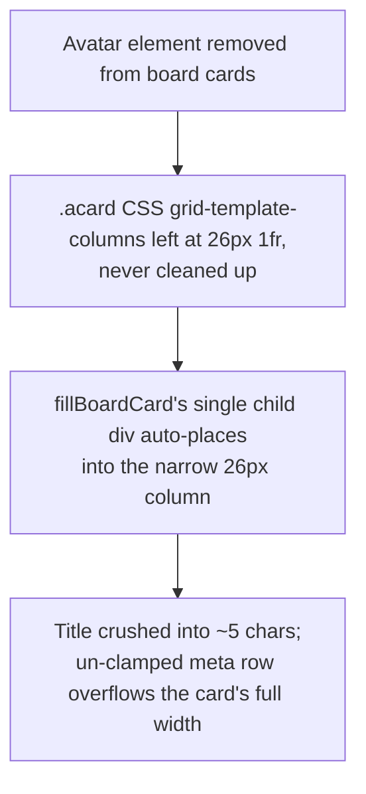

# Board/Card Layout and Responsive (Phone-Width) Fixes

**Confidence:** firm — each fix traces to a measured, reproducible defect (a real screenshot or real `getBoundingClientRect`/`getComputedStyle` measurement in a live browser) with an extended regression test, not a guess at CSS.

Kage's app renders run cards and the run board with hand-written DOM (`h()`, never `innerHTML`) and hand-written CSS in TS template literals (app-client.ts / app-styles.ts), with no build step and no framework — which means every layout bug here is a real CSS/DOM authoring mistake, not a library quirk. The clearest lesson is to distrust the obvious diagnosis: a board-card title that visually "crushed" into a five-character column looked like a font-size or line-clamp bug (a `-webkit-line-clamp:2` rule already existed and looked correct), but the actual cause was a leftover CSS grid — `.acard` was still `display:grid; grid-template-columns:26px 1fr` from a since-removed avatar element, and the card-filling code only ever appended one child, which auto-placed into the narrow 26px column instead of the wide one, crushing the title while the un-clamped meta row (branch slug) overflowed visibly across the card. The fix restructured the card into three explicit sibling rows (name, slug, meta) with a shared middle-truncation helper (prefix + suffix + one ellipsis, capped) rather than patching font sizes. Separately, the app's responsive design was effectively nonexistent before a dedicated pass: the entire stylesheet had exactly three `@media` queries, one of which was `prefers-reduced-motion`, so there was no real narrow-width design — just a single 900px afterthought never opened at phone width (390px). That pass added a genuine phone breakpoint (single-column board, larger touch targets without changing desktop hit areas, a close button reachable in both List and Board layouts) and fixed a specific "can't switch projects on mobile" gap: the command palette (⌘K) already listed every non-current project as a switch command, but had no touch-reachable trigger at narrow width — the fix was a discoverable `#m-palette` button, not a new switcher UI, and that surfaced-existing-feature pattern is worth checking before rebuilding something that already exists. The same crushed/overflow bug class recurred on a different surface: work-row run-title headers were rendered uncapped everywhere, at one point producing 3000+ character `<h2>` headers that pushed all controls below the fold; the first report blamed a missing line-clamp, but the title class already had `-webkit-line-clamp:2` set, and the real culprit — same as the board card — was a CSS grid column left at its browser default `min-width:auto`, letting one unbroken character run force the column wider than its share. The fix was `overflow-wrap:anywhere` on the title, which bounds width, not `-webkit-line-clamp`, which only bounds height. A related but distinct rendering-discipline lesson: cards and list rows were also found to mutate their DOM even when the text they render is unchanged (an age ticker rewriting "17h" to "17h" every second, a sidebar project-list poll rewriting rows with no actual change) — the fix pattern is write-if-changed: compute the next string, compare to the node's current `textContent`/`nodeValue`, and skip the DOM write when it's identical, so real changes still land immediately but idle screens produce zero incidental mutation. What looked, from live `MutationObserver` measurement, like five separate mutation classes (`qtime`, `pnl-tl-at`, `label`, `plist`, `sidefoot`) turned out to trace to exactly two real code paths — nearly all created via one `ageSpan()` helper and patched by one `tickAges()` sweep — so a single write-if-changed gate on that one sweep silenced almost the entire at-rest mutation rate. A sibling gotcha runs the other direction: `openProject()`'s click handler mutates a project row's DOM directly (`row.classList.add('on')`, text set to "starting…") *outside* any state the render gate's revision fingerprint tracks, so a failed project switch can leave the row stuck reading "starting…" forever unless the failure branch explicitly forces a rebuild — write-if-changed diffing and gate-tracked state both need to stay in sync with what's actually on screen, or the render layer produces either redundant writes or missed ones.

## Supporting evidence

- `.agent_memory/packets/bug_fix-the-actual-root-cause-of-the-crushed-board-card-title-was-not-font-size-or-line--aad0db2d.md` — the real root cause: a leftover CSS-grid column definition from a removed avatar element, not font-size or line-clamp.
- `.agent_memory/packets/bug_fix-cardcoreatoms-run-returns-branchatom-stateatom-tokensatom-in-that-fixed-order-bo-cb0ea940.md` — the fix itself: three sibling rows (name/slug/meta) and the middle-truncation helper, plus the regression tests added to `sessions-ui.test.ts`.
- `.agent_memory/packets/bug_fix-the-command-palette-k-already-lists-every-non-current-project-as-a-switch-comman-6e53c5b7.md` — the command palette already covered project switching; the actual gap was a missing touch-reachable trigger at narrow width.
- `.agent_memory/packets/bug_fix-renderdetail-s-dclose-button-now-renders-in-both-list-and-board-layouts-previous-1a95d525.md` — the broader phone-width pass: measured defects via real `getBoundingClientRect`/`getComputedStyle`, single-column board below the phone breakpoint, and raised touch targets without changing desktop hit areas.
- `.agent_memory/packets/bug_fix-the-gui-must-render-structured-claim-data-not-the-clis-text-card-and-must-never--a3a6dff9.md` — in the same pass, board columns using `grid-template-columns:repeat(4, minmax(240px,1fr))` let one long unbroken card title force its column wider than its siblings; `minmax(0,1fr)` plus `min-width:0` on the column keeps columns genuinely equal (this packet's main lesson is about verdict rendering — see `ui-transcript-chat-and-receipt-rendering.md` — but the board-column fix is cited here too since it is a distinct, genuine board-layout contribution).
- `.agent_memory/packets/decision-sessions-ui-test-ts-50-hard-asserts-the-exact-literal-source-string-if-current-l-0f24c63c.md` — the write-if-changed discipline for card/list DOM: age tickers, sidebar list rows, and similar periodic text patches must compare-before-write to avoid incidental mutation churn at rest.
- `.agent_memory/packets/bug_fix-the-work-row-title-class-qt-already-had-webkit-line-clamp-2-set-before-this-chan-a32f6e68.md` — the work-row/run-title recurrence of the board card's CSS-grid `min-width:auto` overflow bug, and the `overflow-wrap:anywhere` fix.
- `.agent_memory/packets/bug_fix-the-transcripts-action-group-fold-pattern-h-button-foldrow-containing-a-tw-tri-80f07007.md` — the same run's initial (later-corrected) report of the run-title-overflow release-blocker; cited alongside `a32f6e68` since the two packets are sequential takes on one defect, not independent findings.
- `.agent_memory/packets/decision-the-five-sub-mutation-classes-qtime-pnl-tl-at-the-memory-panels-label-class-a-b53a562b.md` — five apparent mutation sources collapse to two real code paths (`ageSpan`/`tickAges`), explaining why one write-if-changed gate closed nearly all of the at-rest churn.
- `.agent_memory/packets/decision-renderprojects-s-openproject-click-handler-mutates-a-project-rows-dom-directly-r-d994c639.md` — DOM mutation that bypasses the render gate's tracked fingerprint, requiring explicit rebuild-forcing on failure branches or the row sticks on stale optimistic text.

## Contradictions / open questions

None found in the cited evidence. One implicit constraint worth flagging for future work: `decision-sessions-ui-test-ts-50-hard-asserts...` notes that `sessions-ui.test.ts` hard-asserts an exact literal source string (`if (current) list.appendChild(renderSidebarFleet())`) inside `renderProjects()` via regex against the composed page — any future rewrite of that function (e.g. a per-row keyed cache) must preserve that literal call-site shape or an unrelated-looking test will break for a real reason. Separately, `80f07007` and `a32f6e68` are two takes on the same work-row title-overflow defect from the same run — `80f07007` states the release-blocker report at face value, `a32f6e68` corrects the root-cause diagnosis; treat them as one sequential story, not two independent bugs.

## Causality

