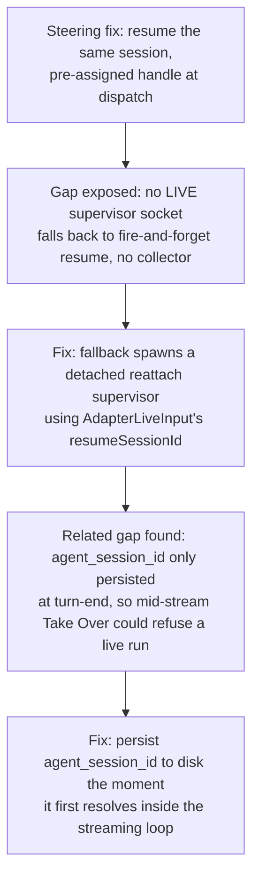

# Chat/Session Continuity: Resume the Real Session, Never Restart

**Confidence:** firm — the core rule (answering an agent must resume its own session, not start a fresh one) is stated as an explicit law and proven live end-to-end at least once, but the mechanism has visibly evolved across several fixes as edge cases were found, so treat the current shape as the latest iteration rather than a finished, unchanging design.

The load-bearing rule across this whole area is: continuing a conversation with a running or blocked agent must resume that agent's own session, because a fresh session discards everything the agent had already figured out — and "starting over while calling it steering" is treated as a real bug, not an acceptable shortcut. This required modeling `sessionId` (start fresh under a chosen id) and `resumeSessionId` (reattach an existing session) as mutually exclusive spawn shapes for the adapter's *live* pty path, mirroring a split that already existed for the plain, non-live `.run()` path — the live path had simply never modeled it before. The mechanism has evolved in visible steps: first, steering was made to actually resume by pre-assigning the session handle at dispatch time (before the process starts, since the handle must exist before context can attach to it) and relaunching with a resume flag; blocked state is detected from two independent signals (the claim protocol fence, and a stream event whose `status_category` is `blocked`, which also catches an agent asking in plain prose with no fence) so a dead process is never misreported as still running. That fix left a gap: when `steerRun` finds no live supervisor socket for a resumable run, it fell back to a fire-and-forget `claude --resume` child with no collector — the agent's reply and its claim fence land in the transcript, but nothing verifies or transitions the run, an orphaned-run failure mode observed multiple times. The fix was to make that fallback path spawn a detached supervisor (the same shape used elsewhere for detached dispatch) that itself knows how to resume: find the existing `agent_session_id` and any undelivered steer, resume that specific session via the adapter's live-input `resumeSessionId`, deliver the pending steer as the first frame, then run the normal read→fence→verify→land loop — so a resumed run is now actually collected, not just delivered. A separate, subtler bug in the same neighborhood: `agent_session_id` was previously only persisted to disk at turn-end cleanup, so a "Take Over" action mid-stream could refuse a live run with "no agent session recorded" even though the session plainly existed — fixed by patching it to disk the moment it first resolves inside the streaming loop, not only at the end. Underlying all of this is a narrower live-session constraint worth remembering: today's Room reply path only works through a live, held-open `claude` session gated by `isAgentInstalled("claude")`, and the interactive terminal spawns the binary named by `KAGE_CLAUDE_BIN`/`"claude"` unconditionally — there is no config-driven "pick your orchestrator agent" today, so that would require touching the pty/supervisor modules directly.

## Supporting evidence

- `.agent_memory/packets/bug_fix-steering-must-resume-the-same-agent-session-not-restart-a-new-one-184320ba.md` — the founding law and its first working mechanism: pre-assigned session handle, dual blocked-detection signals, honest liveness reporting, proven live end-to-end.
- `.agent_memory/packets/bug_fix-adapterliveinputs-sessionid-start-fresh-under-a-chosen-id-and-resumesessionid-r-f5454e15.md` — extending the sessionId/resumeSessionId split (already present for the non-live path) to the live pty adapter path, and the fix for the orphaned-run fallback: spawn a detached reattach supervisor instead of a fire-and-forget resume child.
- `.agent_memory/packets/decision-agent-session-id-is-now-patched-to-disk-the-moment-sessionidfrom-line-first-reso-584c14c1.md` — `agent_session_id` is now written to disk as soon as it first resolves mid-stream, fixing a real "Take Over refuses a live run" bug, not just a documentation update.
- `.agent_memory/packets/decision-mcp-delegation-api-tss-resolveroomreply-only-tries-a-live-held-open-session-with-a02bd27d.md` — today's Room reply mechanism is scoped to one live, held-open `claude` session with no config-driven agent choice; a future multi-agent feature needs changes in the pty/supervisor layer specifically.

## Contradictions / open questions

None found in the cited evidence — each fix explicitly builds on and closes a gap left by the previous one (steering resume → orphaned-run fallback → mid-stream session-id persistence), rather than contradicting it. It is worth noting for a future reader that this area was fixed incrementally across at least three separate rounds, so a "resume" bug reported now could plausibly be a fourth still-undiscovered edge case in the same family rather than a regression of any single one of these fixes.

## Causality

