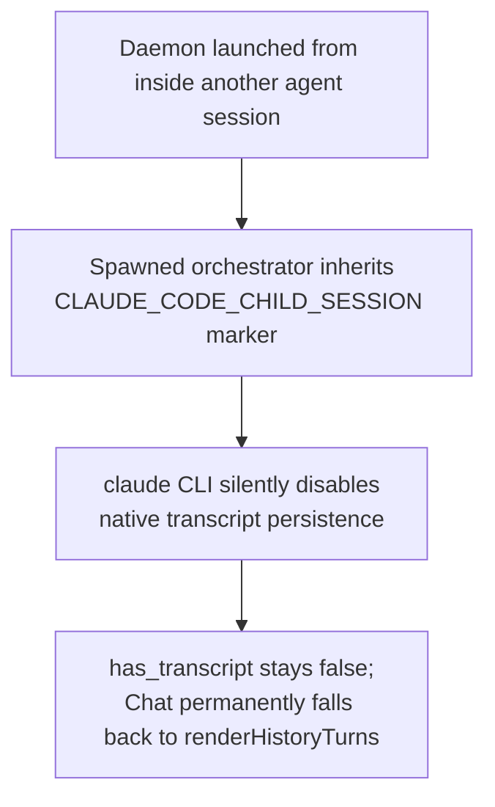

# Transcript, Chat, and Receipt Rendering Must Stay Honest

**Confidence:** firm — the verdict-honesty fix is backed by a real regression test and a visual before/after in a live Electron window; the transcript-renderer unification and the env-var root cause are each backed by one concrete, source-level fix rather than a broad pattern, so treat those two as well-understood but narrower in scope.

Kage's app has two places where "just render the string" is actively the wrong instinct, and both were caught by the same underlying discipline: a surface must render structured truth from the backend, never reformat CLI-shaped text or re-derive a judgment client-side. In the Chat/transcript pane, Kage has two independently-written turn renderers — `renderHistoryTurns` (the fallback, used when no live pty transcript exists) and `renderTranscriptTurns` (the primary renderer, used once a real transcript exists) — and they had drifted apart, with only one carrying the "toolgroup chip" treatment that folds consecutive `ran X · Y` tool-call lines into a single collapsible chip row per reply instead of a wall of individual tool lines. The fix factored shared helpers (`toolGroupChip`, `turnMetaLine`) so the two renderers can't silently diverge again. Critically, *why* a session ever falls back to the degraded renderer has a concrete, previously-invisible cause: the installed `claude` CLI silently disables native transcript persistence whenever it detects an inherited `CLAUDE_CODE_CHILD_SESSION` marker on an interactive session — which happens whenever Kage's daemon itself was launched from inside another agent session — so the orchestrator's own transcript is never written, `has_transcript` stays false, and Chat is stuck on the fallback renderer with no visible explanation to the user. The fix deletes the inherited marker and forces `CLAUDE_CODE_FORCE_SESSION_PERSISTENCE=1` on the spawned env so the primary renderer's precondition (a real transcript) is reliably met; headless `-p` worker spawns were checked and found structurally immune to this specific bug, since the suppression only fires for interactive sessions. The second, more serious instance of the same discipline is the Receipt (verdict) view: the GUI's first version re-derived a run's verdict client-side by folding `checks[]` itself, and that fold treated a check that could not execute (exit 127, `result: "skipped"`) as merely absent rather than as a reason to withhold certification — so a run the kernel had already marked failed rendered a green "VERIFIED 2/3" in the product's own signature trust surface, exactly the kind of overclaim the product exists to prevent. The fix and the resulting law: `runDetail()` now ships `detail.verdict` computed once by the kernel's own `claimVerdict()`, and the client renders that label verbatim (falling back to a pessimistic local guess only for an older API missing the field) — surfaces render verdicts, they never compute them.

## Supporting evidence

- `.agent_memory/packets/decision-renderhistoryturns-fallback-no-live-pty-transcript-and-rendertranscriptturns-pri-90224571.md` — the two-renderer split (fallback vs. primary transcript), the drift between them, and the toolgroup-chip fold pattern for consecutive tool-call lines.
- `.agent_memory/packets/bug_fix-the-installed-claude-cli-2-1-235-sets-claude-code-child-session-1-on-every-child-0d8f4788.md` — the root cause of the fallback ever triggering for the orchestrator session: an inherited env marker silently disables native transcript persistence.
- `.agent_memory/packets/bug_fix-the-gui-must-render-structured-claim-data-not-the-clis-text-card-and-must-never--a3a6dff9.md` — the verdict-honesty bug and fix: a client-side re-fold of `checks[]` produced a false VERIFIED label; the law is that surfaces render the kernel's verdict verbatim.

## Contradictions / open questions

None found in the cited evidence, though the transcript-renderer unification packet is verified only by build/parse-level checks (diff-size, tsc, node --check) rather than a named unit-test count, unlike the verdict-honesty fix which has an explicit regression test — so the toolgroup-chip fold should be treated as less rigorously pinned than the verdict law.

## Causality

