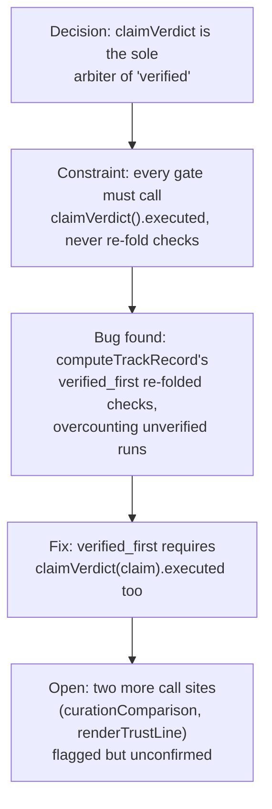

# Checks Passed Is Not Verified

**Confidence:** firm — the rule is well established and fixed at two call sites with a standing acceptance test, but a follow-up sweep flagged two more call sites as still unconfirmed within this evidence set.

A recurring bug shape in this repo is code that folds `claim.checks.every(check => check.result === "pass")` and treats the result as "this claim is verified". That fold is true even when *nothing executed* — in a repo with no configured test command, only non-executing checks run (diff-size, citations, reachability), they all trivially pass, and a claim can look perfect while proving nothing. The established rule is that any consequential gate (auto-merge, trust/track-record metrics, autonomy decisions) must call the single source of truth, `claimVerdict(claim).executed`, rather than re-deriving "verified" by re-folding checks itself. This was fixed first in `maybeAutoMerge` (ratify.ts), then in `computeTrackRecord`'s `verified_first` metric (trackrecord.ts) after measurement showed 31 runs counting as `verified_first` on this repo, one of which executed nothing — a figure that would read 100% in a fresh repo with no test command, i.e. exactly the situation where an autonomy gate matters most. The corrected metric now backs an autonomy gate: a goal with autonomy `merge` only auto-merges a run *type* whose track record clears a minimum sample size and a stated bar, falling back to `recommend` with an explicit reason below threshold. The canonical regression test for the whole property is a fresh git repo with no test command: it must render "UNVERIFIED — nothing was executed", `claimVerdict().executed` must be false, autonomy must HOLD rather than auto-merge, and `computeTrackRecord`'s `verified_first` must read 0. A related but separate measurement gap in the same function: a run whose agent died, was blocked, or was stopped before ever producing a `claim.json` has nothing for `claimVerdict` to even evaluate, so it silently contributes 0 to `verified_first` while still counting toward `dispatched` — meaning a process-death or an abandoned-blocked run is statistically indistinguishable, in the reported ratio, from a run that genuinely executed and failed verification; the metric conflates "didn't get the chance to be verified" with "was verified and failed." The same single-source-of-truth discipline is violated on the read side too: `withActivity()` in `api.ts` computes a formatted `claim_summary` string for list-level run cards but never attaches `claimVerdict()`'s structured label/executed flag there — only the per-run detail route does — so a UI wanting a "VERIFIED n/n" chip at list level currently has no cheap source without re-deriving verdict logic itself, exactly the pattern this doc's core rule forbids.

## Supporting evidence

- `.agent_memory/packets/decision-claimverdict-verify-ts-is-now-consumed-by-three-call-sites-maybeautomerge-ratify-5b86bbe0.md` — establishes the rule, the measured over-count bug in `computeTrackRecord`, and the sample-threshold autonomy gate design.
- `.agent_memory/packets/negative_result-rejected-approach-finish-the-every-check-passed-is-not-verified-sweep-two-more-c-d1257a60.md` — a follow-up dispatch naming two more call sites in `trackrecord.ts` (`curationComparison`, `renderTrustLine`'s `claimsVerified` tally) suspected of the same bug; the run itself was orphaned by an operator shell timeout before doing any work, so the fix is unconfirmed in this evidence set.
- `.agent_memory/packets/runbook-the-fresh-repo-honesty-property-holds-end-to-end-acceptance-test-and-how-to-re-r-64194e4d.md` — the canonical end-to-end acceptance test proving the four downstream consequences (receipt text, `claimVerdict().executed`, autonomy hold, `verified_first` score) all behave honestly together, and the recommended pre-release re-run procedure.
- `.agent_memory/packets/decision-trackrecord-tss-computetrackrecord-confidencefor-the-source-of-the-8-15-43-45-44-24c0e3d3.md` — the claim-less-run measurement gap: agent-died/blocked/stopped runs with no `claim.json` count 0 toward `verified_first` but still count toward `dispatched`, conflating "never got a chance" with "failed verification."
- `.agent_memory/packets/decision-withactivity-in-api-ts-computes-claim-summary-a-formatted-p-t-checks-string-for--0205ac42.md` — `withActivity()`'s list-level `claim_summary` lacks the structured verdict label that only `runDetail()` exposes, the same single-source-of-truth gap on the read/display side.

## Contradictions / open questions

- Whether `curationComparison` and `renderTrustLine`'s `claimsVerified` tally in `trackrecord.ts` were ever actually fixed is unresolved in this evidence set — the run tasked with confirming and fixing them was orphaned before it could look, and no later packet in this batch reports the outcome. The packet itself calls this "the same designed-but-unwired pattern that has bitten this repo seven times," suggesting the bug shape recurs faster than sweeps can close it out.
- A separate investigation into why chore-typed runs verify less reliably than feature/bugfix runs ruled out one hypothesis (`RUN_TYPES`' default-to-"chore" fallback) — every chore run in the real data already had an explicit type, so that fallback wasn't the driver — but the packet does not record what the actual root cause turned out to be; it remains open. (`.agent_memory/packets/decision-kages-run-types-defaults-any-unspecified-unrecognized-run-type-to-chore-in-three-875d659a.md`)

## Causality

