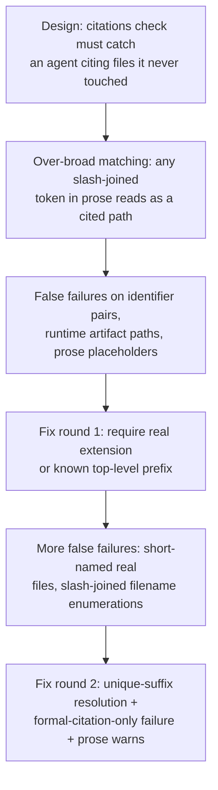

# The Citations Check's Honesty Boundary

**Confidence:** firm — the check's purpose is stable and well argued, but its exact matching rules were tightened across at least two separate rounds within this evidence set, and three separate dispatch attempts failed for infrastructure reasons (not logic) before fixes landed.

The citations check exists to catch an agent that cites a file it never actually touched — not to police an agent's English. Its implementation, `citedPaths` in `mcp/delegation/verify.ts`, extracts path-like tokens from a claim and fails the run if a formally cited one doesn't resolve to a real file. In its early form it was too aggressive: it read *any* slash-joined token in claim prose as a cited file path, which failed otherwise-correct runs on ordinary text like an identifier pair (`state.room/state.pty`) or a runtime artifact path never present in a worktree (`.agent_memory/runs/room-mcp.json`) — a real example was a claim citing three real files as one unmatched string, `contract.ts/ratify.ts/review.ts`, and failing verification on an otherwise-correct claim. An early attempt at excluding `.agent_memory/` paths had its own bug: a leading-`\b` word-boundary assertion silently dropped the leading dot from `.agent_memory/...` tokens, so the exclusion still failed for the wrong reason (it happened to still work, by accident, until the match target changed) — the fix replaced it with a negative-lookbehind `(?<![\w.])`. The first real hardening round required a final segment to have a real file extension or a known top-level prefix, and excluded anything under `.agent_memory/`; the actual defect there was an unwhitelisted extension pattern, not a missing extension check outright — a subtlety worth keeping straight since both symptoms look identical from the outside (an otherwise-valid path failing the check). A second round of false positives surfaced afterward — placeholder prose, and a real file cited by a short name the extractor only resolved from the repo root — which produced a further-refined design: resolve a cited path as a unique suffix of a real repo file when unambiguous; distinguish a *formally cited* path from one merely mentioned in narrative prose, letting only the former fail the check (prose-only unresolvable paths become a warning); and accept a slash-joined enumeration of filenames (e.g. `a.ts/b.ts/c.ts`) if every segment independently resolves. Through all of this the check kept its teeth: a genuinely invented citation must still fail, with a dedicated regression test for that case in every round. A structural note from the same work: the citation checker runs against whatever `citedPaths` implementation is *currently installed*, not the worktree's edited version — so a claim describing a citation-checker fix must avoid literally reproducing its own bad example string, or the pre-fix (or a stale) checker will flag that string and fail the very claim that fixes it.

## Supporting evidence

- `.agent_memory/packets/bug_fix-the-citation-checker-that-verifies-a-claim-statement-runs-against-whatever-cited-5ef2dc5e.md` — the first hardening round: real file extension / known top-level prefix required, `.agent_memory/` excluded, plus the self-referential "don't quote your own bad example" gotcha.
- `.agent_memory/packets/bug_fix-git-ls-files-after-the-worktree-is-already-staged-via-git-add-a-which-verifyruns-d4660b36.md` and `.agent_memory/packets/bug_fix-static-checks-ts-imports-writeevidence-from-verify-ts-at-module-scope-so-verify--280bd68d.md` — near-duplicate captures of the second hardening round: unique-suffix resolution, formal-citation-vs-prose distinction, slash-joined enumeration handling, and (same run) the addition of `kage reverify` to recover failed runs without re-running the agent.
- `.agent_memory/packets/negative_result-rejected-approach-in-mcp-delegation-verify-ts-the-citedpaths-function-reads-any--9de952a7.md` — a first dispatch attempt at tightening `citedPaths`, superseded and redispatched cleanly, carrying forward the finding that earlier failures were infrastructure (git lock contention, a flaky timing test), not bad logic.
- `.agent_memory/packets/negative_result-rejected-approach-tighten-citedpaths-in-mcp-delegation-verify-ts-it-currently-re-cf13fefb.md` — a second, duplicate dispatch of the same fix, rejected as a casualty of a transient-git sandboxing bug elsewhere in the kernel, confirming the fix itself remained wanted.
- `.agent_memory/packets/bug_fix-the-old-regexs-leading-b-assertion-silently-dropped-the-leading-dot-from-agent-m-61f3e200.md` — the `\b` vs. negative-lookbehind regex fix for `.agent_memory/` path detection.
- `.agent_memory/packets/bug_fix-the-original-citedpaths-regex-already-required-a-trailing-dot-extension-pattern--0232e629.md` — clarifies the real defect was an unwhitelisted extension pattern, not a missing extension check.
- `.agent_memory/packets/decision-slash-joined-enumerations-in-a-claims-statement-citations-are-read-by-the-checke-547caa12.md` — the concrete real-world example of the slash-joined-enumeration bug (`contract.ts/ratify.ts/review.ts` read as one unmatched path), documenting the pre-fix failure this later fix addressed.
- `.agent_memory/packets/negative_result-rejected-approach-fix-the-citation-extractor-false-positive-that-has-now-failed--b5abb72b.md` — a third rejected dispatch attempt at the same fix, again on unrelated flaky-test infrastructure (a room-message timing assertion under five concurrent heavy runs); the concrete remediation this time was lowering `max_concurrent` to 3 to reduce that contention going forward.

## Contradictions / open questions

- None found in the cited evidence — all three rejected attempts explicitly corroborate each other's diagnosis (infrastructure, not logic), and the eventual fix packets cite the same root cause the rejections predicted.
- The `\b`/leading-dot regex packet and the trailing-extension-pattern packet are each marked stale/deprecated in their own freshness metadata ("linked path changed since memory was verified: mcp/delegation/verify.ts") — the specific regex text has likely moved on again, but the underlying lesson (prose gets misread as file paths; tighten deliberately, not with a blanket extension check) is still durable.

## Causality

