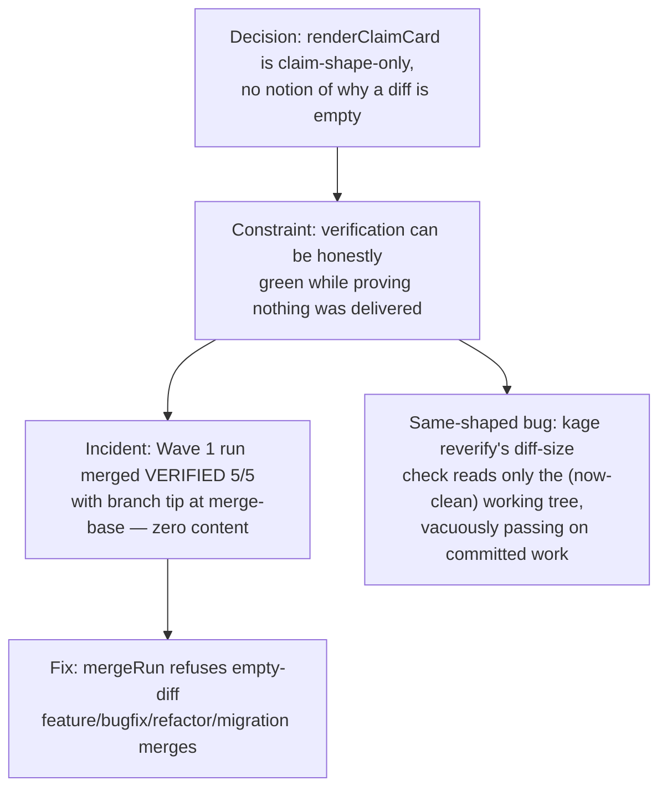

# Claim-Shape Receipts And The Empty Diff

**Confidence:** firm — the specific incident that motivated this line of fixes is well documented and the merge-time guard is confirmed shipped, but a same-shaped bug in `reverify`'s diff measurement is documented as found, not confirmed fixed, in this evidence set.

The CLI receipt renderer (`verify.ts`'s `renderClaimCard`) is claim-shape-only: it knows a diff has zero lines and zero files, but it has no notion of *why* — whether that's a legitimate no-op conclusion or a symptom of measuring the wrong thing. This blind spot let a real incident happen: a run merged reading "VERIFIED 5/5" while its branch tip sat exactly at the merge-base — zero commits, zero content — because every check (a green suite, a diff-size cap trivially satisfied by an empty diff, citations that happened to resolve) passed honestly on nothing. `kage merge` fast-forwarded nothing and deleted the worktree holding the only uncommitted copy of the work; the loss was discovered a day later only because downstream agents checked the tree instead of trusting the goal record. The fix was a merge-time content guard: `mergeRun` now counts commits between merge-base and branch-tip before merging, and refuses outright for feature/bugfix/refactor/migration-type runs with zero commits (never deleting the worktree on a refusal); chore/investigation runs may still merge empty, but the receipt must then lead with "EMPTY DIFF" so it can't be missed. A structurally identical bug was separately found in `kage reverify`: because runs commit their work at claim time, by the time reverify re-measures the diff the working tree is clean, so the diff-size check vacuously reports "0 files, 0 lines" no matter how large the real change was — observed on a run whose actual diff was ~1,400 lines. And `kage reverify` itself has a narrower recovery role than its own help text implies: it re-checks an existing *claim* against the current worktree, not the worktree in isolation, so a run whose supervisor died before any claim was ever parsed cannot be recovered through it at all, even with a fully intact, correct worktree.

## Supporting evidence

- `.agent_memory/packets/bug_fix-the-cli-receipt-renderer-verify-ts-is-claim-shape-only-it-has-no-notion-of-why-a-81bcc00f.md` and `.agent_memory/packets/bug_fix-verify-tss-renderclaimcard-is-claim-shape-only-it-has-no-notion-of-why-a-diff-is-7c1faa87.md` — near-duplicate captures of the same fix: the claim-shape limitation, the merge-refuses-empty-diff guard, and a companion slash-joined-citation-enumeration fix.
- `.agent_memory/packets/gotcha-a-run-can-merge-verified-with-an-empty-diff-verification-proves-the-tree-is-gree-60560a43.md` — the original incident record (now superseded): the reviewer-goal Wave 1 run merged VERIFIED with its branch tip at an unrelated ancestor commit.
- `.agent_memory/packets/gotcha-empty-diff-feature-merges-are-now-refused-verification-proves-green-the-merge-ho-9c4bb78b.md` — the current state after the guard shipped, explicitly superseding the incident-record gotcha above.
- `.agent_memory/packets/gotcha-reverifys-diff-size-check-reads-the-working-tree-so-a-claim-time-commit-makes-it-ecf3165a.md` — the same-shaped vacuous-pass bug found in `kage reverify`'s diff-size check.
- `.agent_memory/packets/bug_fix-verify-tss-verifyrun-called-by-runallchecks-which-supervisor-ts-claim-time-dispa-cd7799cf.md` — names `verifyRun` as the single choke point for diff measurement (fixing it there covers claim-time, reverify, and adopt in one place) alongside two related integrity defects: spend resetting to zero across a resumed session, and a worktree-boundary guard that flagged an operator's own legitimate rebuild because it attributed by drift rather than content.
- `.agent_memory/packets/gotcha-kage-reverify-re-checks-a-claim-not-a-worktree-its-help-text-promises-the-worktr-d5e7c0e6.md` — `kage reverify` cannot recover a claim-less orphaned run even with an intact, correct worktree; its help text overpromises.

## Contradictions / open questions

- Whether the `reverify` vacuous-diff bug was actually fixed (measuring merge-base..HEAD *plus* uncommitted changes, as the decision packet proposes) is not confirmed by a later packet in this batch — it is documented as a found defect with a fix direction, not as a verified fix.
- The empty-diff merge guard and the reverify vacuous-diff bug are the same root cause (measuring only the working tree, which is clean once work is committed at claim time) surfacing in two different call sites at two different times — the first was fixed relatively quickly (merge-time), the second was still open in this evidence set.

## Causality

