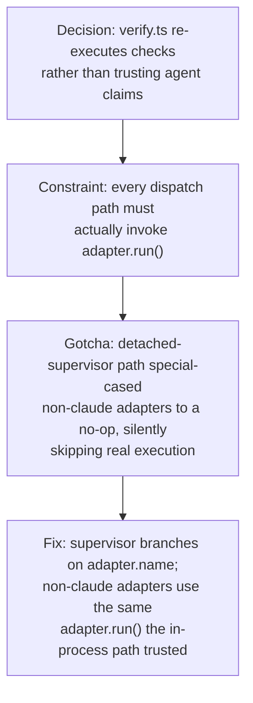

# Verification By Execution

**Confidence:** settled — this is the product's core architectural guarantee, restated consistently across the delegation-layer decision and re-proven by the incidents that tried to violate it.

Kage's delegation layer is built as a "manager on kernel": a hired coding agent works in an isolated git worktree, but nothing it says about its own work is trusted at face value. The kernel (`mcp/delegation/verify.ts`, driven from `contract.ts`'s run state machine) re-executes every declared check itself, inside the run's actual worktree, and takes the real exit code as the verdict, writing an evidence log per check. An agent claiming "tests pass" over a red suite is caught by construction, not by review discipline — a command that cannot even run returns `unverified_no_env`, which never counts as a pass. This is deliberately separate from static analysis: an early self-hosted run showed a claim could pass only non-executing checks (diff-size, citations) and still render as "VERIFIED 2/2", so `claimVerdict` was split to distinguish *executed* from merely *inspected*, and a battery of kernel-executed static checks (TypeScript compile, composed-script parse) was added so a run can never reach "ready" with code that doesn't even build — these run automatically and are attributed to Kage, not the agent, in the receipt. The whole loop (dispatch → verify → merge) is also how the Kage repo itself is built: the operator does not hand-edit; they review the receipt, diff, and blast radius, then `kage merge` lands the code and ratifies the run's learnings into memory in the same act. This guarantee is real but not indestructible — it was caught bypassed in production once (see Contradictions). Because this repo runs multiple delegation runs concurrently by design, each in its own git worktree, re-execution itself needed its own serialization discipline: `spawnWithTreeKill` acquires a per-machine lock for every executed command, so a run's own `npm test` can legitimately take 10-20x longer when another run's verification holds that lock — expected contention under the concurrency model, not a hang to kill. That lock is genuinely hard to test in isolation, because ambient lock state has to be scrubbed from three separate places (the parent process's own env, every spawned child's env, and a restore-after snapshot) or a "real contention" test silently degrades into a no-op that still reports green; and a child's own start/end timestamps span the time it spent waiting for the lock, so timestamp overlap between two children does not by itself prove serialization actually happened — only the evidence log's own "waited" note is trustworthy proof of that.

## Supporting evidence

- `.agent_memory/packets/decision-v0-delegation-layer-manager-on-kernel-verification-by-execution-f5cfaa2e.md` — states the core architecture: verify.ts as "the moat", re-execution against worktree contents, `unverified_no_env` semantics, merge-time ratification.
- `.agent_memory/packets/bug_fix-dogfood-fixes-static-checks-are-not-verification-commit-at-claim-time-06a9da07.md` — the founding incident: a claim passing only static checks rendered VERIFIED 2/2; introduces the executed-vs-inspected split in `claimVerdict`.
- `.agent_memory/packets/decision-verify-tss-writeevidence-was-private-i-exported-it-so-static-checks-tss-kernel-e-8a6b4608.md` — adds kernel-executed pre-claim static checks (tsc, composed-script parse) after two agents shipped non-compiling / non-parsing code that still passed every declared test.
- `.agent_memory/packets/bug_fix-detached-supervisor-faked-verified-for-any-non-claude-agent-now-runs-the-real-ad-8879528c.md` — the guarantee's real-world failure mode: the detached supervisor path (used by the desktop app and `POST /runs`) silently skipped execution for any non-Claude adapter.
- `.agent_memory/packets/convention-this-repo-is-built-through-its-own-delegation-loop-dispatch-verify-merge-the-ope-e20411f6.md` — the operator-level convention this architecture exists to support: dispatch/verify/merge, not hand-editing, with a narrow bootstrap exception.
- `.agent_memory/packets/decision-this-machine-runs-multiple-kage-delegation-runs-concurrently-by-design-each-in-i-61d142d5.md` — establishes concurrent worktree runs sharing one verify lock as intended contention, not a hang.
- `.agent_memory/packets/bug_fix-an-ambient-env-var-that-must-be-sanitized-in-a-lock-test-has-to-be-deleted-in-th-2171a381.md` — the three-places-to-scrub env sanitization rule for testing `spawnWithTreeKill`'s per-machine verify-lock, and its reentrancy fix.
- `.agent_memory/packets/decision-a-child-processs-own-start-end-timestamps-around-a-runcommandcheck-call-span-the-bb38a0d4.md` — why wall-clock timestamp overlap doesn't prove lock serialization; the evidence log's own "waited" note is the real signal.

## Contradictions / open questions

- The "every run is really executed" guarantee was violated in production: `mcp/delegation/supervisor.ts`'s `superviseRun` — the *only* path a web-app or `POST /runs` dispatch uses — special-cased any adapter other than `claude` to spawn a no-op (`node -e process.exit(0)`) instead of running the real adapter. This produced a VERIFIED claim for work that never happened, and was invisible to the in-process dispatch path (which always called `adapter.run()` correctly), so existing tests didn't catch it. It was found only by noticing an empty Follow-tab transcript. This shows the architecture's soundness depends on every dispatch *path* honoring it, not just the primary one — a lesson worth re-checking whenever a new dispatch entry point is added.

## Causality

