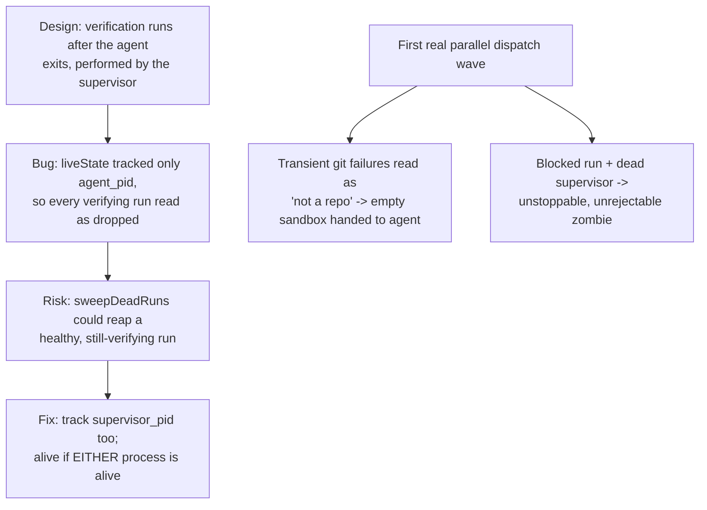

# Liveness Tracking Under Parallel Dispatch

**Confidence:** firm — all four bugs here were reproduced live with process-table or task-record evidence, and fixes are described concretely, though this batch does not include a later confirmation packet for the git-retry and blocked-zombie fixes.

Verification happens *after* a hired agent exits — the supervisor process performs it itself — but the run's liveness check, `liveState`, originally tracked only `task.agent_pid`. That meant every run sitting in the `verifying` state displayed as "dropped" throughout its entire check window (tests + build, 90+ seconds), because the agent's own process is expected to be gone by design at that point. This was more than cosmetic: `sweepDeadRuns` reaps runs it considers dropped after a five-minute grace period, so a slow-but-healthy verification could be killed outright by the reaper, and it already cost real work once — the operator rejected an earlier run partly on this false signal. The fix records the *supervisor's* pid on the task alongside the agent's, and `liveState` now treats a run as in-flight when either process is alive; a verifying run is only genuinely stale when neither exists. A related ordering bug compounded the same failure mode from a different angle: `dispatchRun` executes a run's entire life — agent work plus verification — before returning, so any code that waits for that return value to attach a goal (`attachRunToGoal`) leaves `goalForRun(runId)` null for the run's *entire* life, which kept the orchestrator's wake-loop dead; the fix moves goal attachment to immediately after `createRun`, before the agent even starts. The first live wave of truly parallel dispatch (two runs fired simultaneously by the Room manager) surfaced two further honesty gaps that only appear under real concurrency: (1) `isGitRepo`/`hasCommits` collapse on *any* git failure, including transient `index.lock` contention from concurrent `git worktree add` calls, so a transient failure was silently read as "not a git repo" and a healthy repo got handed to the agent as an empty sandbox directory — the agent behaved correctly (refused to work, reported the danger), but the kernel had already lied to it first; (2) a `blocked` run whose supervisor has died becomes an unstoppable, unrejectable zombie, because `stop` reports "no live supervisor — nothing to stop" without changing state, and `reject` refuses `blocked` states on the assumption that an agent is actively waiting.

## Supporting evidence

- `.agent_memory/packets/bug_fix-every-verifying-run-falsely-displays-as-dropped-livestate-checks-the-agent-pid-b-94df3da3.md` — the original false-dropped bug, with live pgrep evidence and the operator-cost consequence.
- `.agent_memory/packets/bug_fix-dispatchrun-executes-a-runs-entire-life-agent-work-verification-before-returning-d9ac46c8.md` and `.agent_memory/packets/bug_fix-livestates-inflight-check-running-dispatched-verifying-must-never-rely-on-agent--4b117b72.md` — near-duplicate captures of the same paired fix: goal-attachment ordering, and the supervisor_pid liveness fix.
- `.agent_memory/packets/bug_fix-parallel-dispatch-exposed-two-honesty-gaps-transient-git-failure-silently-sandbo-73279ec2.md` — the first real parallel-dispatch wave's two honesty gaps: silent sandboxing on transient git failure, and the unstoppable blocked-zombie run.

## Contradictions / open questions

- This evidence set documents the silent-sandboxing and blocked-zombie bugs with a stated "fix direction" (retry transient git failures, distinguish command-failed from command-answered-no; transition a dead-supervisor blocked run to stopped so reject becomes legal) but no later packet in this batch confirms either fix actually shipped and held under a repeat of the same live-parallel-dispatch scenario.

## Causality

