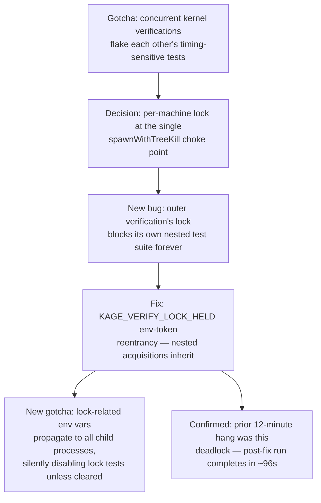

# Verification Lock Mechanics

**Confidence:** settled — the fix is confirmed with before/after timing evidence (a 12-minute hang collapsed to ~96 seconds), and the operator-facing gotchas around its environment variables are documented from direct incidents, not speculation.

Kernel-executed checks (tests, typecheck, app-parse — never the cheap inspected checks like diff-size or citations) run under a per-machine mutex, because concurrent full-suite verifications on one machine were observed flaking each other's timing-sensitive tests: three different runs failed three different timing-shaped tests on the same day, each passing solo, with the common factor being another verification or worker suite running at the same time. The lock is acquired at a single choke point, `spawnWithTreeKill` in `verify.ts` — every executed check (declared checks via `runCommandCheck`, and static checks like typecheck/app-parse) funnels through it, so locking there covers everything without touching each call site. It is keyed to the machine, not the project (two projects' verifications still interleave the same CPU), waits with a visible note in the check evidence so a slow verdict is explained rather than silently late, and recovers from a crashed holder by stealing the lock (also noted). `KAGE_NO_VERIFY_LOCK=1` is the intentional escape hatch for CI machines that already parallelize across isolated executors. Shipping the lock introduced a real reentrancy deadlock: because the lock is acquired for *every* executed command, the kernel's own outer verification run holds it for the whole `npm test` invocation, and any nested test whose code path reaches `spawnWithTreeKill` without its own lock-path override blocks forever on its own ancestor's lock (the holder pid is alive, so the steal path never fires) until a 1200-second tree-kill. The fix is environment-token reentrancy: when a lock is genuinely acquired, `KAGE_VERIFY_LOCK_HELD=1` is exported into the child process environment, and any nested acquisition sees that marker and returns immediately as "inherited" rather than waiting. This has two sharp edges for anyone testing the lock itself: `KAGE_NO_VERIFY_LOCK=1` and `KAGE_VERIFY_LOCK_HELD=1` both propagate to all descendant processes by default, so a test suite invoked with either already set — or run nested inside a real kernel verification that stamped the marker — will silently prove nothing (its deliberately separate lock-path override gets short-circuited); lock tests must explicitly delete these variables in both the spawned child's script and any same-process call within the test itself. A same-process test of the lock's *wait* behavior is a distinct trap: `acquireVerifyLock`'s wait loop is a synchronous poll on the one JS thread, so if that same process also holds the lock, nothing can ever run the release code — a real second OS process is required to exercise waiting honestly.

## Supporting evidence

- `.agent_memory/packets/gotcha-concurrent-kernel-verifications-on-one-machine-flake-each-others-timing-sensitiv-bde2e11a.md` — the original problem: three timing-sensitive tests failing only under concurrent verification, all passing solo.
- `.agent_memory/packets/decision-a-same-process-test-of-the-locks-wait-behavior-deadlocks-acquireverifylocks-wait-99aa636d.md` — the lock's design (machine-keyed, honest wait notes, crash-safe steal, `KAGE_NO_VERIFY_LOCK` escape hatch) plus the same-process wait-test deadlock trap.
- `.agent_memory/packets/decision-verify-tss-spawnwithtreekill-is-the-single-choke-point-every-executed-check-pass-2fdaa9b2.md` — names `spawnWithTreeKill` as the single lock-acquisition choke point covering both declared and static checks.
- `.agent_memory/packets/bug_fix-running-npm-test-prefix-mcp-locally-via-bash-with-kage-no-verify-lock-1-set-on-t-0d01f86c.md` — the critical reentrancy deadlock (outer verification's lock blocks its own nested tests) and the `KAGE_VERIFY_LOCK_HELD` inheritance fix; also documents `KAGE_NO_VERIFY_LOCK=1` propagating to all descendant processes and silently disabling nested lock tests.
- `.agent_memory/packets/bug_fix-tests-that-spawn-child-node-processes-to-exercise-verify-lock-ts-must-explicitly-535fc5b3.md` — the companion test-hygiene rule: explicitly delete `KAGE_VERIFY_LOCK_HELD` in both the child script and same-process test calls, since the test runner may itself be nested inside a real verification.
- `.agent_memory/packets/bug_fix-when-verifying-this-repos-own-verify-lock-fix-the-operator-must-run-its-own-oute-a3432cf8.md` — the operator-facing consequence: verifying the lock fix itself requires `KAGE_NO_VERIFY_LOCK=1` as a bootstrap escape hatch, since the pre-fix kernel would otherwise deadlock on itself.
- `.agent_memory/packets/decision-the-prior-verification-hang-i-hit-documented-in-my-earlier-claim-as-12-minutes-u-c607fbbc.md` — confirms the fix worked: a prior 12-minute hang, earlier misattributed to generic CPU contention, dropped to ~96 seconds post-fix.
- `.agent_memory/packets/convention-agents-may-only-kill-processes-they-own-and-operators-must-verify-ownership-befo-880501a3.md` — the operating convention this lock supports (concurrent-run contention is by design and the lock handles it — slowness is never a license to kill an unowned process), including a correction of a false sabotage accusation that was actually an internal hang.

## Contradictions / open questions

None found in the cited evidence — the timing confirmation (12 min → 96s) directly corroborates the reentrancy-deadlock diagnosis, and the false-accusation correction reinforces rather than contradicts the "contention is by design, handled by the lock" convention.

## Causality

