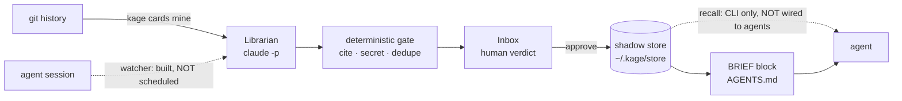

# What is built, how it works, and what comes next

*State of the rebuild as of 2026-08-04. The product argument lives in [DIRECTION.md](./DIRECTION.md);
this document is the engineering counterpart — what actually exists, what it does when you run it,
and what is still missing. Every number here was measured, not estimated.*

---

## The one-line shape

Kage turns agent sessions and git history into **cards** — small, cited, verifiable claims — keeps
them in a **shadow git repo outside your project**, and puts them back in front of agents at the
moment they matter. A background **Librarian**, running on your own coding-agent subscription, does
the extracting. A deterministic gate does the refusing. You do the approving.

> **Intelligence where judgment is needed. Determinism where trust is needed. A human where team
> knowledge is born.**

The old system had that backwards: deterministic code (substring scoring) made the semantic
judgments, and nothing enforced the trust rules. That is what produced 405 packets, 43% of them
dead, in a repo where memory noise landed in 200 of the last 200 commits.

---

## What is built

Sixteen modules, ~2,970 lines, in `mcp/vnext/librarian/`. Node builtins only — the packaged desktop
app ships `mcp/dist` with no `node_modules`, so anything the app reaches must resolve without them.

### The unit — `types.ts`, `card.ts` (325 lines)

A **card** is one claim of at most 160 words, in exactly one of three kinds:

| kind | holds |
|---|---|
| `decision` | what we chose, why, what was rejected |
| `runbook` | a verified procedure with exact commands |
| `caution` | a failure, its cause, its fix |

Three kinds and no more, because the previous 15-type taxonomy became a *gate exemption*: 54% of the
legacy store was typed `decision` precisely because that label skipped the derivability check.
Anything finer is a tag.

Every card carries **citations** (a repo path plus optional symbol, pinned to a git blob sha; or
`commit:`/`pr:` refs), a **trigger** in prose, **provenance**, and two independent state machines:

- **lifecycle** — `proposed → approved → superseded | retired`. Supersede, never delete.
- **trust** — `verified | unverified | stale`, recomputed from the code, not asserted by anyone.

Two rules are load-bearing and enforced in code:

```
A card that cites nothing cannot exist.     A claim nothing can falsify is trivia.
A claim is capped at 160 words.             Cards are claims; a 400-word card is a doc that dodged review.
```

The file format is markdown with JSON-valued frontmatter — a hand-rolled parser cannot be wrong
about quoting, `JSON.parse` does the hard part, and the file stays readable with `cat` if Kage
disappears. Frontmatter keys serialize in a fixed order so identical cards produce identical bytes;
otherwise every rewrite would be a spurious diff in a store that commits on every mutation.

### The store — `store.ts` (308 lines)

A **shadow repo** at `~/.kage/store/<id>/`, where `<id>` is a hash of the git remote (falling back to
the absolute path, so two clones of one origin share a store and two unrelated repos never do). One
file per card, **one git commit per mutation**, authored by the Librarian. History, blame, revert and
diff are therefore native git rather than invented machinery.

Your project repo gets **nothing**. Not a directory, not a dotfile.

### Trust — `verify.ts`, `secretscan.ts` (188 lines)

`auditCard` checks every citation against the working tree:

- a cited file or symbol is **gone** → `stale` → **withheld from recall entirely**
- the file **drifted** from its pinned blob sha → `unverified` → served, but stamped as such
- everything matches → `verified`
- a citation with no pinned sha is **never** `verified` by default — verification is an act, not an
  assumption

`secretscan` is the gate's hardest refusal: eight patterns (AWS, `sk-`, GitHub, Slack, private-key
blocks, bearer tokens, quoted credential assignments), run before any human sees a proposal. False
positives are acceptable here in a way false negatives are not — a blocked card is rephrased in a
minute; a synced secret cannot be unsynced.

### The extractor — `provider.ts`, `prompts.ts`, `librarian.ts` (467 lines)

`provider.ts` spawns **your own agent headless** (`claude -p --output-format json`). Kage pays for
zero inference, ever. A scripted fake backs every test.

`distillSession` runs two passes:

1. **Triage** (cheap tier) — "is there anything durable here?" A reply starting `NO` ends it with
   zero proposals. **Rejecting most sessions is correct behavior**, not failure: Cursor shipped
   memories without this filter and killed the feature over junk.
2. **Extract** (working tier) — at most 3 cards, cited only to files and commits that literally
   appear in the digest.

Then a **deterministic reconciler** — no third model call — decides `ADD` / `UPDATE` / `NOOP` by
content address and title Jaccard. Unparseable model output degrades to an empty outcome and
**never throws**: this runs unattended, and a bad model day must not take down the daemon.

### Day one — `miner.ts`, `transcripts.ts` (373 lines)

A memory product with no memories is a dead demo, so the first cards come from history the team
already wrote. `buildHistoryDigest` reads commits, **reverts** (gold: something was tried and
undone), and the 15 hottest files, then asks for up to 10 cited cards in one call.

`transcripts.ts` finds Claude Code session logs and digests them, keeping the **start** (the task)
and the **end** (the resolution) when a transcript is too long. The middle is churn.

### Delivery — `brief.ts`, `recall.ts`, `receipts.ts` (384 lines)

Three tiers, matching where the industry converged:

1. **BRIEF** — a ≤200-line fenced block spliced into the `AGENTS.md`/`CLAUDE.md` you already have.
   Byte-preserving outside the markers, idempotent. **Stale cards are never in it** — an always-on
   stale claim reaches every session, which is the exact failure this product exists to prevent.
2. **Trigger-scoped recall** — `recallCards` scores approved cards by cited-path overlap and trigger
   keywords, serves the top few with a human-readable *why*, and routes stale ones to `withheld`
   where they are counted and visible.
3. **Receipts** — append-only JSONL, one line per counted event. The only source any displayed
   number is allowed to have.

### The verbs — `operations.ts` (220 lines)

Every surface calls these and nothing beneath them, because approving is not one write: it re-pins
citations *at approval time* (a card sitting in the inbox for an afternoon must not arrive already
drifted), audits trust, resolves a supersede, appends a receipt, and regenerates the BRIEF. Two
surfaces assembling that sequence themselves would eventually assemble it differently.

### The surfaces

- **CLI** — `kage cards list|show|approve|reject|mine|verify|brief|recall|receipts`. One branch in
  `cli.ts`; the dispatcher lives beside the store it drives, where it is unit-tested.
- **Desktop Inbox** — proposals with claim, citations, trigger and provenance; `j`/`k` to move, `a`
  to approve, `r` to reject. Deliberately boring, like code review.
- **`librarian-host.ts`** — owns the two decisions the shell actually has: who signs an approval
  (repo `git config user.name`, then the OS account — the store's commits are authored by the
  Librarian, so this is the only record of which *human* said yes), and which binary to borrow (a
  GUI app inherits launchd's PATH and would otherwise die with `spawn claude ENOENT` at the *end* of
  a run you watched).

---

## How it runs today — measured



A real run on this repository:

| | |
|---|---|
| mined | 150 commits, 74 seconds |
| proposed | 10 cards, all cited to real commits |
| cost | `$0.40`, 2 in / 4,175 out tokens — **on your subscription** |
| approved | 6, through the CLI and the app |
| in-repo footprint | **1 fenced block**, 6 lines |
| store | `~/.kage/store/bb02419cfae5/`, 20 cards, 736 KB |

Two of the cards it proposed — a 38-second `/v2/work` block and a metric written but never drained —
are bugs I had found by hand hours earlier. It found them from history alone.

**Tests:** librarian 166, core 1824, web 172. Verified on a clean rebuild from source, audited for
`ts-ignore` / `.skip` / `as any` / always-true assertions.

### The bug dogfooding found

The first mining run proposed a card warning that *the Librarian had been reverted*, citing the
commit that created it an hour earlier. Cause: `git log --grep=Revert` searches the whole message,
and that commit's body reads "Reverts are gold." A revert is a commit whose **subject** is
`Revert "..."`. Every unit test passed, because their fixtures used real revert subjects.

The general lesson, now a card: **a heuristic over free text matches what discusses the thing as
readily as what is the thing.**

---

## What is not wired

Stated plainly, because a half-wired loop that looks whole is worse than an honest gap.

| gap | consequence |
|---|---|
| `watcher.ts` is built and tested, but **no timer calls it** | your agent works all day and the Librarian never wakes |
| **no MCP tool or hook serves cards** | cards reach agents only via the passive BRIEF; the trigger-scoped tier does not exist in practice |
| `mineHistory` does not use the reconciler | a second mining run proposed 10 fresh cards and `0 already known` — the Inbox will bury you |
| **legacy capture still runs** | two stores, two capture paths, two staleness checkers; junk accumulates in the weaker one |
| OKF is still tangled into `kernel.ts` | that kill-list item is deferred — an extraction from 24k lines, not a delete |
| the CLI is **118 commands** (from 131) | the collapse has barely started |
| **no team sync** | the shadow store has no remote story yet |

---

## What comes next

### Phase 1 — close the daily loop *(the difference between a demo and a habit)*

Day one works. Day two does not. Three changes fix that:

- **Schedule the watcher.** A tick in the desktop app calls `distillIdleSessions`. Sessions idle for
  ten minutes get digested, triaged, and — nine times in ten — correctly ignored. The tenth produces
  proposals, and the tray badge counts them.
- **Serve cards to agents.** A `kage_recall` MCP tool plus a pre-edit hook, so touching a cited file
  brings its cards back stamped with live trust state (`verified against a1b2c3, 2h ago`). This is
  the visceral moment — the one where an agent doesn't repeat the thing that got reverted twice —
  and today it is the piece that does not exist.
- **Dedupe on mine.** Route mining proposals through the same reconciler `distillSession` uses.

*Done when:* a session ends, a card appears without anyone typing a command, and the next agent to
touch that file is told about it.

### Phase 2 — one memory system, not two

The legacy pipeline still writes packets; I wrote two myself while building this. Migrate the 229
surviving packets into cards where they earn admission — most will not, and that is the point — then
retire the legacy capture path and the OKF tooling entangled with it. The CLI collapse rides along,
because most of the commands that go are legacy-store verbs.

*Done when:* `.agent_memory/packets/` is gone, there is one store, one gate, one review queue.

### Phase 3 — team

Give the shadow store a remote on the git host the team already uses. Teammates' proposals arrive as
branches; review stays per-card in the same Inbox; identity is git identity. A conflict between two
people's claims becomes a question, not a merge accident.

The scoreboard is **cross-pollination**: cards authored in one person's session, delivered into
another person's agent. Measurable per receipt — unlike "repeat failures prevented," which needs a
counterfactual nobody can run.

*Done when:* a card you approve on Monday is injected into a teammate's agent on Wednesday, on a
different machine, and the receipt proves it.

### Then

Spec grounding (`memory → PRD → tasks`), the post-merge post-mortem, and provenance signing against
memory poisoning. All of it rests on Phases 1–3 and none of it should start before they land.

---

## How it will feel when Phase 1 is done

You start Claude Code. It already read the BRIEF. You touch `src/limits.ts` and a caution arrives —
*"two PRs flipped this comparison and both were reverted"* — stamped verified two hours ago. Your
agent doesn't propose it.

You never open Kage for that. You just notice the agent stops re-litigating settled questions.

Tomorrow morning, the tray badge says `2`. Coffee, `j` `a` `j` `r`, inbox clear. Ninety seconds.

That is the product.
