# How Kage works — product and technical

*The visual companion to [DIRECTION.md](./DIRECTION.md) (why) and [BUILD.md](./BUILD.md) (what
exists). Diagrams render on GitHub. Solid lines are wired and running; **dashed lines are built but
not yet connected**, and are called out every time.*

---

# Part 1 — The product

## 1.1 The problem, drawn

Every agent session pays to learn the same things, then throws the result away.

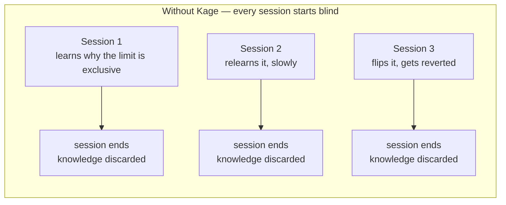

The knowledge does exist — in reverted PRs, in someone's head, in a Slack thread from March. It is
just not anywhere an agent can reach at the moment it matters.

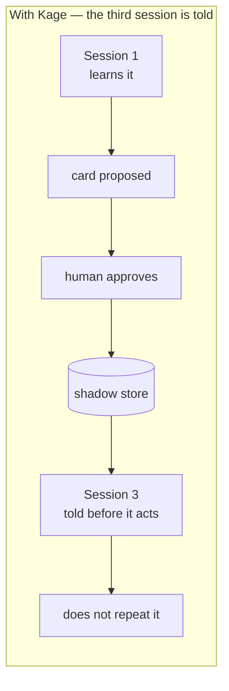

## 1.2 Day one — the first thirty minutes

The cold-start problem is fatal for a memory product: an empty store is a dead demo. Kage solves it
by reading history the team already wrote.

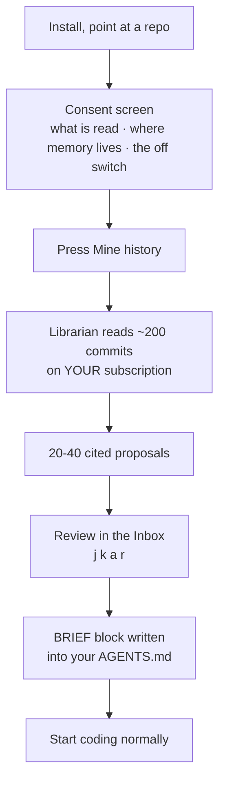

**Measured on this repository:** 150 commits → 10 cited cards, **74 seconds**, **$0.40** of your own
subscription. Reviewing them doubles as the fastest architecture tour of your own codebase, because
every card cites the commit it came from.

## 1.3 The daily loop — the habit

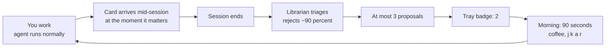

Two properties make this a habit rather than a chore:

- **You never open Kage to get value.** Cards reach you inside the agent session you already live in.
- **The only thing you open Kage for is a verdict**, and it takes ninety seconds with a keyboard.

The `~90%` rejection is the design working. Cursor shipped memories without a triage filter and
killed the feature over junk.

## 1.4 The team loop

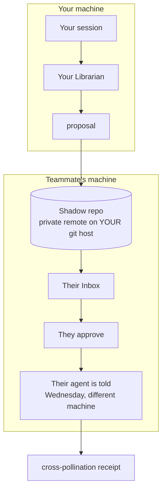

**The scoreboard is cross-pollination** — cards authored in one person's session, delivered into
another person's agent. Measurable per receipt. Deliberately *not* "repeat failures prevented,"
which needs a counterfactual nobody can run.

## 1.5 Where Kage sits

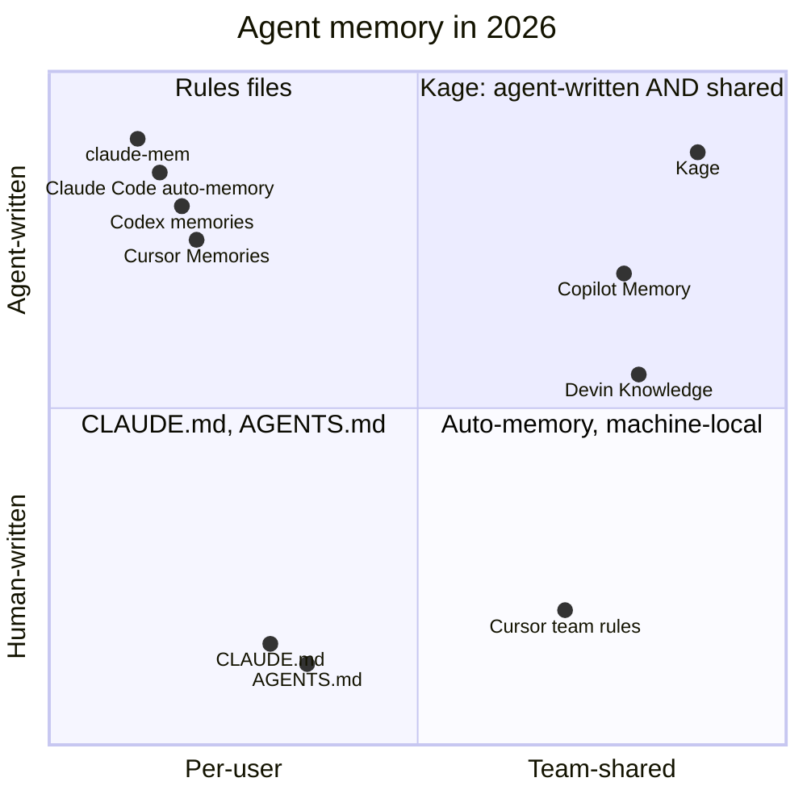

First-party memory is per-user and machine-local; vendors explicitly punt team knowledge to
hand-written repo files. Devin and Copilot are team-shared but locked to one vendor's cloud. The
unoccupied corner is **cross-agent + team-shared + agent-written + verified-against-git**.

## 1.6 The business, in one diagram

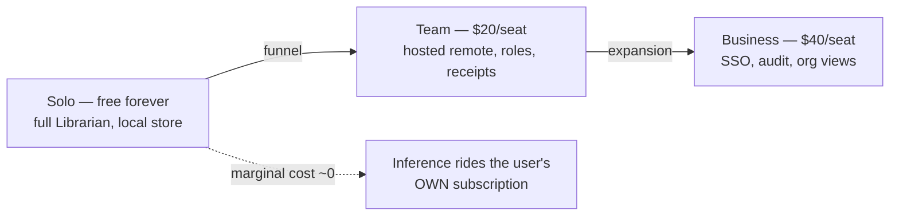

> *Your agents' subscription pays for the intelligence. You pay Kage for trust, sync, and governance
> — the layer nobody bundles.*

---

# Part 2 — The technical system

## 2.1 Components

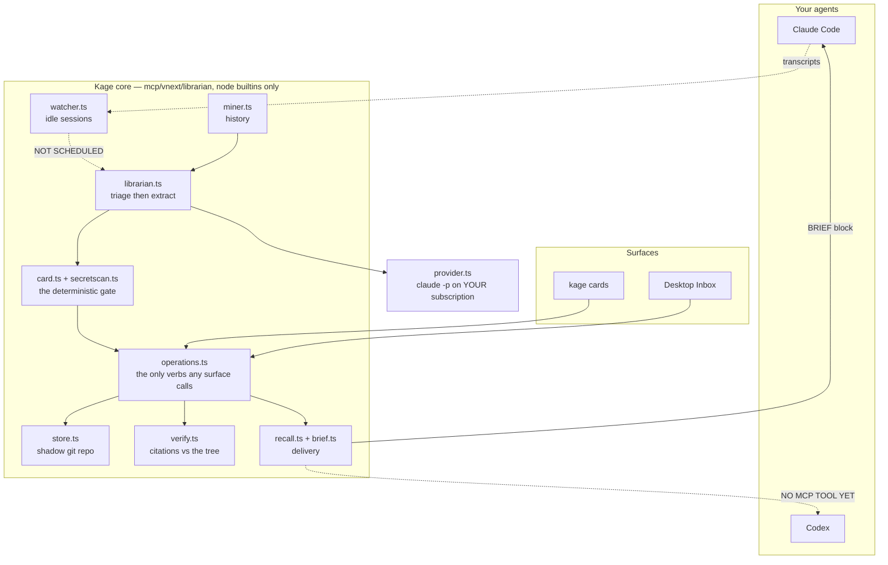

Two dashed edges are the whole of what is missing from the loop: **nothing schedules the watcher**,
and **no MCP tool serves cards to an agent mid-session**.

## 2.2 Capture — the sequence

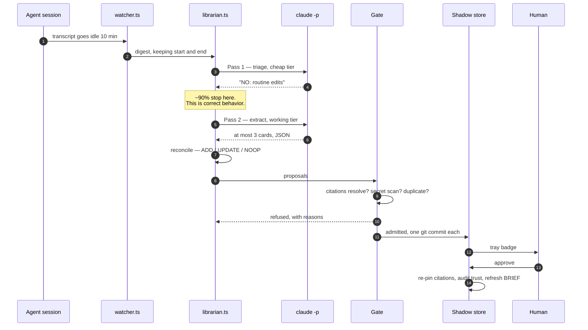

Step 9 is the load-bearing one: **the model proposes, the machine disposes.** The gate is
deterministic so its refusals are auditable and cannot be argued with by a model having a bad day.

## 2.3 The gate

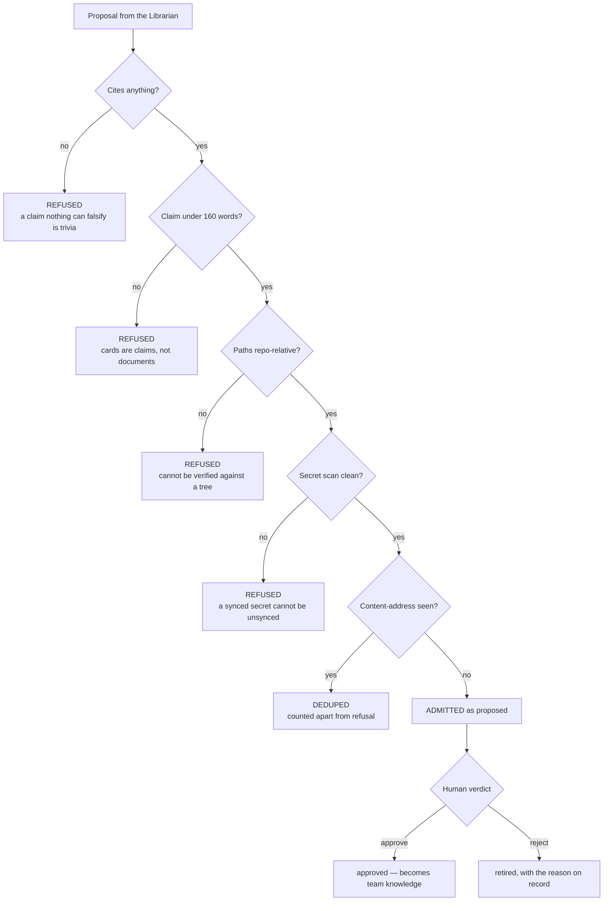

Dedupe is counted **separately** from refusal on purpose: *"we already knew that"* is the system
working, while *"the gate refused this"* is a quality signal about the extractor. One number would
hide whichever is degrading.

## 2.4 Two state machines, deliberately separate

Lifecycle is what **humans** decide. Trust is what the **code** decides. Conflating them is how
memory systems end up serving confidently wrong facts.

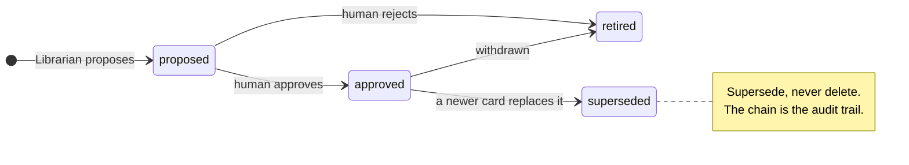

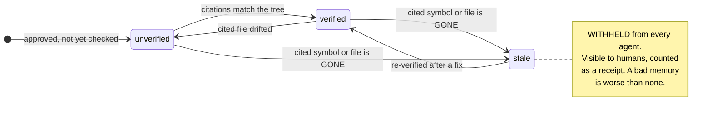

## 2.5 Retrieval — three tiers

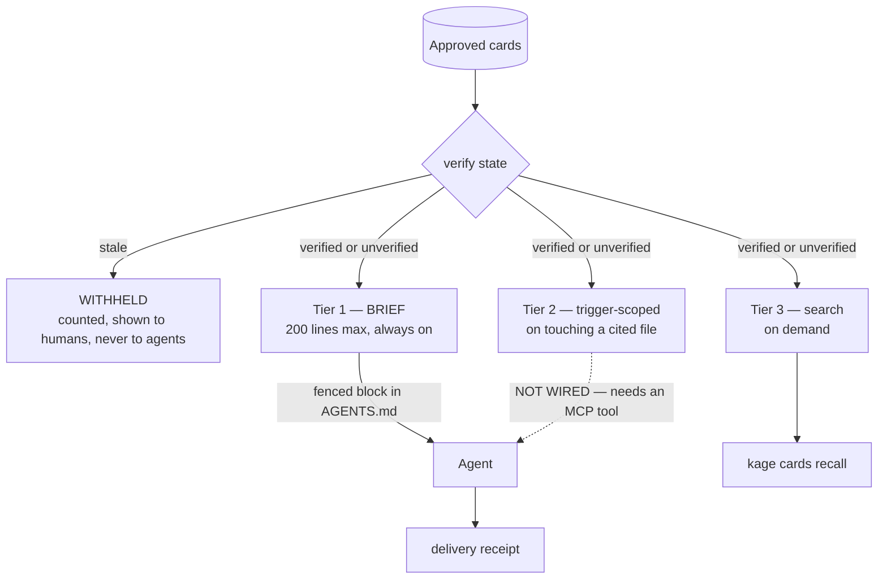

Scoring for Tier 2 is deterministic and explainable — every served card carries a *why*:

```
+3.0   a query file matches a cited path
+1.0   a query keyword appears in the trigger
+0.5   a query keyword appears in title or claim
```

A real run: `kage cards recall "why is the board slow" --files mcp/vnext/api/read-models.ts` served
three cards, each annotated `trigger matched 'board', 'slow'`.

## 2.6 Where the bytes live

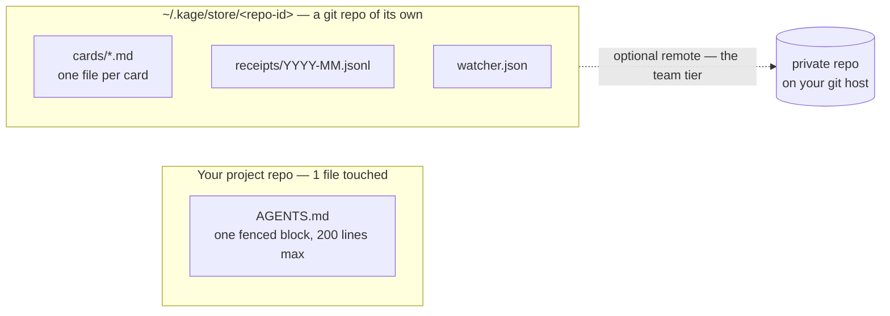

```
~/.kage/store/bb02419cfae5/     ← sha of the git remote, so two clones share one store
├── cards/
│   └── card_fa02a676.md        ← markdown, JSON frontmatter, readable with `cat`
├── receipts/2026-08.jsonl      ← append-only counted events
└── watcher.json                ← machine-local, never synced
```

`repoStoreId` hashes the **git remote** when there is one, falling back to the absolute path. Two
clones of one origin therefore share a store; two unrelated repos never collide.

**Repo footprint, before and after:**

| | packets in repo | tracked memory files | commits touching memory |
|---|---|---|---|
| before | 405 | 404 of 1,018 — **40%** | 200 of last 200 |
| after | 0 | **1 fenced block** | only when the BRIEF changes |

## 2.7 The card, as data

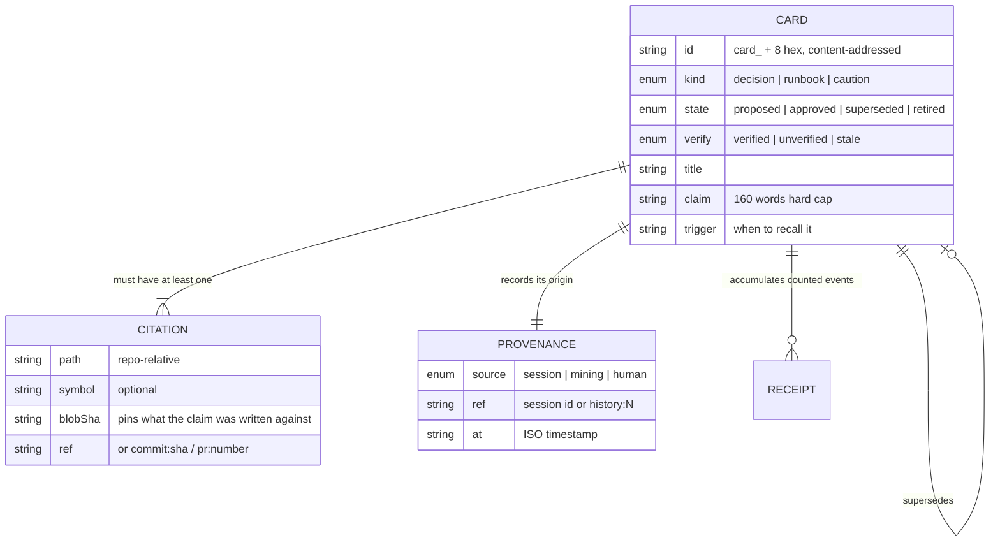

## 2.8 Why the extraction sits where it does

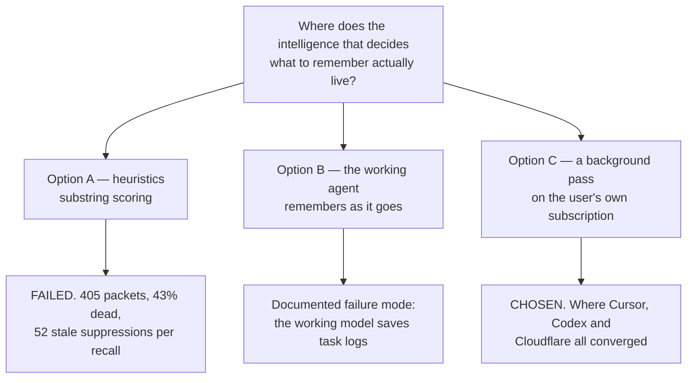

The old Kage was Option A, and worse: the LLM seam existed as **dead code** —
`createProxyLoopbackProvider` even harvested credentials on every proxied request, but the one
production pipeline was constructed without a model provider.

---

# Part 3 — Wired vs not

```mermaid
flowchart LR
  subgraph done["Running today"]
    D1["Mine history → cards"]
    D2["Deterministic gate"]
    D3["Shadow store, git-backed"]
    D4["Inbox: approve / reject"]
    D5["BRIEF block into AGENTS.md"]
    D6["Trust audit + stale withholding"]
    D7["Counted receipts"]
    D8["kage cards CLI, 9 verbs"]
  end
  subgraph next["Phase 1 — closes the loop"]
    N1["Schedule the watcher"]
    N2["kage_recall MCP tool + hook"]
    N3["Dedupe on mine"]
  end
  subgraph later["Phase 2 and 3"]
    L1["One store — retire legacy capture"]
    L2["Team remote + per-card review"]
    L3["Spec grounding, post-merge post-mortem"]
  end
  done --> next --> later
```

| | status |
|---|---|
| Librarian core, 16 modules, ~2,970 lines | **done**, 166 tests |
| Real mining run | **done** — 150 commits, 10 cards, 74s, $0.40 |
| Desktop Inbox with real cards | **done**, verified in the running app |
| `watcher.ts` | built, tested, **no timer calls it** |
| MCP recall tool / pre-edit hook | **not built** |
| Dedupe inside `mineHistory` | **not built** — a second run proposed 10 fresh cards, `0 already known` |
| Legacy capture pipeline | **still running in parallel** |
| Team sync | **not built** |

**Suites:** librarian 166 · core 1,824 · web 172.

---

## The sentence the whole system is built from

> **Intelligence where judgment is needed. Determinism where trust is needed. A human where team
> knowledge is born.**

A model decides what was worth learning, because that needs judgment. A machine decides what may be
stored and what may be served, because that needs to be auditable. A person decides what becomes the
team's, because that is what makes it theirs.
