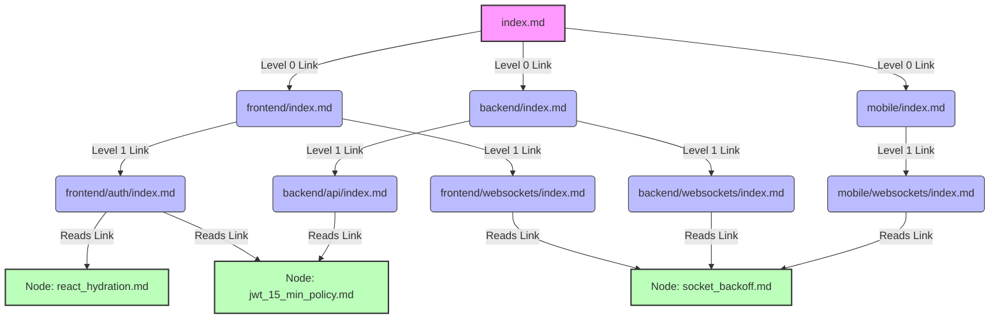

# 🧠 Kage: Enterprise Agent Memory Setup Guide

Welcome to **Kage** (the shared Agent Memory framework). This architecture solves the "Isolated Agent" problem by using Git and Markdown files to synchronize crucial architectural insights, framework bugs, and repository context across an entire engineering team and their AI tools (Cursor, Claude, AntiGravity).

This guide explains how an entire Organization goes from zero to a fully synchronized, two-tiered Memory Hive-Mind.

---

## 🏗️ The Architecture Overview

We use a **Two-Tiered** system to ensure knowledge routes to the correct place safely:

1. **Local Memory (`/.agent_memory/`)**: Context strictly tied to a single repository's codebase (e.g., "The local checkout DB schema"). Lives in individual git feature branches.
2. **Global Memory (`/.global_memory/`)**: Universal knowledge (e.g., "Company-wide Next.js caching rules"). Lives in a central repository, distributed everywhere as a Submodule.

---

## 🗺️ How the Multi-Path Graph Works (Architecture Example)

Kage uses Hierarchical Markdown to create a "Multi-Path Graph." This means a single cross-functional rule is stored securely exactly *once* as a central "Node," but is hyperlinked simultaneously from multiple routing indexes (like the Frontend and Backend maps). 

When your AI is debugging the Frontend, it reads the Frontend index and finds the rule. When it's debugging the Backend, it reads the Backend index and finds the *exact same* rule. This prevents knowledge fragmentation.

### The Scenario: Authentication & WebSockets
Imagine your team has an AI coding session that formalizes three new engineering rules:
1. **Node A:** React hydration error fixes for the User profile page. *(Strictly Frontend)*
2. **Node B:** A new 15-minute JWT Token expiration policy. *(Affects Frontend API calls AND Backend validation).*
3. **Node C:** A mandatory exponential backoff strategy for dead WebSockets. *(Affects Frontend, Mobile, and Backend socket handlers).*

When Kage extracts these, it creates three central **Nodes**, but constructs a massive, interconnected markdown routing tree to ensure any agent working *anywhere* in the codebase organically discovers them!

### The Indexing Graph (Mermaid)



---

## 🚀 Org-Wide Implementation Steps

### Phase 1: Create the Global Brain Repository
First, create a brand-new repository on GitHub dedicated *solely* to enterprise agent memory.
1. Create `github.com/YourOrg/global-agent-memory.git`.
2. Inside it, create a single map file: `index.md`.
3. Give your entire engineering team `write` access to this repo.

### Phase 2: Connect the Microservices
For every single application repository your team actively develops in:

1. **Attach the Global Submodule:**
   Pull the Global Brain directly into the app repository:
   ```bash
   git submodule add https://github.com/YourOrg/global-agent-memory.git .global_memory
   ```
2. **Scaffold the Local Memory:**
   Create the isolated local tracker for repo-specific rules:
   ```bash
   mkdir -p .agent_memory/nodes && touch .agent_memory/index.md
   ```
3. **Configure the AI Ecosystem:**
   Create a `.cursorrules` file at the root of the application repository. This natively forces Cursor IDE (and auto-agents) to read the memory map before treating your code as a blank slate.
   ```text
   # .cursorrules
   You MUST read BOTH `/.agent_memory/index.md` AND `/.global_memory/index.md` before suggesting architectural changes or assuming framework behaviors. Follow any structural warnings found in those nodes exactly.
   ```

### Phase 3: Activating the Distiller Agent (Automation)

Humans hate writing documentation, so we automate it. This repository includes two background tools in `/.agent_memory/scripts/` to invisibly track agent sessions and write memory.

*   **The Session Watcher (`session_watcher.py`)**: A daemon that permanently runs in the background. It reads the raw chat transcripts from AntiGravity or Claude. When you solve a complex bug with AI, the Watcher realizes it, extracts a "Stack Overflow" style lesson, creates the Markdown file, and seamlessly appends the hyperlink to your `index.md` map.
*   **The Routing Rules**: The Distiller script asks the LLM: *"Is this highly specific to this app, or a global framework rule?"* 
    *   If Local: It saves to `.agent_memory/` on the current Git branch.
    *   If Global: It saves to `.global_memory/` and bypasses the local branch by pushing directly to the `main` branch of the global submodule repo instantly syncing it to every other engineer in the company.

---

## 🔌 How to Enable Different Agent Platforms

Because the Memory is just plain-text Markdown tracked over Git, it integrates anywhere natively.

*   **Cursor IDE:** Fully automatic. `Composer` naturally follows the `.cursorrules` file instructions and hyperlinks.
*   **AntiGravity:** Included in this repo is a custom workflow (`.agents/workflows/save-memory.md`). Just type `/save-memory` in the chat, and AntiGravity will act as the Distiller Agent, parsing and saving the memory manually.
*   **Claude Code (CLI):** Start Claude Code by actively passing the memory maps in the system prompt:
    ```bash
    claude --system "Before writing code, read /.agent_memory/index.md and /.global_memory/index.md."
    ```
*   **GitHub Copilot Workspace:** The Markdown files are natively indexed by GitHub's semantic search. Asking Copilot chat an architectural question will automatically surface the memory nodes.

---
*Built with anti-hallucination, cross-functional architecture in mind.*
