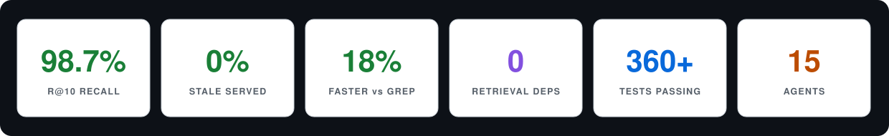

<div align="center">


### Kage manages your memory and agents

State an intent. Kage's orchestrator briefs a coding agent from your repo's own memory, runs it
in an isolated git worktree — a single run or a multi-wave goal — and **re-runs the checks
itself** rather than trusting the agent's report:

```
┌ VERIFIED 3/3 — checks run by Kage, not the agent · build-a-stale-memory-triage-surface-do-n-260818-ec2c
│ "the stale-memory triage surface is built and wired into the review flow"
│ ✓ tests       ran       npm test --prefix mcp → exit 0   evidence/tests.log
│ ✓ diff-size   inspected at most 800 changed lines   evidence/diff-size.log
│ ✓ citations   inspected every formally cited path exists (directly, or as a unique suffix) in the worktree   evidence/citations.log
│ · touched     4 file(s), 212 line(s)
└────────────────────────────────────────────────────────────────
```

<sub>A real receipt from this repo's own run history. Every row is a command Kage ran or a fact
it inspected — never a claim the agent made about itself. `kage merge` only lands the code once
the claim holds, and ratifies what the agent learned, so the next brief, yours or a teammate's,
starts smarter.</sub>

That memory is the decisions behind your codebase, the runbook for a tricky deploy, the root
cause of a gnarly bug — captured as your agents work and checked against the actual code, so
what gets reused stays true. It's kept as plain Markdown files in your repo, conformant to the
[Google Open Knowledge Format (OKF)](https://github.com/GoogleCloudPlatform/knowledge-catalog/tree/main/okf)
so there's no lock-in, and shared with your whole team through git. No account, no database,
no API key.

```bash
npx -y @kage-core/kage-graph-mcp install
```

<p>
  <a href="https://www.npmjs.com/package/@kage-core/kage-graph-mcp"></a>
  <a href="https://www.npmjs.com/package/@kage-core/kage-graph-mcp"></a>
  
  
  
  <a href="https://github.com/GoogleCloudPlatform/knowledge-catalog/tree/main/okf"></a>
</p>



<p>
  <a href="https://kage-core.com/">Website</a> ·
  <a href="https://kage-core.com/guide.html">Docs</a> ·
  <a href="https://kage-core.com/viewer/">Live viewer</a> ·
  <a href="https://www.npmjs.com/package/@kage-core/kage-graph-mcp">npm</a> ·
  <a href="https://kage-core.com/demo.html"><b>Book a demo</b></a>
</p>

**Works with** Claude Code · Codex · Cursor · Windsurf · Gemini CLI · Cline · Goose ·
Roo Code · Kilo Code · OpenCode · Aider · Claude Desktop · Copilot · OpenClaw · Hermes · any MCP client

🌐 English · [简体中文](translations/README.zh-CN.md) · [日本語](translations/README.ja.md) · [한국어](translations/README.ko.md) · [Español](translations/README.es.md) · [Português (Brasil)](translations/README.pt-BR.md) · [Français](translations/README.fr.md) · [Deutsch](translations/README.de.md) · [हिन्दी](translations/README.hi.md)

</div>

---

## Install

**One command, inside your repo, then restart your agent.** That's the whole setup.

```bash
npx -y @kage-core/kage-graph-mcp install
```

It creates `.agent_memory/`, builds the code graph, writes the `AGENTS.md` / `CLAUDE.md`
policy that tells agents to use Kage, auto-detects and wires your agents, and configures
`.gitignore` + the packet merge driver. Requires Node.js 18+. No account, no API key.

**Or just ask your agent to set it up.** Paste this into Claude Code, Cursor, or any coding agent:

> Set up Kage (verified memory for coding agents, https://github.com/kage-core/Kage)
> in this repo: run `npx -y @kage-core/kage-graph-mcp install`, then tell me to restart you.

<details><summary>Other ways (plugin · per-agent · memory-only)</summary>

```bash
# Claude Code / Codex plugin
/plugin marketplace add kage-core/Kage      # then: /plugin install kage@kage

# wire a single agent (run `kage setup list` for all supported)
kage setup claude-code --project . --write

# memory store only, no agent wiring
kage init --project .

# confirm the harness is live
kage setup verify-agent --agent claude-code --project .
```
</details>

## Delegate work (the orchestrator)

```bash
kage room --project .                      # talk to Kage; it briefs and hires agents for you
kage dispatch "<intent>" --agent claude    # one delegated run, briefed from repo memory
kage runs --project .                      # what every run is doing right now
kage review --project .                    # read a finished run's claim and diff
kage merge <run-id> --project .            # land the code and ratify what it learned
```

Every run works in its own git worktree. The checks that decide the verdict on the receipt
above — tests, diff size, citations — are commands **Kage** runs itself, never the agent's
self-report.

- **The app.** `kage app --project <dir>` starts (or reuses) the local daemon and opens the
  same room, runs board, and memory view in a UI. From a checkout, `npm start --prefix shell`
  runs it as a native window — a thin Electron shell with no HTML of its own, it just loads the
  daemon's own page — and `npm run dmg --prefix shell` builds a macOS `.dmg` (arm64 only;
  Windows/Linux packaging isn't built yet).
- **From your phone.** The daemon can also bind to your machine's LAN address, gated by a
  pairing secret required on every request, reads included. Today that means setting
  `"lan": true` in `.agent_memory/config.json` by hand — there's no `--lan` flag or app toggle
  yet.
- **Add a project without a terminal.** `kage projects add <dir> --agent claude` registers
  another repo the same way the app's "+" button does, then `kage app --project <dir>` opens it.

```bash
kage app --project <dir>
kage projects add <dir> --agent claude
```

## What is Kage

Kage is an orchestrator for coding agents, built on a memory layer. As your agent works, it captures what it learns
(decisions, bug fixes, conventions, how the code fits together) as
[**Open Knowledge Format (OKF)**](https://github.com/GoogleCloudPlatform/knowledge-catalog/tree/main/okf)
concept files committed in your repo under `.agent_memory/`. The next session (yours or a
teammate's) starts already knowing it, instead of re-reading or re-asking.

Three things make it different from other memory tools:

- **It's collaborative.** The knowledge one person (or their agent) figures out becomes the
  whole team's. Memory is shared through git, so a teammate's next session starts with what
  you just learned, not a blank slate.
- **It's standard & git-native.** Memory is a conformant OKF bundle — plain Markdown in your
  repo, reviewed in the same PR as the code, readable by any OKF tool — not locked in one
  machine or a vendor's cloud. Your knowledge stays yours.
- **It's verified.** Every memory cites the code it's about, and Kage checks those citations
  against your actual files at write time, at recall time, and when a diff changes the code.
  Memory that no longer matches the code is withheld, so the agent never acts on a stale claim.

## Kage called it. Google standardized it.

From day one, Kage kept agent memory as plain files in your repo — no cloud, no database, no
lock-in, while everyone else was building memory clouds. In June 2026, Google Cloud shipped
the **Open Knowledge Format**: knowledge as Markdown in git, vendor-neutral, no account — the
exact thesis Kage already ran on. So Kage **adopted OKF as its standard, and supercharges it**
with the layer OKF deliberately leaves out:

- **Verification** — OKF stores what you wrote down; Kage checks every concept against your
  real code and refuses hallucinated citations at write time.
- **Freshness** — OKF has no notion of staleness; Kage catches drift the moment your code
  changes and withholds memory that's no longer true.
- **Code-grounding** — a deterministic code graph anchors each concept to the exact symbols it
  describes — the layer OKF leaves to tooling.

The trust metadata rides in OKF-legal `x-kage-*` fields, so a Kage bundle stays 100%
conformant and opens in any OKF consumer, including Google's own visualizer.
**OKF standardizes the store; Kage is the verification and freshness layer Google left out.**

## How it works

Once installed, it's ambient. You don't run anything by hand:

1. **Recall before acting.** At the start of a task (and the moment the agent opens a file),
   Kage surfaces the relevant verified memory for it. Stale or deleted memory is left out.
2. **Capture as it works.** Durable learnings become packets. A memory that cites a file
   which doesn't exist is rejected on the spot, so hallucinations never enter storage.
3. **Stay honest as the code moves.** When a diff changes code that a memory cites, that
   memory is flagged at commit/PR time (`kage pr check`) and withheld from recall until it's
   re-verified or replaced, so knowledge can't quietly rot.

Watch it happen in the **local dashboard** (`kage viewer`): packets, the memory↔code graph,
trust gates, and live events stream in as the agent works. Wrap anything in
`<private>…</private>` and it's never stored.

<p align="center">

</p>

<p align="center"><sub>`kage viewer`: the memory engine underneath the orchestrator above — your
team's decisions, runbooks, and bug fixes (purple), kept in the repo and linked to the code they
are about (blue).</sub></p>

## Why Kage

Most memory tools ([claude-mem](https://github.com/thedotmack/claude-mem),
[agentmemory](https://github.com/rohitg00/agentmemory), mem0, Zep) store memory per-machine
or in a cloud you don't own, and never re-check it against the code. Kage keeps it in your
repo and verifies it, so it stays your team's and stays true as the code changes.

| | Kage | claude-mem | mem0 / Zep |
|---|---|---|---|
| Automatic capture + session-start recall | ✓ | ✓ | via SDK |
| Hallucinated citations **rejected at write time** | ✓ | — | — |
| Stale memory **withheld at recall** (cited files deleted/changed, TTL, reported) | ✓ | — | — |
| **Diff-time stale-catch**, warned before the PR when your change breaks a memory | ✓ | — | — |
| Memory reviewed in git, same PR as the code (plain files, no DB) | ✓ | SQLite + cloud | hosted API |
| Codify memory into team `SKILL.md` files agents auto-load | ✓ (`kage skills`) | — | — |
| Cross-machine sync | ✓ your own git remote | their cloud | their cloud |
| Account / API key required | none | cloud optional | yes |

## Features

- **Truth Report.** `kage scan` reads any repo in ~60s and surfaces its highest-risk
  knowledge gaps: undocumented hot files, untested hot paths, complexity hotspots,
  unresolved code debt, and bus-factor-1 files, plus duplicate implementations, dead
  exports, and doc lies when they exist. Every finding cited to `file:line`. Zero setup,
  nothing generated, runs before you install anything.
- **Savings receipts.** `kage gains` keeps a per-repo value ledger (tokens + $ the agent
  didn't have to re-spend), every number traceable to a logged event; the agent relays it
  after each recall.
- **Team skills.** `kage skills` turns durable, verified procedures into
  `.claude/skills/<name>/SKILL.md` files agents auto-load, committed and shared, no cloud.
- **Personal memory & sync.** `kage learn --personal` keeps cross-machine notes in
  `~/.kage/memory`, recalled as a clearly separated lower-trust section and synced over your
  own git remote.
- **Self-healing session loop.** Uncaptured sessions are auto-distilled into pending drafts
  you review; `kage resume` opens each session with a "previously…" digest; `kage repair`
  fixes broken packets and indexes in one command.

## Benchmarks

- **18% faster than grep at equal correctness** on real code-navigation tasks (N=3 suite,
  same agent/model; reproduce with `kage benchmark --project . --compare`).
- **LongMemEval-S retrieval:** 98.72% R@10 / 99.79% R@20 / 0.909 MRR — ahead of plain BM25
  at every depth except R@5, where BM25 edges it (96.60% vs 96.17%; full table in
  [benchmarks/LONGMEMEVAL.md](benchmarks/LONGMEMEVAL.md)). The retrieval path itself is
  dependency-free: BM25 + sparse lexical scoring, no embeddings, no network.
- **Memory Correctness Under Change:** 0% stale-served (memory whose code was deleted or
  changed is withheld), vs 100% for capture-everything stores.
- **Trust benchmark:** 100/100, covering hallucination rejection, stale exclusion, and live
  grounding (`kage benchmark --trust --project .`).

Methodology, commands, and caveats: [docs/BENCHMARKS.md](docs/BENCHMARKS.md).

## Daily commands

```bash
kage recall "how do I run tests" --project .
kage verify --project .        # check citations against current code
kage pr check --project .      # stale-catch + graph freshness gate
kage gains --project .         # what Kage saved you
kage viewer --project .        # local dashboard
kage okf migrate --project .   # render memory as a Google OKF bundle
```

Full CLI and MCP reference: [docs](https://kage-core.com/guide.html).
Delegating work to coding agents (dispatch → verified claim → merge): [docs/DELEGATION.md](docs/DELEGATION.md).

## Storage

Everything lives in `.agent_memory/`: `packets/` is durable repo memory (git-tracked OKF Markdown);
`graph/`, `code_graph/`, `structural/`, and `indexes/` are rebuildable with `kage refresh`;
`reports/` holds the value ledger and health reports. Capture scans for secrets and PII
before writing.

**Standard format — Open Knowledge Format (OKF).** Kage's memory is an
[OKF](https://github.com/GoogleCloudPlatform/knowledge-catalog/tree/main/okf) bundle:
plain Markdown concept files with YAML frontmatter, readable by any OKF consumer
(including Google's visualizer). Run `kage okf migrate` to render the store as an OKF
bundle under `.agent_memory/okf/`. Kage adds the lifecycle OKF leaves out — grounding,
verification, and freshness — carried in OKF-legal `x-kage-*` fields, and can `import`
any third-party OKF bundle. The round-trip is lossless. See [OKF_STANDARD.md](OKF_STANDARD.md).

## Development

```bash
cd mcp
npm install
npm test
npm run build
```

## Contributing & community

Kage is built in the open and we'd love your help. Four runtime dependencies (the
retrieval core uses none), no account, no cloud — it's a friendly codebase to jump into.

- **[CONTRIBUTING.md](CONTRIBUTING.md)** — dev setup, project layout, conventions.
- **[ROADMAP.md](ROADMAP.md)** — where Kage is headed, and where to plug in.
- **[Good first issues](https://github.com/kage-core/Kage/issues?q=is%3Aissue+is%3Aopen+label%3A%22good+first+issue%22)** ·
  **[Help wanted](https://github.com/kage-core/Kage/issues?q=is%3Aissue+is%3Aopen+label%3A%22help+wanted%22)** — scoped places to start.
- **[Discussions](https://github.com/kage-core/Kage/discussions)** — questions, ideas, show-and-tell.

By participating you agree to our [Code of Conduct](CODE_OF_CONDUCT.md).

## License

GPL-3.0-only. See [LICENSE](LICENSE). Releases before the GPL switch were MIT.
